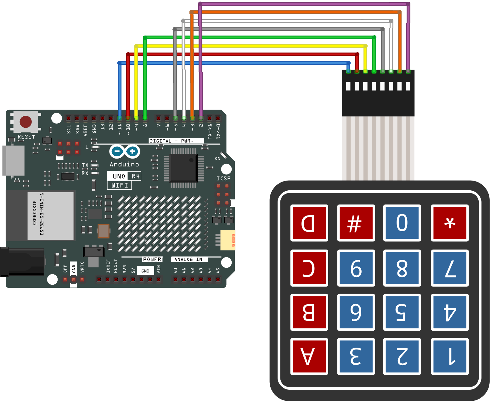
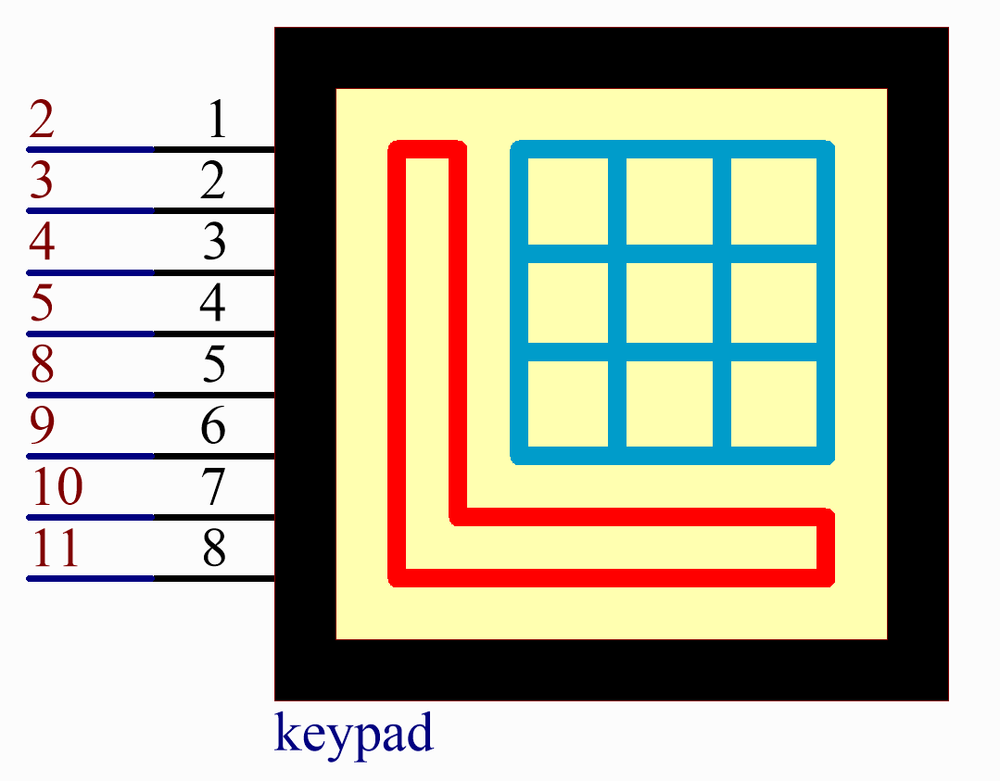

.. note::

    Hallo und willkommen in der SunFounder Raspberry Pi & Arduino & ESP32 Enthusiasten-Gemeinschaft auf Facebook! Tauchen Sie tiefer ein in die Welt von Raspberry Pi, Arduino und ESP32 mit anderen Enthusiasten.

    **Warum beitreten?**

    - **Expertenunterstützung**: Lösen Sie Nachverkaufsprobleme und technische Herausforderungen mit Hilfe unserer Gemeinschaft und unseres Teams.
    - **Lernen & Teilen**: Tauschen Sie Tipps und Anleitungen aus, um Ihre Fähigkeiten zu verbessern.
    - **Exklusive Vorschauen**: Erhalten Sie frühzeitigen Zugang zu neuen Produktankündigungen und exklusiven Einblicken.
    - **Spezialrabatte**: Genießen Sie exklusive Rabatte auf unsere neuesten Produkte.
    - **Festliche Aktionen und Gewinnspiele**: Nehmen Sie an Gewinnspielen und Feiertagsaktionen teil.

    👉 Sind Sie bereit, mit uns zu erkunden und zu erschaffen? Klicken Sie auf [|link_sf_facebook|] und treten Sie heute bei!

.. _basic_keypad:

Tastenfeld
==========================

.. https://docs.sunfounder.com/projects/vincent-kit-de/en/latest/arduino/2.19_keypad.html#ar-keypad

Überblick
-------------

In dieser Lektion lernen Sie, wie man ein Tastenfeld verwendet. Tastenfelder können in verschiedene Arten von Geräten eingesetzt werden, einschließlich Mobiltelefone, Faxgeräte, Mikrowellenherde und so weiter. Sie werden häufig für Benutzereingaben verwendet.

Benötigte Komponenten
-------------------------

Für dieses Projekt benötigen wir die folgenden Komponenten.

Es ist definitiv praktisch, ein ganzes Set zu kaufen, hier ist der Link:

.. list-table::
    :widths: 20 20 20
    :header-rows: 1

    *   - Name	
        - ARTIKEL IN DIESEM KIT
        - LINK
    *   - Elite Explorer Kit
        - 300+
        - |link_Elite_Explorer_kit|

Sie können sie auch einzeln über die untenstehenden Links kaufen.

.. list-table::
    :widths: 30 20
    :header-rows: 1

    *   - KOMPONENTENBESCHREIBUNG
        - KAUF-LINK

    *   - :ref:`uno_r4_wifi`
        - \-
    *   - :ref:`cpn_wires`
        - |link_wires_buy|
    *   - :ref:`cpn_keypad`
        - |link_keypad_buy|

Verdrahtung
----------------------

Schaltplan
----------------------

Code
-----------

.. note::

    * Sie können die Datei ``21-keypad.ino`` direkt im Pfad ``elite-explorer-kit-main\basic_project\21-keypad`` öffnen.
    * Um die Bibliothek zu installieren, verwenden Sie den Arduino Library Manager und suchen nach **„Adafruit Keypad“** und installieren es.

.. literalinclude:: /_code/21_basic_keypad.ino
   :language: cpp
   :linenos:
   :caption: 21-keypad.ino

Nachdem die Codes auf das UNO-Board hochgeladen wurden, können Sie auf dem seriellen Monitor den Wert der aktuell auf dem Tastenfeld gedrückten Taste sehen.

Code-Analyse
-------------------

1. Einbinden der Bibliothek

   Wir beginnen mit dem Einbinden der ``Adafruit_Keypad`` Bibliothek, die es uns ermöglicht, einfach mit dem Tastenfeld zu interagieren.

   .. code-block:: arduino

     #include "Adafruit_Keypad.h"

   .. note::

      * Um die Bibliothek zu installieren, verwenden Sie den Arduino Library Manager und suchen nach **„Adafruit Keypad“** und installieren es.

2. Konfiguration des Tastenfelds

   .. code-block:: arduino

     const byte ROWS = 4;
     const byte COLS = 4;
     char keys[ROWS][COLS] = {
       { '1', '2', '3', 'A' },
       { '4', '5', '6', 'B' },
       { '7', '8', '9', 'C' },
       { '*', '0', '#', 'D' }
     };
     byte rowPins[ROWS] = { 2, 3, 4, 5 };
     byte colPins[COLS] = { 8, 9, 10, 11 };

   - Die Konstanten ``ROWS`` und ``COLS`` definieren die Abmessungen des Tastenfelds.
   - ``keys`` ist ein 2D-Array, das die Beschriftung jeder Taste auf dem Tastenfeld speichert.
   - ``rowPins`` und ``colPins`` sind Arrays, die die mit den Reihen und Spalten des Tastenfelds verbundenen Arduino-Pins speichern.

   .. raw:: html

       

3. Initialisierung des Tastenfelds

   Erstellen Sie eine Instanz von ``Adafruit_Keypad`` namens ``myKeypad`` und initialisieren Sie diese.

   .. code-block:: arduino

     Adafruit_Keypad myKeypad = Adafruit_Keypad(makeKeymap(keys), rowPins, colPins, ROWS, COLS);

4. setup()-Funktion

   Initialisieren Sie die serielle Kommunikation und das benutzerdefinierte Tastenfeld.

   .. code-block:: arduino

     void setup() {
       Serial.begin(9600);
       myKeypad.begin();
     }

5. Hauptloop

   Überprüfen Sie auf Tastenereignisse und zeigen Sie diese im seriellen Monitor an.

   .. code-block:: arduino

     void loop() {
       myKeypad.tick();
       while (myKeypad.available()) {
         keypadEvent e = myKeypad.read();
         Serial.print((char)e.bit.KEY);
         if (e.bit.EVENT == KEY_JUST_PRESSED) Serial.println(" pressed");
         else if (e.bit.EVENT == KEY_JUST_RELEASED) Serial.println(" released");
       }
       delay(10);
     }

