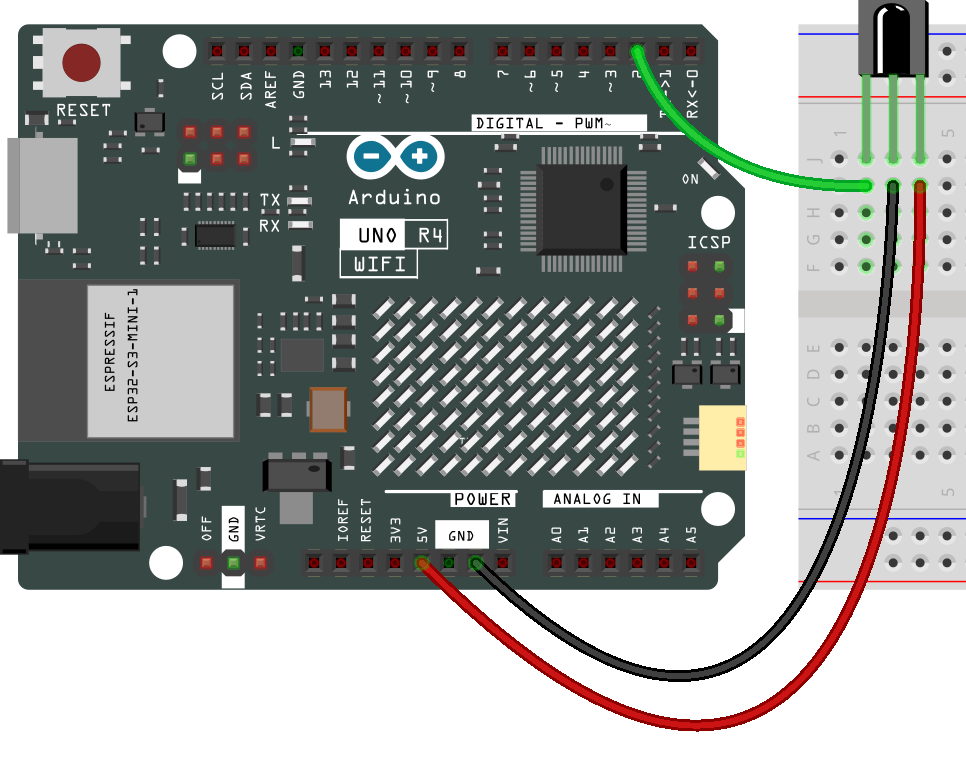
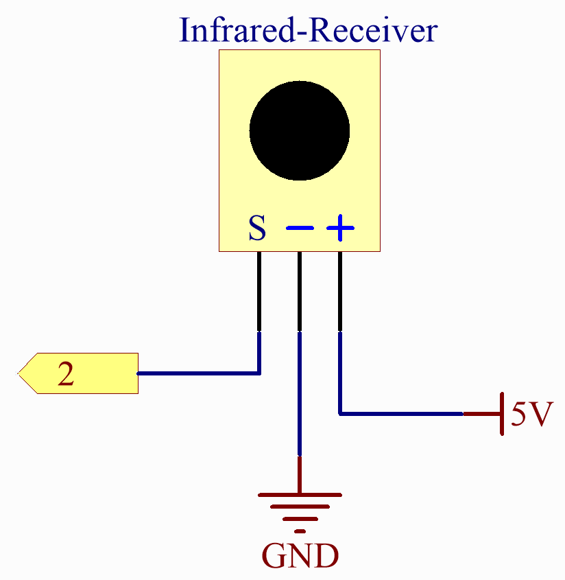

.. _basic_irrecv:

Infrared Receiver
==========================

.. https://docs.sunfounder.com/projects/uno-mega-kit/en/latest/uno/infrared_Receiver_uno.html#receive-uno

.. https://docs.sunfounder.com/projects/r4-basic-kit/en/latest/projects/infrared_Receiver_uno.html#receive-uno

Overview
------------------

An infrared-receiver is a component that receives infrared signals and can independently receive infrared ray and output signals compatible with TTL level. It's similar with a normal plastic-packaged transistor in size and it is suitable for all kinds of infrared remote control and infrared transmission.

Required Components
-------------------------

* :ref:`uno_r4_wifi`
* :ref:`cpn_breadboard`
* :ref:`cpn_wires`
* :ref:`cpn_ir_receiver`

Wiring
----------------------

Schematic Diagram
---------------------

Code
---------------

.. note::

    * You can open the file ``22-ir_receiver.ino`` under the path of ``Elite-Explorer-Kit-main\basic_project\22-ir_receiver`` directly.
    * Or copy this code into Arduino IDE.

.. raw:: html

    <iframe src=https://create.arduino.cc/editor/sunfounder01/92e1cb75-cda1-4fc7-9680-28e28df8dccc/preview?embed style="height:510px;width:100%;margin:10px 0" frameborder=0></iframe>

* The ``IRremote`` library is used here, you can install it from the **Library Manager**.

    .. image:: img/22_irrecv_lib.png
        :align: center

.. Note::

    * There is a transparent plastic piece at the back of the remote control to cut off the power and pull it out before you use the remote control.

Code Analysis
---------------------

This code is designed to work with an infrared (IR) remote control using the ``IRremote`` library. Here's the breakdown:

#. Including the library and defining constants. First, the IRremote library is included, and the pin number for the IR receiver is defined as 2.

   .. code-block:: cpp
 
     #include <IRremote.h>
     const int IR_RECEIVE_PIN = 2;

#. Initializes serial communication at a baud rate of 9600. Initializes the IR receiver on the specified pin (``IR_RECEIVE_PIN``) and enables LED feedback (if applicable).

   .. code-block:: arduino

       void setup() {
           Serial.begin(9600);                                     // Start serial communication at 9600 baud rate
           IrReceiver.begin(IR_RECEIVE_PIN, ENABLE_LED_FEEDBACK);  // Start the IR receiver
       }

#. The loop runs continuously to process incoming IR remote signals.

   .. code-block:: arduino

      void loop() {
        // Check if there is any incoming IR signal
        if (IrReceiver.decode()) {
          // IrReceiver.printIRResultShort(&Serial);                 // Print the received data in one line
          // Serial.println(IrReceiver.decodedIRData.command, HEX);  // Print the command in hexadecimal format
          Serial.println(decodeKeyValue(IrReceiver.decodedIRData.command));  // Map and print the decoded IR signal to corresponding key value
      
          IrReceiver.resume();  // Enable receiving of the next value
        }
      }
   
   * Checks if an IR signal is received and successfully decoded.
   * Decodes the IR command and stores it in ``decodedValue`` using a custom ``decodeKeyValue()`` function.
   * Prints the decoded IR value to the serial monitor.
   * Resumes IR signal reception for the next signal.

   .. raw:: html

         

#. Helper function to map received IR signals to corresponding keys

   .. image:: img/22_irrecv_key.png
      :align: center
      :width: 80%

   .. code-block:: arduino

      // Function to map received IR signals to corresponding keys
      String decodeKeyValue(long result) {
        // Each case corresponds to a specific IR command
        switch (result) {
          case 0x16:
            return "0";
          case 0xC:
            return "1";
          case 0x18:
            return "2";
          case 0x5E:
            return "3";
          case 0x8:
            return "4";
          case 0x1C:
            return "5";
          case 0x5A:
            return "6";
          case 0x42:
            return "7";
          case 0x52:
            return "8";
          case 0x4A:
            return "9";
          case 0x9:
            return "+";
          case 0x15:
            return "-";
          case 0x7:
            return "EQ";
          case 0xD:
            return "U/SD";
          case 0x19:
            return "CYCLE";
          case 0x44:
            return "PLAY/PAUSE";
          case 0x43:
            return "FORWARD";
          case 0x40:
            return "BACKWARD";
          case 0x45:
            return "POWER";
          case 0x47:
            return "MUTE";
          case 0x46:
            return "MODE";
          case 0x0:
            return "ERROR";
          default:
            return "ERROR";
        }
      }