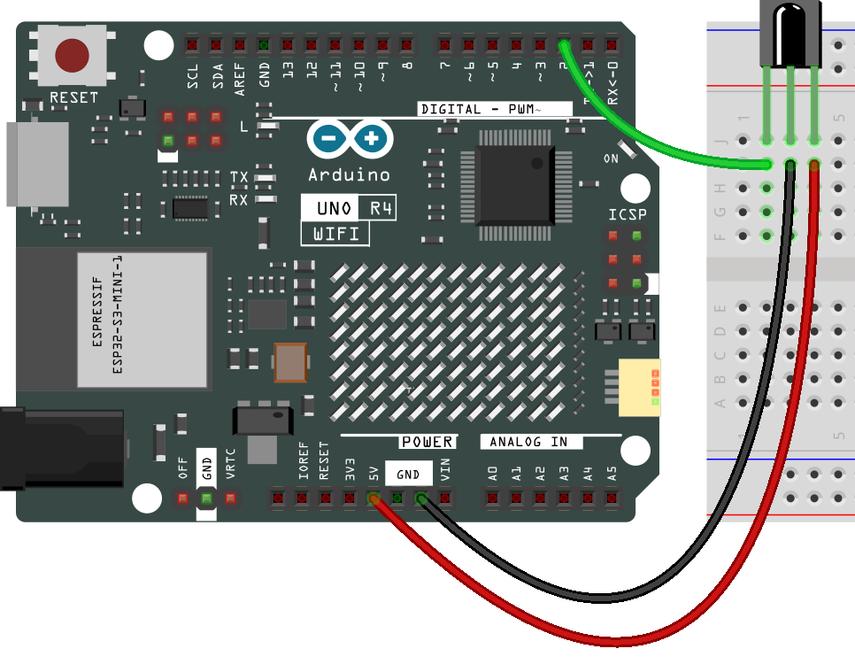
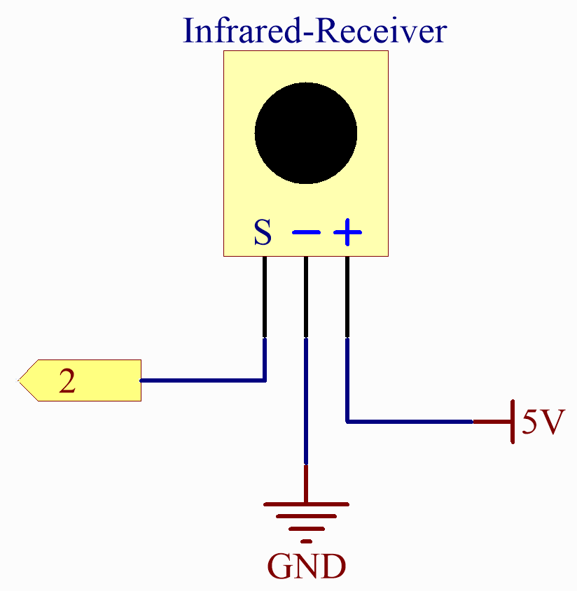

.. note::

    ¡Hola! Bienvenido a la Comunidad de Entusiastas de SunFounder Raspberry Pi & Arduino & ESP32 en Facebook. Sumérgete en el mundo de Raspberry Pi, Arduino y ESP32 con otros entusiastas.

    **¿Por qué unirse?**

    - **Soporte experto**: Resuelve problemas postventa y desafíos técnicos con la ayuda de nuestra comunidad y equipo.
    - **Aprende y comparte**: Intercambia consejos y tutoriales para mejorar tus habilidades.
    - **Vistas previas exclusivas**: Obtén acceso anticipado a nuevos anuncios de productos y adelantos.
    - **Descuentos especiales**: Disfruta de descuentos exclusivos en nuestros productos más nuevos.
    - **Promociones y sorteos festivos**: Participa en sorteos y promociones de temporada.

    👉 ¿Listo para explorar y crear con nosotros? Haz clic en [|link_sf_facebook|] y únete hoy mismo.

.. _basic_irrecv:

Receptor Infrarrojo
==========================

.. https://docs.sunfounder.com/projects/uno-mega-kit/en/latest/uno/infrared_Receiver_uno.html#receive-uno

.. https://docs.sunfounder.com/projects/r4-basic-kit/en/latest/projects/infrared_Receiver_uno.html#receive-uno

Descripción general
-------------------------

Un receptor infrarrojo es un componente que recibe señales infrarrojas y puede recibir rayos infrarrojos de forma independiente y emitir señales compatibles con el nivel TTL. Es similar en tamaño a un transistor normal encapsulado en plástico y es adecuado para todo tipo de control remoto por infrarrojos y transmisión infrarroja.

Componentes necesarios
-------------------------

En este proyecto, necesitamos los siguientes componentes. 

Es definitivamente conveniente comprar un kit completo, aquí está el enlace: 

.. list-table::
    :widths: 20 20 20
    :header-rows: 1

    *   - Nombre	
        - ELEMENTOS EN ESTE KIT
        - ENLACE
    *   - Elite Explorer Kit
        - 300+
        - |link_Elite_Explorer_kit|

También puedes comprarlos por separado en los enlaces a continuación.

.. list-table::
    :widths: 30 20
    :header-rows: 1

    *   - INTRODUCCIÓN A LOS COMPONENTES
        - ENLACE DE COMPRA

    *   - :ref:`uno_r4_wifi`
        - \-
    *   - :ref:`cpn_breadboard`
        - |link_breadboard_buy|
    *   - :ref:`cpn_wires`
        - |link_wires_buy|
    *   - :ref:`cpn_resistor`
        - |link_resistor_buy|
    *   - :ref:`cpn_ir_receiver`
        - |link_receiver_buy|

Conexión
----------------------

Diagrama esquemático
---------------------

Código
---------------

.. note::

    * Puedes abrir el archivo ``22-ir_receiver.ino`` directamente en la ruta ``elite-explorer-kit-main\basic_project\22-ir_receiver``.
    * O copia este código en el IDE de Arduino.

.. literalinclude:: /_code/22_basic_irrecv.ino
   :language: cpp
   :linenos:
   :caption: 22-ir_receiver.ino

* Se utiliza la biblioteca ``IRremote`` aquí, puedes instalarla desde el **Administrador de Bibliotecas**.

    .. image:: img/22_irrecv_lib.png
        :align: center

.. Note::

    * Hay una pieza de plástico transparente en la parte trasera del control remoto para cortar la energía, retírala antes de usar el control remoto.

Análisis del código
---------------------

Este código está diseñado para trabajar con un control remoto por infrarrojos (IR) usando la biblioteca ``IRremote``. Aquí está el desglose:

#. Incluir la biblioteca y definir constantes. Primero, se incluye la biblioteca IRremote y se define el número de pin para el receptor IR como 2.

   .. code-block:: cpp
 
     #include <IRremote.h>
     const int IR_RECEIVE_PIN = 2;

#. Inicializar la comunicación serie a una velocidad de 9600 baudios. Inicializa el receptor IR en el pin especificado (``IR_RECEIVE_PIN``) y habilita la retroalimentación LED (si corresponde).

   .. code-block:: arduino

       void setup() {
           Serial.begin(9600);                                     // Iniciar comunicación serie a 9600 baudios
           IrReceiver.begin(IR_RECEIVE_PIN, ENABLE_LED_FEEDBACK);  // Iniciar el receptor IR
       }

#. El bucle se ejecuta continuamente para procesar las señales entrantes del control remoto IR.

   .. code-block:: arduino

      void loop() {
        // Comprobar si hay alguna señal IR entrante
        if (IrReceiver.decode()) {
          // IrReceiver.printIRResultShort(&Serial);                 // Imprimir los datos recibidos en una línea
          // Serial.println(IrReceiver.decodedIRData.command, HEX);  // Imprimir el comando en formato hexadecimal
          Serial.println(decodeKeyValue(IrReceiver.decodedIRData.command));  // Mapear e imprimir la señal IR decodificada al valor correspondiente de la tecla
      
          IrReceiver.resume();  // Habilitar la recepción del siguiente valor
        }
      }
   
   * Comprueba si se recibe una señal IR y si se decodifica con éxito.
   * Decodifica el comando IR y lo almacena en ``decodedValue`` usando una función personalizada ``decodeKeyValue()``.
   * Imprime el valor IR decodificado en el monitor serie.
   * Reanuda la recepción de señales IR para la siguiente señal.

   .. raw:: html

         

#. Función auxiliar para mapear señales IR recibidas a teclas correspondientes

   .. image:: img/22_irrecv_key.png
      :align: center
      :width: 80%

   .. code-block:: arduino

      // Función para mapear señales IR recibidas a teclas correspondientes
      String decodeKeyValue(long result) {
        // Cada caso corresponde a un comando IR específico
        switch (result) {
          case 0x16:
            return "0";
          case 0xC:
            return "1";
          case 0x18:
            return "2";
          case 0x5E:
            return "3";
          case 0x8:
            return "4";
          case 0x1C:
            return "5";
          case 0x5A:
            return "6";
          case 0x42:
            return "7";
          case 0x52:
            return "8";
          case 0x4A:
            return "9";
          case 0x9:
            return "+";
          case 0x15:
            return "-";
          case 0x7:
            return "EQ";
          case 0xD:
            return "U/SD";
          case 0x19:
            return "CYCLE";
          case 0x44:
            return "PLAY/PAUSE";
          case 0x43:
            return "FORWARD";
          case 0x40:
            return "BACKWARD";
          case 0x45:
            return "POWER";
          case 0x47:
            return "MUTE";
          case 0x46:
            return "MODE";
          case 0x0:
            return "ERROR";
          default:
            return "ERROR";
        }
      }