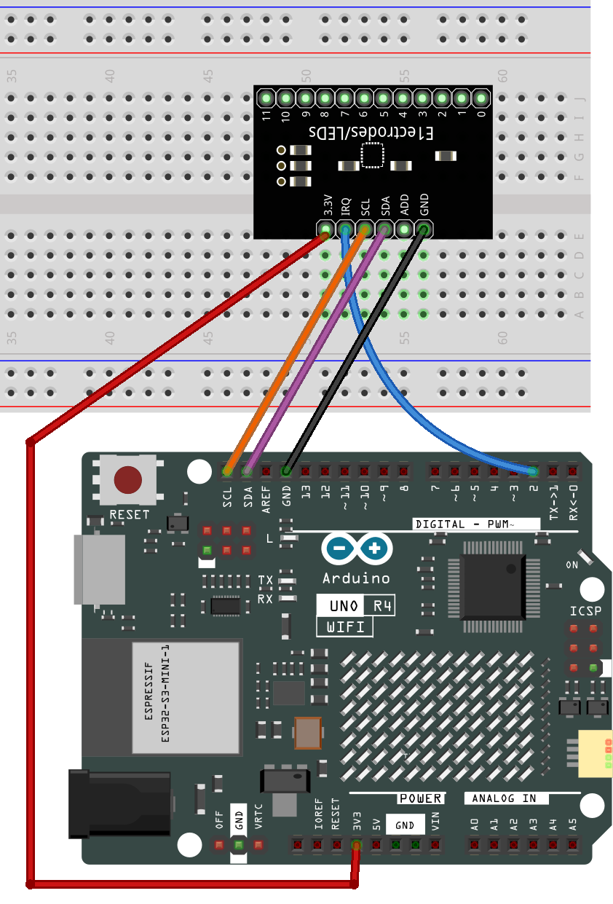

.. note::

    Hallo und willkommen in der SunFounder Raspberry Pi & Arduino & ESP32 Enthusiasten-Gemeinschaft auf Facebook! Tauchen Sie tiefer ein in die Welt von Raspberry Pi, Arduino und ESP32 mit anderen Enthusiasten.

    **Warum beitreten?**

    - **Expertenunterstützung**: Lösen Sie Nachverkaufsprobleme und technische Herausforderungen mit Hilfe unserer Gemeinschaft und unseres Teams.
    - **Lernen & Teilen**: Tauschen Sie Tipps und Anleitungen aus, um Ihre Fähigkeiten zu verbessern.
    - **Exklusive Vorschauen**: Erhalten Sie frühzeitigen Zugang zu neuen Produktankündigungen und exklusiven Einblicken.
    - **Spezialrabatte**: Genießen Sie exklusive Rabatte auf unsere neuesten Produkte.
    - **Festliche Aktionen und Gewinnspiele**: Nehmen Sie an Gewinnspielen und Feiertagsaktionen teil.

    👉 Sind Sie bereit, mit uns zu erkunden und zu erschaffen? Klicken Sie auf [|link_sf_facebook|] und treten Sie heute bei!

.. _basic_mpr121:

MPR121
==========================

.. https://docs.sunfounder.com/projects/vincent-kit/en/latest/arduino/2.24_mpr121_module.html#ar-mpr121

Überblick
---------------

In dieser Lektion lernen Sie, wie man MPR121 verwendet. Es ist eine gute Wahl, wenn Sie viele Berührungsschalter zu Ihrem Projekt hinzufügen möchten. Die Elektrode des MPR121 kann mit einem Leiter verlängert werden. Wenn Sie einen Draht an eine Banane anschließen, können Sie die Banane in einen Berührungsschalter verwandeln und so Projekte wie ein Fruchtpiano realisieren.

Benötigte Komponenten
-------------------------

Für dieses Projekt benötigen wir die folgenden Komponenten.

Es ist definitiv praktisch, ein ganzes Set zu kaufen, hier ist der Link:

.. list-table::
    :widths: 20 20 20
    :header-rows: 1

    *   - Name	
        - ARTIKEL IN DIESEM KIT
        - LINK
    *   - Elite Explorer Kit
        - 300+
        - |link_Elite_Explorer_kit|

Sie können sie auch einzeln über die untenstehenden Links kaufen.

.. list-table::
    :widths: 30 20
    :header-rows: 1

    *   - KOMPONENTENBESCHREIBUNG
        - KAUF-LINK

    *   - :ref:`uno_r4_wifi`
        - \-
    *   - :ref:`cpn_breadboard`
        - |link_breadboard_buy|
    *   - :ref:`cpn_wires`
        - |link_wires_buy|
    *   - :ref:`cpn_mpr121`
        - \-

Verdrahtung
----------------------

In diesem Beispiel setzen wir MPR121 in das Breadboard ein. Verbinden Sie GND von MPR121 mit GND, 3.3V mit 3V3, IRQ mit dem digitalen Pin 2, SCL mit dem Pin SCL(A5) und SDA mit dem Pin SDA(A4). Es gibt 12 Elektroden für die Berührungserkennung.

.. note::
    MPR121 wird mit 3.3V betrieben, nicht mit 5V.

Schaltplan
----------------------

.. image:: img/23_mpr121_schematic.png
   :align: center
   :width: 70%

Code
--------

.. note::

    * Sie können die Datei ``23-mpr121.ino`` direkt im Pfad ``elite-explorer-kit-main\basic_project\23-mpr121`` öffnen.
    * Hier wird die ``Adafruit MPR121`` Bibliothek verwendet, die Sie über den **Library Manager** installieren können.

        .. image:: img/22_mpr121_lib.png
            :align: center

.. raw:: html

    <iframe src=https://create.arduino.cc/editor/sunfounder01/de0aa390-de85-43ab-87f7-f380c67c65e8/preview?embed style="height:510px;width:100%;margin:10px 0" frameborder=0></iframe>

Nachdem der Code auf das UNO-Board hochgeladen wurde, wird der Berührungszustand der MPR121-Pins „1“ und „0“ in einem 12-Bit-Boolean-Array erfasst. Dieses Array wird dann auf dem seriellen Monitor ausgegeben.

Code-Analyse
--------------------
Dieser Code ermöglicht die Kommunikation und Bedienung des MPR121-Berührungssensors. Er kann den Status von Berührungselektroden erkennen und Informationen über berührte oder freigegebene Elektroden auf der seriellen Schnittstelle ausgeben. Wenn detaillierte Sensordaten erforderlich sind, kann der entsprechende Code auskommentiert werden.

Hier eine Analyse des Codes:

#. Bibliotheken importieren:

   .. code-block:: arduino

       #include <Wire.h>
       #include "Adafruit_MPR121.h"

   * ``Wire.h``: Wird für die I2C-Kommunikation verwendet.
   * ``Adafruit_MPR121.h``: Adafruits MPR121-Bibliothek zur Bedienung des MPR121-Berührungssensors.

#. Die Makro ``_BV`` definieren:

   .. code-block:: arduino

       #ifndef _BV
       #define _BV(bit) (1 << (bit)) 
       #endif
   
   ``_BV(bit)`` definiert ein Makro, das einen gegebenen Bit in den entsprechenden Binärwert umwandelt, ähnlich wie 1 << bit.

#. Instanz der Klasse ``Adafruit_MPR121`` initialisieren:

   .. code-block:: arduino

       Adafruit_MPR121 cap = Adafruit_MPR121();

   Erstellen Sie eine Instanz der Klasse ``Adafruit_MPR121`` namens ``cap``. Das Objekt ``cap`` wird verwendet, um mit dem MPR121-Berührungssensor zu kommunizieren und ihn zu bedienen.

#. Funktion ``setup()``:

   Initialisieren Sie die serielle Kommunikation mit einer Baudrate von 9600. Dann initialisieren Sie den MPR121-Berührungssensor mit der Standard-I2C-Adresse 0x5A. Falls die Initialisierung fehlschlägt, geben Sie eine Fehlermeldung aus und treten Sie in eine Endlosschleife ein.

   .. code-block:: arduino

       void setup() {
           Serial.begin(9600);
           
           while (!Serial) { // needed to keep leonardo/micro from starting too fast!
               delay(10);
           }
           
           Serial.println("Adafruit MPR121 Capacitive Touch sensor test"); 
           
           // Default address is 0x5A, if tied to 3.3V its 0x5B
           // If tied to SDA its 0x5C and if SCL then 0x5D
           if (!cap.begin(0x5A)) {
               Serial.println("MPR121 not found, check wiring?");
               while (1);
           }
           Serial.println("MPR121 found!");
       }

#. Funktion ``loop()``:

   * Ermitteln Sie den aktuellen Berührungsstatus, der als 16-Bit-Integer zurückgegeben wird.

     .. code-block:: arduino

         currtouched = cap.touched();

   * Durchlaufen Sie den Status der 12 Elektroden (nummeriert von 0 bis 11).

     .. code-block:: arduino

         for (uint8_t i=0; i<12; i++) {
             // it if *is* touched and *wasnt* touched before, alert!
             if ((currtouched & _BV(i)) && !(lasttouched & _BV(i)) ) {
                 Serial.print(i); Serial.println(" touched");
             }
             // if it *was* touched and now *isnt*, alert!
             if (!(currtouched & _BV(i)) && (lasttouched & _BV(i)) ) {
                 Serial.print(i); Serial.println(" released");
             }
         }

     * Wenn eine Elektrode berührt wird und vorher nicht berührt wurde, drucken Sie „x berührt“, wobei x die Nummer der Elektrode ist.
     * Wenn eine Elektrode vorher berührt wurde, aber jetzt nicht mehr berührt wird, drucken Sie „x freigegeben“.

   * Aktualisieren Sie ``lasttouched``, um den aktuellen Berührungsstatus für den Vergleich in der nächsten Iteration zu speichern.

     .. code-block:: arduino

         lasttouched = currtouched;

   * Debugging-Informationen (Optional):

     .. code-block:: arduino

         // debugging info, what
         Serial.print("\t\t\t\t\t\t\t\t\t\t\t\t\t 0x"); Serial.println(cap.touched(), HEX);
         Serial.print("Filt: ");
         for (uint8_t i=0; i<12; i++) {
             Serial.print(cap.filteredData(i)); Serial.print("\t");
         }
         Serial.println();
         Serial.print("Base: ");
         for (uint8_t i=0; i<12; i++) {
             Serial.print(cap.baselineData(i)); Serial.print("\t");
         }
         Serial.println();
         
         // put a delay so it isn't overwhelming
         delay(100);
