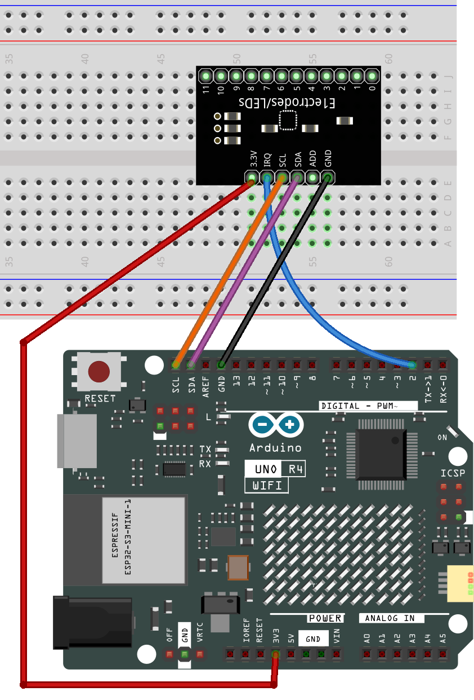
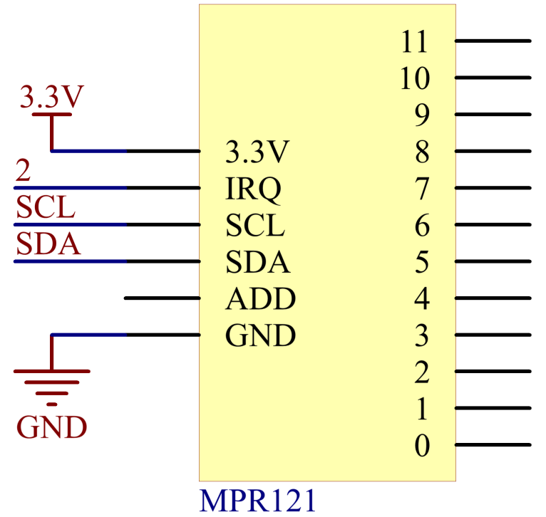

.. _basic_mpr121:

MPR121
==========================

.. https://docs.sunfounder.com/projects/vincent-kit/en/latest/arduino/2.24_mpr121_module.html#ar-mpr121

概述
---------------

在本课中，您将学习如何使用 MPR121。当您想在项目中添加大量触摸开关时，它是一个很好的选择。MPR121 的电极可以通过导体进行扩展。如果您将一根电线连接到香蕉上，就可以将香蕉变成一个触摸开关，从而实现水果钢琴等项目。

所需元件
-------------------------

本项目中，我们需要以下元件。

购买整套套件会更加方便，以下是链接：

.. list-table::
    :widths: 20 20 20
    :header-rows: 1

    *   - 名称
        - 套件所含项目
        - 链接
    *   - Elite Explorer 套件
        - 300+
        - |link_Elite_Explorer_kit|

您也可以从以下链接单独购买。

.. list-table::
    :widths: 30 20
    :header-rows: 1

    *   - 元件介绍
        - 购买链接

    *   - :ref:`uno_r4_wifi`
        - \-
    *   - :ref:`cpn_breadboard`
        - |link_breadboard_buy|
    *   - :ref:`cpn_wires`
        - |link_wires_buy|
    *   - :ref:`cpn_mpr121`
        - \-

接线
----------------------

在本示例中，我们将 MPR121 插入面包板。将 MPR121 的 GND 连接到 GND，3.3V 连接到 3V3，IRQ 连接到数字引脚 2，SCL 连接到引脚 SCL(A5)，SDA 连接到引脚 SDA(A4)。共有 12 个电极用于触摸感应。

.. note::
    MPR121 使用 3.3V 供电，而非 5V。

原理图
----------------------

代码
--------

.. note::

    * 您可以直接打开路径 ``elite-explorer-kit-main\basic_project\23-mpr121`` 下的 ``23-mpr121.ino`` 文件。
    * 这里使用 ``Adafruit MPR121`` 库，您可以从 **库管理器** 安装它。

        .. image:: img/22_mpr121_lib.png
            :align: center

.. literalinclude:: /_code/23_basic_mpr121_module.ino
   :language: cpp
   :linenos:
   :caption: 23-mpr121.ino

将代码上传到 UNO 板后，MPR121 引脚"1"和"0"的触摸状态将记录在一个 12 位布尔数组中。然后该数组将打印在串口监视器上。

代码分析
--------------------
此代码实现了 MPR121 触摸传感器的通信和操作。它可以检测触摸电极的状态，并在串行接口上打印有关触摸或释放电极的信息。如果需要详细的传感器数据，可以取消注释相关代码。

以下是代码分析：

#. 导入库：

   .. code-block:: arduino

       #include <Wire.h>
       #include "Adafruit_MPR121.h"

   * ``Wire.h``：用于 I2C 通信。
   * ``Adafruit_MPR121.h``：Adafruit 的 MPR121 库，用于操作 MPR121 触摸传感器。

#. 定义 ``_BV`` 宏：

   .. code-block:: arduino

       #ifndef _BV
       #define _BV(bit) (1 << (bit))
       #endif

   ``_BV(bit)`` 定义了一个宏，将给定的位转换为相应的二进制值，类似于 1 << bit。

#. 初始化 ``Adafruit_MPR121`` 类实例：

   .. code-block:: arduino

       Adafruit_MPR121 cap = Adafruit_MPR121();

   创建一个名为 ``cap`` 的 ``Adafruit_MPR121`` 类实例。``cap`` 对象将用于与 MPR121 触摸传感器通信和操作。

#. ``setup()`` 函数：

   以 9600 波特率初始化串口通信。然后使用默认 I2C 地址 0x5A 初始化 MPR121 触摸传感器。如果初始化失败，打印错误消息并进入无限循环。

   .. code-block:: arduino

       void setup() {
           Serial.begin(9600);

           while (!Serial) { // 需要保持 leonardo/micro 不会启动过快！
               delay(10);
           }

           Serial.println("Adafruit MPR121 Capacitive Touch sensor test");

           // 默认地址为 0x5A，如果连接到 3.3V 则为 0x5B
           // 如果连接到 SDA 则为 0x5C，如果连接到 SCL 则为 0x5D
           if (!cap.begin(0x5A)) {
               Serial.println("MPR121 not found, check wiring?");
               while (1);
           }
           Serial.println("MPR121 found!");
       }

#. ``loop()`` 函数：

   * 获取当前触摸状态，返回为 16 位整数。

     .. code-block:: arduino

         currtouched = cap.touched();

   * 遍历 12 个电极（编号从 0 到 11）的状态。

     .. code-block:: arduino

         for (uint8_t i=0; i<12; i++) {
             // 如果 *现在* 被触摸且 *之前* 没有被触摸，则发出提示！
             if ((currtouched & _BV(i)) && !(lasttouched & _BV(i)) ) {
                 Serial.print(i); Serial.println(" touched");
             }
             // 如果 *之前* 被触摸而现在 *没有* 被触摸，则发出提示！
             if (!(currtouched & _BV(i)) && (lasttouched & _BV(i)) ) {
                 Serial.print(i); Serial.println(" released");
             }
         }

     * 如果某个电极被触摸且之前未被触摸，则打印 "x touched"，其中 x 为电极编号。
     * 如果某个电极之前被触摸但现在未被触摸，则打印 "x released"。

   * 更新 ``lasttouched`` 以存储当前触摸状态，用于下一次迭代的比较。

     .. code-block:: arduino

         lasttouched = currtouched;

   * 调试信息（可选部分）：

     .. code-block:: arduino

         // 调试信息
         Serial.print("\t\t\t\t\t\t\t\t\t\t\t\t\t 0x"); Serial.println(cap.touched(), HEX);
         Serial.print("Filt: ");
         for (uint8_t i=0; i<12; i++) {
             Serial.print(cap.filteredData(i)); Serial.print("\t");
         }
         Serial.println();
         Serial.print("Base: ");
         for (uint8_t i=0; i<12; i++) {
             Serial.print(cap.baselineData(i)); Serial.print("\t");
         }
         Serial.println();

         // 添加延迟以防止数据过多
         delay(100);
