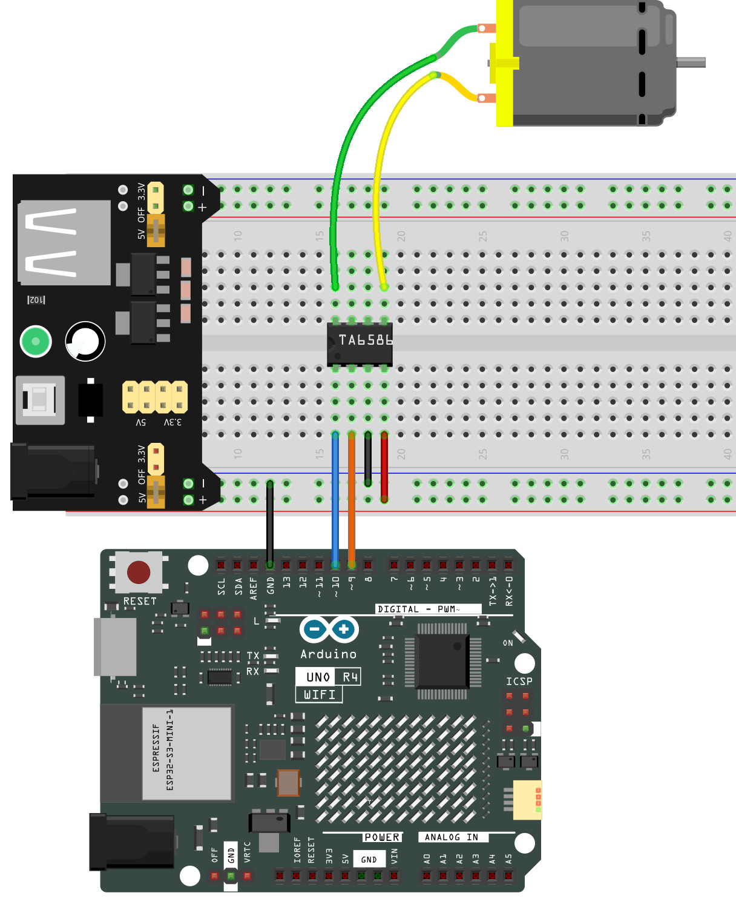
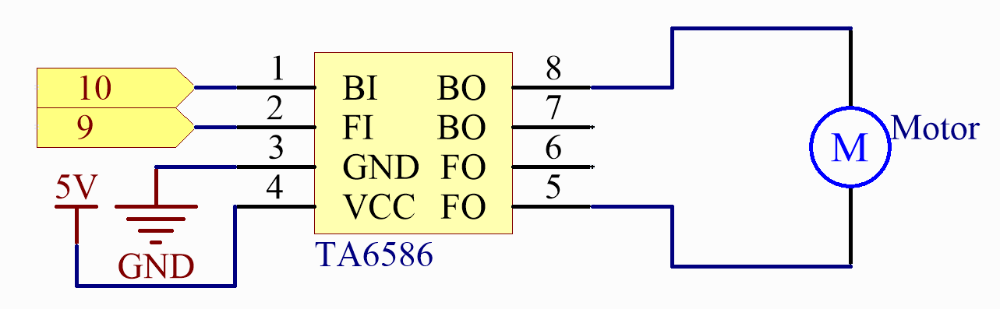

.. note::

    ¡Hola! Bienvenido a la Comunidad de Entusiastas de SunFounder Raspberry Pi & Arduino & ESP32 en Facebook. Sumérgete en el mundo de Raspberry Pi, Arduino y ESP32 con otros entusiastas.

    **¿Por qué unirse?**

    - **Soporte experto**: Resuelve problemas postventa y desafíos técnicos con la ayuda de nuestra comunidad y equipo.
    - **Aprende y comparte**: Intercambia consejos y tutoriales para mejorar tus habilidades.
    - **Vistas previas exclusivas**: Obtén acceso anticipado a nuevos anuncios de productos y adelantos.
    - **Descuentos especiales**: Disfruta de descuentos exclusivos en nuestros productos más nuevos.
    - **Promociones y sorteos festivos**: Participa en sorteos y promociones de temporada.

    👉 ¿Listo para explorar y crear con nosotros? Haz clic en [|link_sf_facebook|] y únete hoy mismo.

.. _basic_motor:

Motor
==========================

Descripción general
---------------------------

En esta lección, aprenderás a usar el Motor, cuyo principio de funcionamiento es que la bobina energizada es forzada a rotar en el campo magnético, luego el rotor del motor gira y el engranaje de piñón impulsa el volante del motor a rotar.

Componentes necesarios
---------------------------

En este proyecto, necesitamos los siguientes componentes. 

Es definitivamente conveniente comprar un kit completo, aquí está el enlace: 

.. list-table::
    :widths: 20 20 20
    :header-rows: 1

    *   - Nombre
        - ELEMENTOS EN ESTE KIT
        - ENLACE
    *   - Elite Explorer Kit
        - 300+
        - |link_Elite_Explorer_kit|

También puedes comprarlos por separado en los enlaces a continuación.

.. list-table::
    :widths: 30 20
    :header-rows: 1

    *   - INTRODUCCIÓN A LOS COMPONENTES
        - ENLACE DE COMPRA

    *   - :ref:`uno_r4_wifi`
        - \-
    *   - :ref:`cpn_breadboard`
        - |link_breadboard_buy|
    *   - :ref:`cpn_wires`
        - |link_wires_buy|
    *   - :ref:`cpn_ta6586`
        - \-
    *   - :ref:`cpn_motor`
        - |link_motor_buy|
    *   - :ref:`cpn_power`
        - \-

Conexión
----------------------

En este ejemplo, usamos el módulo de fuente de alimentación para alimentar el ánodo y cátodo de la placa de pruebas.

.. note::
    Para proteger la batería del :ref:`cpn_power`, cárgala completamente antes de usarla por primera vez.

.. raw:: html
  
    

Diagrama esquemático
--------------------------

.. raw:: html
  
    

Código
----------

.. note::

    * Puedes abrir el archivo ``24-motor.ino`` en la ruta ``elite-explorer-kit-main\basic_project\24-motor`` directamente.
    * O copiar este código en Arduino IDE.

.. raw:: html

    <iframe src=https://create.arduino.cc/editor/sunfounder01/7376df09-204d-4698-b2a6-106e2d2f00e6/preview?embed style="height:510px;width:100%;margin:10px 0" frameborder=0></iframe>

Después de cargar el código en la placa UNO, puedes elegir la dirección de rotación del motor escribiendo "A" o "B" en el monitor serial.

Análisis del código
-------------------------

El motor puede ser impulsado proporcionando una diferencia de voltaje entre las láminas de cobre a ambos lados del motor.
Por lo tanto, solo necesitas escribir 0 para el voltaje de un lado de la lámina de cobre y 5V para el otro lado. Modifica el valor de la señal analógica escrita para ajustar la dirección y velocidad.

.. code-block:: arduino

   // Función para rotar el motor en sentido horario
   void clockwise(int Speed) {
     analogWrite(motorBI, 0);
     analogWrite(motorFI, Speed);
   }
   
   // Función para rotar el motor en sentido antihorario
   void anticlockwise(int Speed) {
     analogWrite(motorBI, Speed);
     analogWrite(motorFI, 0);
   }

En este ejemplo, se utiliza Serial.Read() para controlar la dirección del motor.

Cuando escribes 'A' en el monitor serial, se llama a la función clockwise (255) para hacer girar el motor a una velocidad de 255.
Ingresa 'B', y el motor girará en dirección inversa.

.. code-block:: arduino

   void loop() {
     // Verificar si hay datos disponibles en el puerto serial
     if (Serial.available() > 0) {
       int incomingByte = Serial.read(); // Leer datos entrantes
       
       // Determinar la dirección del motor según la entrada del usuario
       switch (incomingByte) {
         case 'A':
           clockwise(255); // Rotate motor clockwise
           Serial.println("The motor rotates clockwise.");
           break;
         case 'B':
           anticlockwise(255); // Rotate motor anticlockwise
           Serial.println("The motor rotates anticlockwise.");
           break;
       }
     }
     
     delay(3000); // Esperar 3 segundos
     stopMotor(); // Detener el motor
   }

