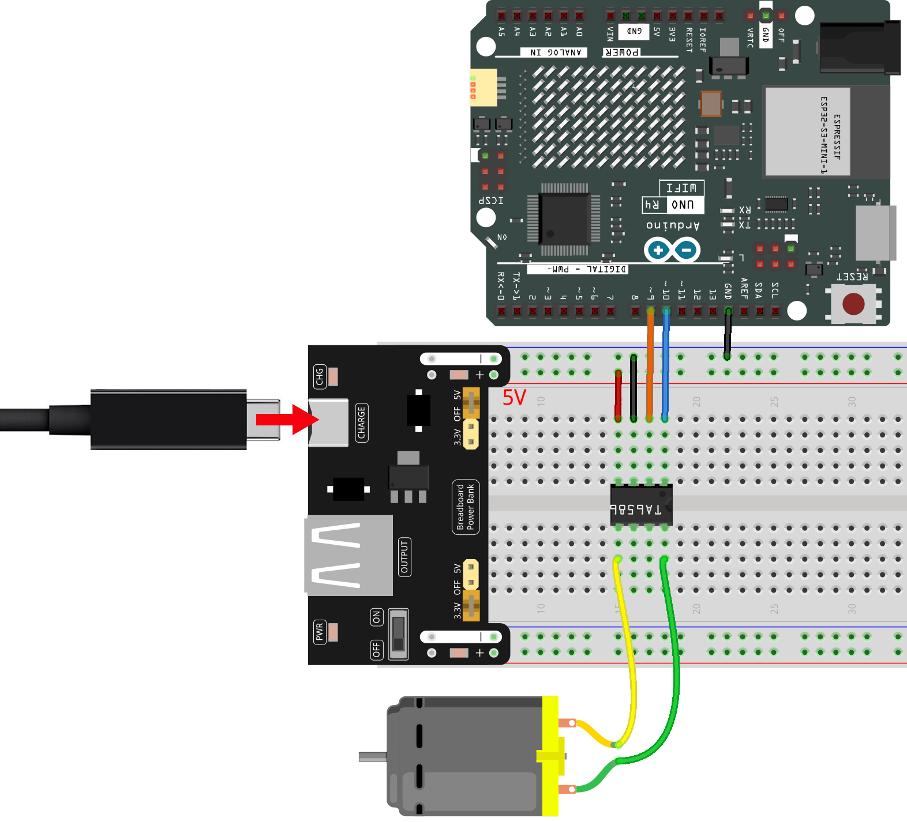
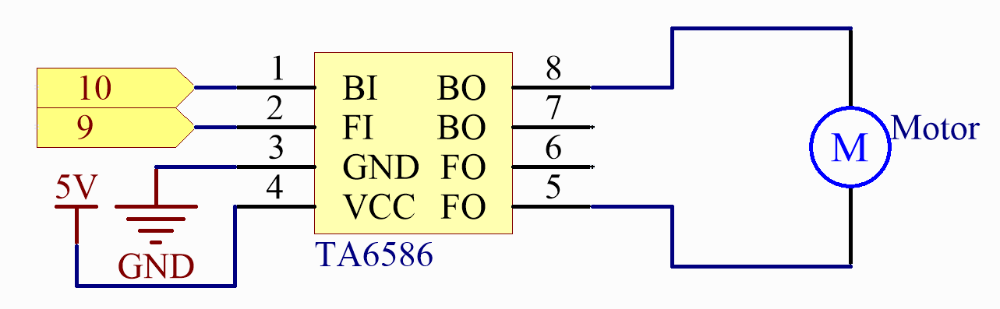

.. note::

    Hallo und willkommen in der SunFounder Raspberry Pi & Arduino & ESP32 Enthusiasten-Gemeinschaft auf Facebook! Tauchen Sie tiefer ein in die Welt von Raspberry Pi, Arduino und ESP32 mit anderen Enthusiasten.

    **Warum beitreten?**

    - **Expertenunterstützung**: Lösen Sie Nachverkaufsprobleme und technische Herausforderungen mit Hilfe unserer Gemeinschaft und unseres Teams.
    - **Lernen & Teilen**: Tauschen Sie Tipps und Anleitungen aus, um Ihre Fähigkeiten zu verbessern.
    - **Exklusive Vorschauen**: Erhalten Sie frühzeitigen Zugang zu neuen Produktankündigungen und exklusiven Einblicken.
    - **Spezialrabatte**: Genießen Sie exklusive Rabatte auf unsere neuesten Produkte.
    - **Festliche Aktionen und Gewinnspiele**: Nehmen Sie an Gewinnspielen und Feiertagsaktionen teil.

    👉 Sind Sie bereit, mit uns zu erkunden und zu erschaffen? Klicken Sie auf [|link_sf_facebook|] und treten Sie heute bei!

.. _basic_motor:

Motor
==========================

Überblick
--------------

In dieser Lektion lernen Sie, wie man einen Motor verwendet, dessen Arbeitsprinzip darauf beruht, dass die stromdurchflossene Spule im Magnetfeld zur Rotation gezwungen wird und somit der Rotor des Motors entsprechend rotiert, wodurch das Ritzelrad das Schwungrad des Motors antreibt.

Benötigte Komponenten
-----------------------

Für dieses Projekt benötigen wir die folgenden Komponenten.

Es ist definitiv praktisch, ein ganzes Set zu kaufen, hier ist der Link:

.. list-table::
    :widths: 20 20 20
    :header-rows: 1

    *   - Name	
        - ARTIKEL IN DIESEM KIT
        - LINK
    *   - Elite Explorer Kit
        - 300+
        - |link_Elite_Explorer_kit|

Sie können sie auch einzeln über die untenstehenden Links kaufen.

.. list-table::
    :widths: 30 20
    :header-rows: 1

    *   - KOMPONENTENBESCHREIBUNG
        - KAUF-LINK

    *   - :ref:`uno_r4_wifi`
        - \-
    *   - :ref:`cpn_breadboard`
        - |link_breadboard_buy|
    *   - :ref:`cpn_wires`
        - |link_wires_buy|
    *   - :ref:`cpn_ta6586`
        - \-
    *   - :ref:`cpn_motor`
        - |link_motor_buy|
    *   - :ref:`cpn_power`
        - \-

Verdrahtung
----------------------

In diesem Beispiel verwenden wir das Power Supply Module, um die Anode und Kathode des Breadboards zu versorgen.

.. note:: Der Motor benötigt im Betrieb mehr Strom, daher muss das Leistungsmodul während des Gebrauchs an ein Ladekabel angeschlossen bleiben.

.. raw:: html
  
    

Schaltplan
-----------------

.. raw:: html
  
    

Code
----

.. note::

    * Sie können die Datei ``24-motor.ino`` direkt im Pfad ``elite-explorer-kit-main\basic_project\24-motor`` öffnen.
    * Oder kopieren Sie diesen Code in die Arduino IDE.

.. literalinclude:: /_code/24_basic_motor.ino
   :language: cpp
   :linenos:
   :caption: 24-motor.ino

Nachdem der Code auf das UNO-Board hochgeladen wurde, können Sie die Drehrichtung des Motors wählen, indem Sie „A“ oder „B“ im seriellen Monitor eingeben.

Code-Analyse
--------------------------

Der Motor kann angetrieben werden, indem man eine Spannungsdifferenz zwischen den Kupferplatten auf beiden Seiten des Motors herstellt.
Daher müssen Sie nur 0 für die Spannung einer Seite der Kupferplatte und 5V für die andere Seite schreiben. Modifizieren Sie den geschriebenen analogen Signalwert, um die Richtung und Geschwindigkeit anzupassen.

.. code-block:: arduino

   // Function to rotate the motor clockwise
   void clockwise(int Speed) {
     analogWrite(motorBI, 0);
     analogWrite(motorFI, Speed);
   }
   
   // Function to rotate the motor anticlockwise
   void anticlockwise(int Speed) {
     analogWrite(motorBI, Speed);
     analogWrite(motorFI, 0);
   }

In diesem Beispiel wird Serial.Read() verwendet, um die Richtung des Motors zu steuern.

Wenn Sie „A“ im seriellen Monitor eingeben, wird die Funktion clockwise (255) aufgerufen, damit sich der Motor mit der Geschwindigkeit von 255 dreht.
Geben Sie „B“ ein, und der Motor dreht sich in die entgegengesetzte Richtung.

.. code-block:: arduino

   void loop() {
     // Check if there is available data on the serial port
     if (Serial.available() > 0) {
       int incomingByte = Serial.read(); // Read incoming data
       
       // Determine motor direction based on user input
       switch (incomingByte) {
         case 'A':
           clockwise(255); // Rotate motor clockwise
           Serial.println("The motor rotates clockwise.");
           break;
         case 'B':
           anticlockwise(255); // Rotate motor anticlockwise
           Serial.println("The motor rotates anticlockwise.");
           break;
       }
     }
     
     delay(3000); // Wait for 3 seconds
     stopMotor(); // Stop the motor
   }

