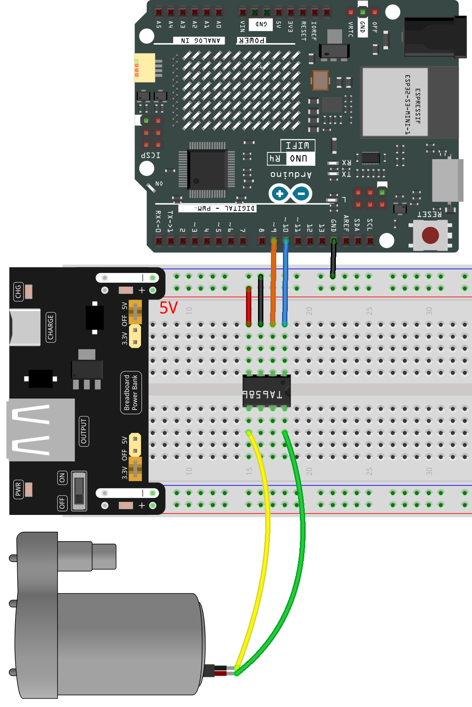
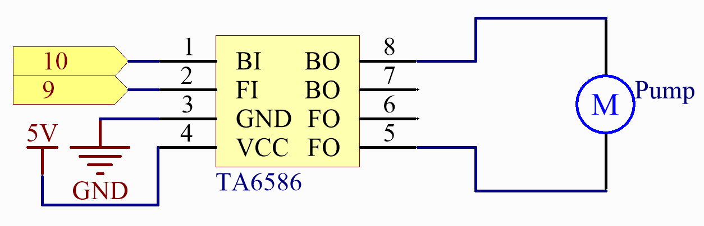

.. _basic_pump:

Water Pump
==========================

Overview
---------------

The water pump is also a motor, which converts the mechanical energy of the motor or other external energy through a special structure to transport the liquid.

Required Components
-------------------------

In this project, we need the following components. 

It's definitely convenient to buy a whole kit, here's the link: 

.. list-table::
    :widths: 20 20 20
    :header-rows: 1

    *   - Name	
        - ITEMS IN THIS KIT
        - LINK
    *   - Elite Explorer Kit
        - 300+
        - |link_Elite_Explorer_kit|

You can also buy them separately from the links below.

.. list-table::
    :widths: 30 20
    :header-rows: 1

    *   - COMPONENT INTRODUCTION
        - PURCHASE LINK

    *   - :ref:`uno_r4_wifi`
        - \-
    *   - :ref:`cpn_breadboard`
        - |link_breadboard_buy|
    *   - :ref:`cpn_wires`
        - |link_wires_buy|
    *   - :ref:`cpn_pump`
        - 
    *   - :ref:`cpn_ta6586`
        - \-
    *   - :ref:`cpn_power`
        - \-

Wiring
----------------------

.. note::
    To protect the :ref:`cpn_power`'s battery, please fully charge it before using it for the first time.

.. raw:: html
  
    

Schematic Diagram
-----------------------

Code
---------------

.. note::

   * You can open the file ``25-pump.ino`` under the path of ``elite-explorer-kit-main\basic_project\25-pump``. 
   * Or copy this code into **Arduino IDE**.

.. raw:: html
    
    <iframe src=https://create.arduino.cc/editor/sunfounder01/8a530528-aa58-4306-acc9-01632ae5e99a/preview?embed style="height:510px;width:100%;margin:10px 0" frameborder=0></iframe>
    
Attach the tubing to the pump and position it in the basin. Once the code is successfully uploaded, the water pump will turn on and remain active for five seconds.
When conducting this experiment, please ensure that the circuit is kept away from water to prevent any potential short circuits.

Code Analysis
--------------------------

The motor can be driven by providing a voltage difference between the copper sheets at both sides of the motor. 

.. code-block:: arduino
    
   digitalWrite(motorBI, HIGH);
   digitalWrite(motorFI, LOW);