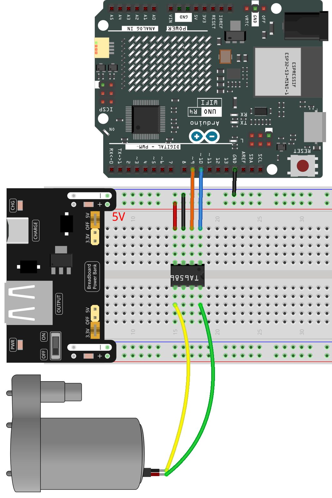
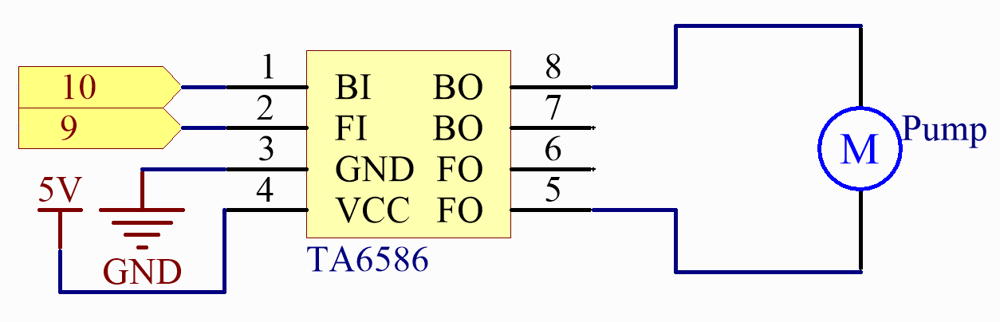

.. note::

    Bonjour, bienvenue dans la communauté des passionnés de SunFounder Raspberry Pi, Arduino et ESP32 sur Facebook ! Plongez au cœur des Raspberry Pi, Arduino et ESP32 avec d'autres passionnés.

    **Pourquoi nous rejoindre ?**

    - **Support d'experts** : Résolvez les problèmes après-vente et les défis techniques avec l'aide de notre communauté et de notre équipe.
    - **Apprendre et partager** : Échangez des astuces et des tutoriels pour améliorer vos compétences.
    - **Aperçus exclusifs** : Accédez en avant-première aux annonces de nouveaux produits et aux avant-goûts.
    - **Réductions spéciales** : Profitez de réductions exclusives sur nos nouveaux produits.
    - **Promotions festives et cadeaux** : Participez à des cadeaux et des promotions spéciales pendant les fêtes.

    👉 Prêt à explorer et créer avec nous ? Cliquez sur [|link_sf_facebook|] et rejoignez-nous dès aujourd'hui !

.. _basic_pump:

Pompe à eau
==========================

Aperçu
---------------

La pompe à eau est également un moteur, qui convertit l'énergie mécanique du moteur ou d'autres sources d'énergie externes à travers une structure spéciale pour transporter le liquide.

Composants nécessaires
-------------------------

Pour ce projet, nous avons besoin des composants suivants. 

Il est très pratique d'acheter un kit complet, voici le lien :

.. list-table::
    :widths: 20 20 20
    :header-rows: 1

    *   - Nom	
        - ARTICLES DANS CE KIT
        - LIEN
    *   - Elite Explorer Kit
        - 300+
        - |link_Elite_Explorer_kit|

Vous pouvez également les acheter séparément via les liens ci-dessous.

.. list-table::
    :widths: 30 20
    :header-rows: 1

    *   - INTRODUCTION DU COMPOSANT
        - LIEN D'ACHAT

    *   - :ref:`uno_r4_wifi`
        - \-
    *   - :ref:`cpn_breadboard`
        - |link_breadboard_buy|
    *   - :ref:`cpn_wires`
        - |link_wires_buy|
    *   - :ref:`cpn_pump`
        - 
    *   - :ref:`cpn_ta6586`
        - \-
    *   - :ref:`cpn_power`
        - \-

Câblage
----------------------

.. note::
    Pour protéger le Power Pack du :ref:`cpn_power`, veuillez le charger complètement avant de l'utiliser pour la première fois.

.. raw:: html
  
    

Schéma de câblage
-----------------------

Code
---------------

.. note::

   * Vous pouvez ouvrir le fichier ``25-pump.ino`` sous le chemin ``elite-explorer-kit-main\basic_project\25-pump``. 
   * Ou copier ce code dans **Arduino IDE**.

.. raw:: html
    
    <iframe src=https://create.arduino.cc/editor/sunfounder01/8a530528-aa58-4306-acc9-01632ae5e99a/preview?embed style="height:510px;width:100%;margin:10px 0" frameborder=0></iframe>
    
Fixez le tuyau à la pompe et positionnez-la dans le bassin. Une fois le code téléversé avec succès, la pompe à eau s'allumera et restera active pendant cinq secondes.
Lors de la réalisation de cette expérience, assurez-vous que le circuit reste à l'écart de l'eau pour éviter tout court-circuit potentiel.

Analyse du code
--------------------------

Le moteur peut être entraîné en fournissant une différence de tension entre les plaques de cuivre des deux côtés du moteur. 

.. code-block:: arduino
    
   digitalWrite(motorBI, HIGH);
   digitalWrite(motorFI, LOW);