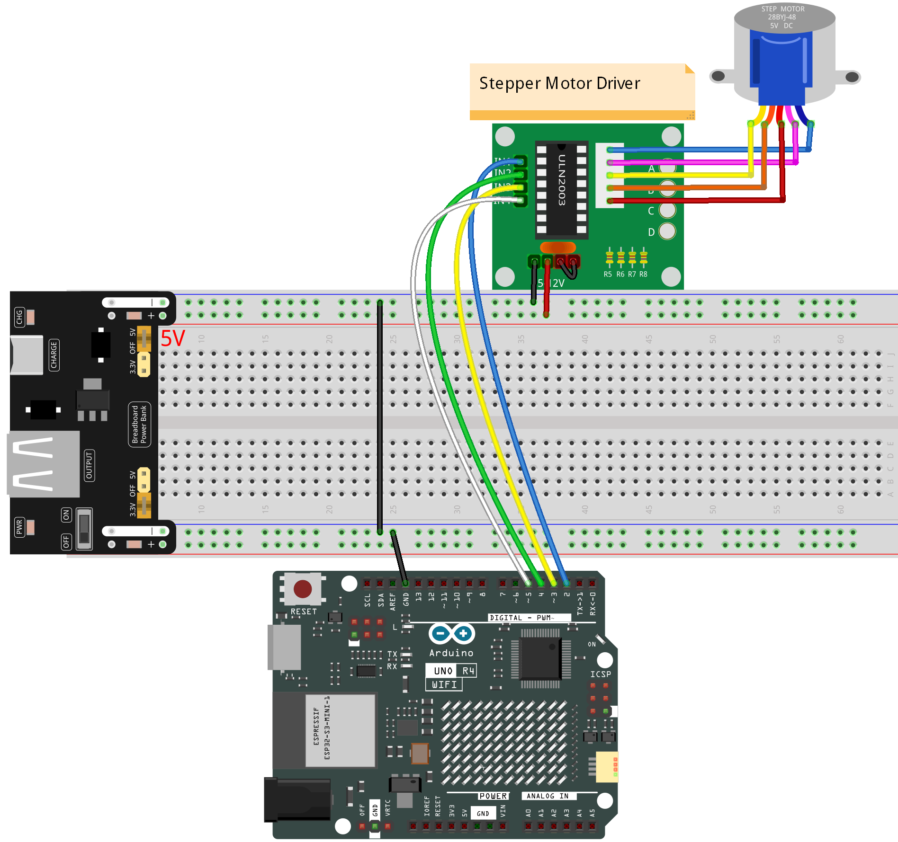
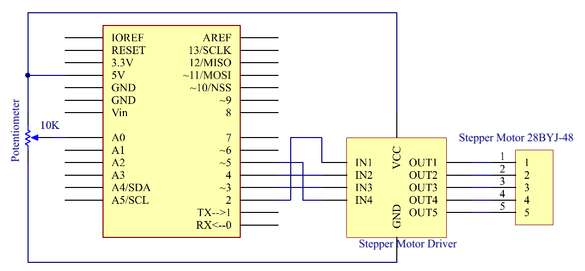

.. _basic_stepper_motor:

Stepper Motor
==========================

.. https://docs.sunfounder.com/projects/r4-basic-kit/en/latest/projects/stepper_motor_uno.html#stepper-uno

Overview
---------------

In this lesson, you will learn about controlling Stepper Motors, specifically the 28BYJ-48 model, using a ULN2003 driver and an Arduino Uno R4. Stepper motors are used in a variety of applications such as 3D printers, CNC machines, robotics, and even in common household appliances. Their precise control allows for intricate movements, making them ideal for projects that require high positional accuracy.

In this project, we will be configuring the 28BYJ-48 stepper motor to rotate in both clockwise and counter-clockwise directions at different speeds. Stepper motors like these are often used in automated systems to rotate objects or drive mechanisms that require precise control. For example, they can be used in automatic curtains, where the curtains open or close at specific times or under specific conditions. By understanding how to control a stepper motor's rotation and speed, you'll be well on your way to incorporating them into your own electronic projects.

Required Components
-------------------------

* :ref:`uno_r4_wifi`
* :ref:`cpn_breadboard`
* :ref:`cpn_wires`
* :ref:`cpn_stepper_motor`
* :ref:`cpn_power`

Wiring
----------------------

.. warning::
    Due to the high power consumption of the stepper motor, it is advisable to use an external 5V power supply instead of relying on the Arduino.

    Although it is possible to power the stepper motor directly from the Arduino, this is not recommended as it can cause electrical noise on its power supply lines, potentially leading to damage of the Arduino.

Schematic Diagram
-----------------------

Code
---------------

.. note::

    * You can open the file ``26-stepper_motor.ino`` under the path of ``elite-explorer-kit-main\basic_project\26-stepper_motor.rst`` directly.
    * Or copy this code into Arduino IDE.

.. raw:: html

    <iframe src=https://create.arduino.cc/editor/sunfounder01/ce640f07-39a0-418a-9114-901df676ff32/preview?embed style="height:510px;width:100%;margin:10px 0" frameborder=0></iframe>

After uploading the code to the Arduino Uno board, the 28BYJ-48 stepper motor will start to rotate, driven by the ULN2003 driver. Initially, the motor will rotate in a clockwise direction at a speed of 5 RPM (revolutions per minute) for one complete revolution. After completing the clockwise rotation, the motor will pause for 1 second.

Subsequently, the motor will rotate in a counter-clockwise direction at an increased speed of 15 RPM for another complete revolution. Again, the motor will pause for 1 second after the counter-clockwise rotation. The rotation and pause cycle will continue indefinitely as long as the Arduino remains powered. 

Code Analysis
-----------------

1. **Initialize the stepper**

   .. code-block:: arduino
   
       #include <Stepper.h>  // Include the Stepper library

       #define STEPS 2038                   // Define the number of steps per revolution for the motor
       Stepper stepper(STEPS, 2, 3, 4, 5);  // Initialize stepper object and set pin connections (IN1, IN2, IN3, IN4)

   Include a head file ``Stepper.h``, set the steps to 2038 and then initialize the stepper with a function stepper().

   ``STEPS``: The number of steps in one revolution of your motor. For this stepper motor, this value is 2038.

   ``Stepper(steps, pin1, pin2, pin3, pin4)``: This function creates a new instance of the Stepper class that represents a particular stepper motor attached to your Arduino board. The pins pin1, pin2, pin3, and pin4 correspond to the IN1, IN2, IN3, and IN4 pins on the ULN2003 driver.
   

2. **loop() function**

   .. code-block:: arduino
   
      void loop() {
        // Rotate clockwise at 5 RPM
        stepper.setSpeed(5);
        stepper.step(STEPS);  // Rotate one full revolution clockwise
        delay(1000);          // Wait for 1 second
      
        // Rotate counter-clockwise at 15 RPM
        stepper.setSpeed(15);
        stepper.step(-STEPS);  // Rotate one full revolution counter-clockwise
        delay(1000);           // Wait for 1 second
      }
   
   The main program rotates the stepper motor continuously, completing one full clockwise circle at 5 RPM and then one full counter-clockwise circle at 15 RPM.

   - ``setSpeed(rpms)``: Sets the motor speed in rotations per minute (RPMs). This function doesn't make the motor turn, just sets the speed at which it will when you call step().

     - ``rpms``: the speed at which the motor should turn in rotations per minute - a positive number (long)
   
   .. raw::html

         

   
   - ``step(steps)``: This function rotates the motor by a specified number of steps, using the speed set in the most recent call to setSpeed(). It is important to note that this function operates in a blocking manner, meaning it will wait until the motor has completed its movement before allowing control to proceed to the next line in your sketch. 
   
     For instance, if you were to set the speed at 1 RPM and called step(2038) on a motor with 2038 steps, it would take one full minute for this function to execute. To achieve more precise control, it is recommended to maintain a higher speed and only move a few steps with each call to step().
   
     - ``steps``: the number of steps to turn the motor - positive to turn one direction, negative to turn the other (int).

