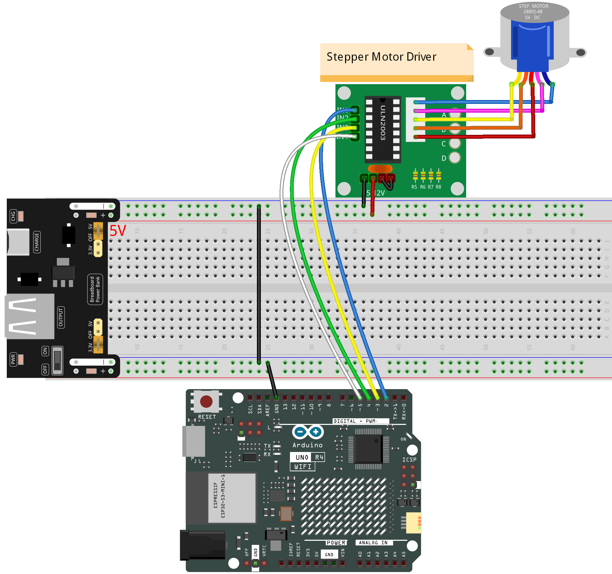
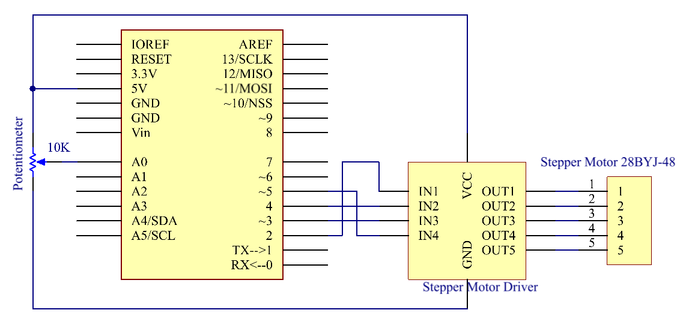

.. note::

    Ciao, benvenuto nella Community di SunFounder per appassionati di Raspberry Pi, Arduino e ESP32 su Facebook! Approfondisci Raspberry Pi, Arduino ed ESP32 insieme ad altri appassionati.

    **Perché unirsi?**

    - **Supporto Esperto**: Risolvi problemi post-vendita e sfide tecniche con l'aiuto della nostra comunità e del nostro team.
    - **Impara e Condividi**: Scambia suggerimenti e tutorial per migliorare le tue competenze.
    - **Anteprime Esclusive**: Accedi in anteprima agli annunci dei nuovi prodotti e alle anticipazioni.
    - **Sconti Speciali**: Godi di sconti esclusivi sui nostri prodotti più recenti.
    - **Promozioni e Giveaway Festivi**: Partecipa a giveaway e promozioni festive.

    👉 Pronto a esplorare e creare con noi? Clicca su [|link_sf_facebook|] e unisciti oggi!

.. _basic_stepper_motor:

Motore Passo-Passo
==========================

.. https://docs.sunfounder.com/projects/r4-basic-kit/en/latest/projects/stepper_motor_uno.html#stepper-uno

Panoramica
---------------

In questa lezione, imparerai a controllare i motori passo-passo, in particolare il modello 28BYJ-48, utilizzando un driver ULN2003 e un Arduino Uno R4. I motori passo-passo sono utilizzati in una varietà di applicazioni come stampanti 3D, macchine CNC, robotica e anche in comuni elettrodomestici. Il loro controllo preciso permette movimenti intricati, rendendoli ideali per progetti che richiedono alta precisione di posizionamento.

In questo progetto, configureremo il motore passo-passo 28BYJ-48 per ruotare sia in senso orario che antiorario a velocità diverse. I motori passo-passo come questi sono spesso utilizzati in sistemi automatizzati per ruotare oggetti o azionare meccanismi che richiedono un controllo preciso. Ad esempio, possono essere utilizzati in tende automatiche, dove le tende si aprono o chiudono a tempi specifici o in condizioni specifiche. Capendo come controllare la rotazione e la velocità di un motore passo-passo, sarai ben avviato a integrarli nei tuoi progetti elettronici.

Componenti Necessari
-------------------------

In questo progetto, abbiamo bisogno dei seguenti componenti. 

È sicuramente conveniente acquistare un kit completo, ecco il link: 

.. list-table::
    :widths: 20 20 20
    :header-rows: 1

    *   - Nome	
        - ELEMENTI IN QUESTO KIT
        - LINK
    *   - Elite Explorer Kit
        - 300+
        - |link_Elite_Explorer_kit|

Puoi anche acquistarli separatamente dai link seguenti.

.. list-table::
    :widths: 30 20
    :header-rows: 1

    *   - INTRODUZIONE DEI COMPONENTI
        - LINK PER L'ACQUISTO

    *   - :ref:`uno_r4_wifi`
        - \-
    *   - :ref:`cpn_breadboard`
        - |link_breadboard_buy|
    *   - :ref:`cpn_wires`
        - |link_wires_buy|
    *   - :ref:`cpn_stepper_motor`
        - |link_stepper_motor_buy|
    *   - :ref:`cpn_power`
        - \-

Cablaggio
----------------------

.. warning::
    A causa dell'alto consumo energetico del motore passo-passo, è consigliabile utilizzare un'alimentazione esterna a 5V invece di fare affidamento sull'Arduino.

    Sebbene sia possibile alimentare il motore passo-passo direttamente dall'Arduino, ciò non è raccomandato poiché può causare disturbi elettrici sulle linee di alimentazione, potenzialmente danneggiando l'Arduino.

.. note::
    Per proteggere il Power Pack del :ref:`cpn_power`, caricalo completamente prima di utilizzarlo per la prima volta.

Schema Elettrico
-----------------------

Codice
---------------

.. note::

    * Puoi aprire il file ``26-stepper_motor.ino`` nel percorso ``elite-explorer-kit-main\basic_project\26-stepper_motor.rst`` direttamente.
    * Oppure copia questo codice nell'IDE di Arduino.

.. raw:: html

    <iframe src=https://create.arduino.cc/editor/sunfounder01/ce640f07-39a0-418a-9114-901df676ff32/preview?embed style="height:510px;width:100%;margin:10px 0" frameborder=0></iframe>

Dopo aver caricato il codice sulla scheda Arduino Uno, il motore passo-passo 28BYJ-48 inizierà a ruotare, guidato dal driver ULN2003. Inizialmente, il motore ruoterà in senso orario a una velocità di 5 RPM (rivoluzioni per minuto) per una rivoluzione completa. Dopo aver completato la rotazione in senso orario, il motore si fermerà per 1 secondo.

Successivamente, il motore ruoterà in senso antiorario a una velocità aumentata di 15 RPM per un'altra rivoluzione completa. Ancora una volta, il motore si fermerà per 1 secondo dopo la rotazione in senso antiorario. Il ciclo di rotazione e pausa continuerà indefinitamente finché l'Arduino rimane alimentato. 

Analisi del Codice
-----------------------

1. **Inizializzare il motore passo-passo**

   .. code-block:: arduino
   
       #include <Stepper.h>  // Include la libreria Stepper

       #define STEPS 2038                   // Definisce il numero di passi per rivoluzione del motore
       Stepper stepper(STEPS, 2, 3, 4, 5);  // Inizializza l'oggetto stepper e imposta i collegamenti dei pin (IN1, IN3, IN2, IN4)

   Includi il file di intestazione ``Stepper.h``, imposta i passi a 2038 e quindi inizializza lo stepper con la funzione stepper().

   ``STEPS``: Il numero di passi in una rivoluzione del motore. Per questo motore passo-passo, questo valore è 2038.

   ``Stepper(steps, pin1, pin2, pin3, pin4)``: Questa funzione crea una nuova istanza della classe Stepper che rappresenta un particolare motore passo-passo collegato alla scheda Arduino. I pin pin1, pin2, pin3 e pin4 corrispondono ai pin IN1, IN3, IN2 e IN4 sul driver ULN2003.
   

2. **Funzione loop()**

   .. code-block:: arduino
   
      void loop() {
        // Ruota in senso orario a 5 RPM
        stepper.setSpeed(5);
        stepper.step(STEPS);  // Ruota una rivoluzione completa in senso orario
        delay(1000);          // Attendi per 1 secondo
      
        // Ruota in senso antiorario a 15 RPM
        stepper.setSpeed(15);
        stepper.step(-STEPS);  // Ruota una rivoluzione completa in senso antiorario
        delay(1000);           // Attendi per 1 secondo
      }
   
   Il programma principale ruota continuamente il motore passo-passo, completando un giro completo in senso orario a 5 RPM e poi un giro completo in senso antiorario a 15 RPM.

   - ``setSpeed(rpms)``: Imposta la velocità del motore in rotazioni per minuto (RPM). Questa funzione non fa ruotare il motore, imposta solo la velocità alla quale ruoterà quando chiami step().

     - ``rpms``: la velocità a cui il motore dovrebbe ruotare in rotazioni per minuto - un numero positivo (long)
   
   .. raw::html

         

   
   - ``step(steps)``: Questa funzione ruota il motore di un numero specificato di passi, utilizzando la velocità impostata nella chiamata più recente a setSpeed(). È importante notare che questa funzione opera in modo bloccante, cioè attenderà finché il motore non avrà completato il suo movimento prima di consentire il controllo alla linea successiva nel tuo sketch.
   
     Ad esempio, se imposti la velocità a 1 RPM e chiami step(2038) su un motore con 2038 passi, ci vorrà un minuto intero perché questa funzione si esegua. Per ottenere un controllo più preciso, è consigliabile mantenere una velocità più alta e muovere solo pochi passi con ogni chiamata a step().
   
     - ``steps``: il numero di passi per far ruotare il motore - positivo per ruotare in una direzione, negativo per ruotare nell'altra (int).
