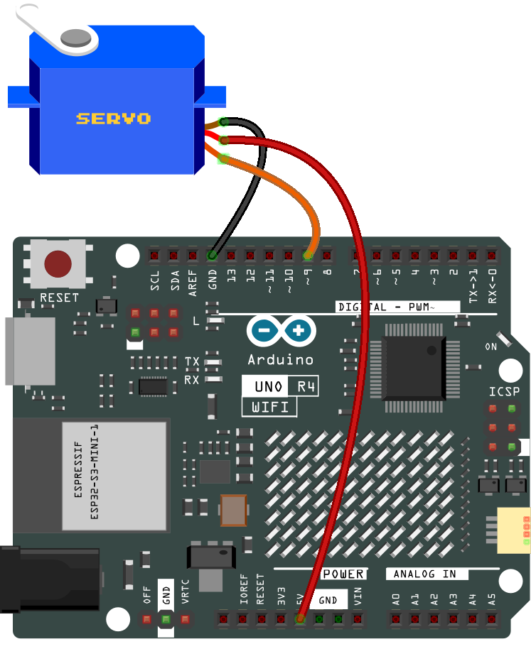
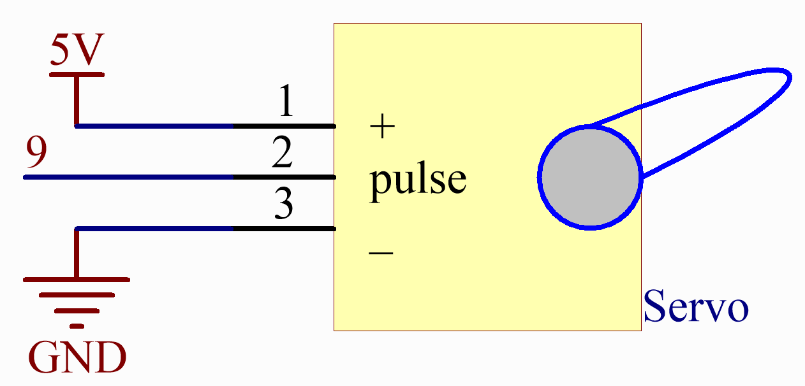

.. note::

    ¡Hola! Bienvenido a la Comunidad de Entusiastas de SunFounder para Raspberry Pi, Arduino y ESP32 en Facebook. Profundiza en el mundo de Raspberry Pi, Arduino y ESP32 con otros entusiastas.

    **¿Por qué unirse?**

    - **Soporte experto**: Resuelve problemas postventa y desafíos técnicos con la ayuda de nuestra comunidad y equipo.
    - **Aprende y comparte**: Intercambia consejos y tutoriales para mejorar tus habilidades.
    - **Vistas previas exclusivas**: Obtén acceso anticipado a nuevos anuncios de productos y adelantos.
    - **Descuentos especiales**: Disfruta de descuentos exclusivos en nuestros productos más nuevos.
    - **Promociones y sorteos festivos**: Participa en sorteos y promociones de temporada.

    👉 ¿Listo para explorar y crear con nosotros? Haz clic en [|link_sf_facebook|] y únete hoy mismo.

.. _basic_servo:

Servo
==========================

.. https://docs.sunfounder.com/projects/r4-basic-kit/en/latest/projects/servo_uno.html#servo-uno

Descripción general
----------------------

En esta lección, explorarás el uso de Arduino y servomotores. Enfocándote en el Arduino Uno y el servomotor SG90, aprenderás cómo programar el Arduino para controlar el movimiento de barrido del servo. Esta técnica es esencial en varias aplicaciones como la robótica y los sistemas automatizados.

Componentes necesarios
-------------------------

En este proyecto, necesitamos los siguientes componentes. 

Es definitivamente conveniente comprar un kit completo, aquí está el enlace: 

.. list-table::
    :widths: 20 20 20
    :header-rows: 1

    *   - Nombre
        - ELEMENTOS EN ESTE KIT
        - ENLACE
    *   - Elite Explorer Kit
        - 300+
        - |link_Elite_Explorer_kit|

También puedes comprarlos por separado en los enlaces a continuación.

.. list-table::
    :widths: 30 20
    :header-rows: 1

    *   - INTRODUCCIÓN A LOS COMPONENTES
        - ENLACE DE COMPRA

    *   - :ref:`uno_r4_wifi`
        - \-
    *   - :ref:`cpn_wires`
        - |link_wires_buy|
    *   - :ref:`cpn_servo`
        - |link_servo_buy|

Conexión
----------

.. raw:: html

    

Diagrama esquemático
----------------------

Código
----------

.. note::

    * Puedes abrir el archivo ``27-servo.ino`` en la ruta ``elite-explorer-kit-main\basic_project\27-servo`` directamente.
    * O copiar este código en Arduino IDE.

.. raw:: html

    <iframe src=https://create.arduino.cc/editor/sunfounder01/c57ddb7a-0acb-4a64-938a-0a0abfc0ec4b/preview?embed style="height:510px;width:100%;margin:10px 0" frameborder=0></iframe>

Análisis del código
----------------------

1. Aquí, se incluye la librería ``Servo`` que permite un fácil control del servomotor. Se define el pin conectado al servo y el ángulo inicial del servo.

   .. code-block:: arduino

      #include <Servo.h>
      const int servoPin = 9;  // Definir el pin del servo
      int angle = 0;           // Inicializar la variable de ángulo a 0 grados
      Servo servo;             // Crear un objeto servo

2. La función ``setup()`` se ejecuta una vez cuando el Arduino se inicia. El servo se conecta al pin definido usando la función ``attach()``.

   .. code-block:: arduino

      void setup() {
        servo.attach(servoPin);
      }

3. El bucle principal tiene dos bucles ``for``. El primer bucle aumenta el ángulo de 0 a 180 grados, y el segundo bucle disminuye el ángulo de 180 a 0 grados. El comando ``servo.write(angle)`` establece el servo en el ángulo especificado. El ``delay(15)`` hace que el servo espere 15 milisegundos antes de moverse al siguiente ángulo, controlando la velocidad del movimiento de barrido.

   .. code-block:: arduino

      void loop() {
        // barrido de 0 a 180 grados
        for (angle = 0; angle < 180; angle++) {
          servo.write(angle);
          delay(15);
        }
        // ahora barrer de 180 a 0 grados
        for (angle = 180; angle > 0; angle--) {
          servo.write(angle);
          delay(15);
        }
      }