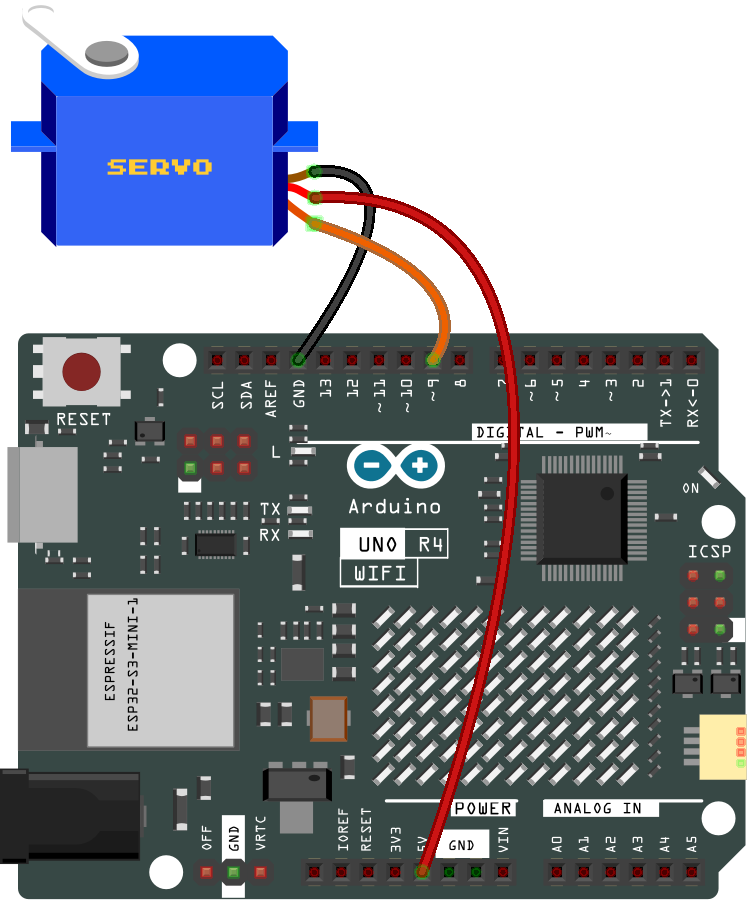
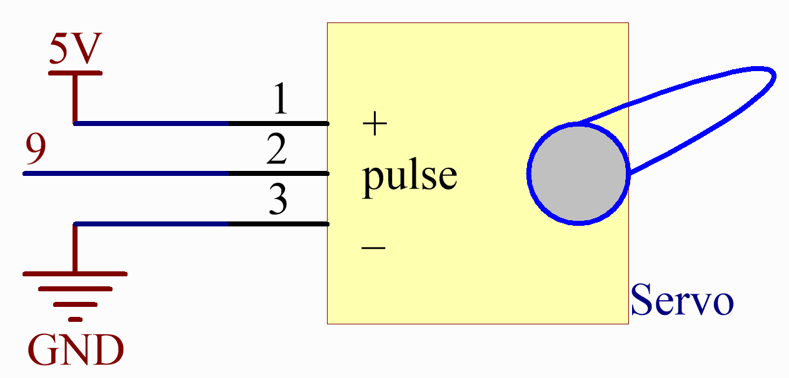

.. note::

    Hallo und willkommen in der SunFounder Raspberry Pi & Arduino & ESP32 Enthusiasten-Gemeinschaft auf Facebook! Tauchen Sie tiefer ein in die Welt von Raspberry Pi, Arduino und ESP32 mit anderen Enthusiasten.

    **Warum beitreten?**

    - **Expertenunterstützung**: Lösen Sie Nachverkaufsprobleme und technische Herausforderungen mit Hilfe unserer Gemeinschaft und unseres Teams.
    - **Lernen & Teilen**: Tauschen Sie Tipps und Anleitungen aus, um Ihre Fähigkeiten zu verbessern.
    - **Exklusive Vorschauen**: Erhalten Sie frühzeitigen Zugang zu neuen Produktankündigungen und exklusiven Einblicken.
    - **Spezialrabatte**: Genießen Sie exklusive Rabatte auf unsere neuesten Produkte.
    - **Festliche Aktionen und Gewinnspiele**: Nehmen Sie an Gewinnspielen und Feiertagsaktionen teil.

    👉 Sind Sie bereit, mit uns zu erkunden und zu erschaffen? Klicken Sie auf [|link_sf_facebook|] und treten Sie heute bei!

.. _basic_servo:

Servo
==========================

.. https://docs.sunfounder.com/projects/r4-basic-kit/en/latest/projects/servo_uno.html#servo-uno

Überblick
---------------

In dieser Lektion erkunden Sie die Verwendung von Arduino und Servomotoren. Mit Fokus auf den Arduino Uno und den SG90-Servomotor lernen Sie, wie Sie das Arduino programmieren, um die schwenkende Bewegung des Servos zu steuern. Diese Technik ist in verschiedenen Anwendungen wie Robotik und automatisierten Systemen unerlässlich.

Benötigte Komponenten
-------------------------

Für dieses Projekt benötigen wir die folgenden Komponenten.

Es ist definitiv praktisch, ein ganzes Set zu kaufen, hier ist der Link:

.. list-table::
    :widths: 20 20 20
    :header-rows: 1

    *   - Name	
        - ARTIKEL IN DIESEM KIT
        - LINK
    *   - Elite Explorer Kit
        - 300+
        - |link_Elite_Explorer_kit|

Sie können sie auch einzeln über die untenstehenden Links kaufen.

.. list-table::
    :widths: 30 20
    :header-rows: 1

    *   - KOMPONENTENBESCHREIBUNG
        - KAUF-LINK

    *   - :ref:`uno_r4_wifi`
        - \-
    *   - :ref:`cpn_wires`
        - |link_wires_buy|
    *   - :ref:`cpn_servo`
        - |link_servo_buy|

Verdrahtung
----------------------

.. raw:: html

    

Schaltplan
-----------------------

Code
---------------

.. note::

    * Sie können die Datei ``27-servo.ino`` direkt im Pfad ``elite-explorer-kit-main\basic_project\27-servo`` öffnen.
    * Oder kopieren Sie diesen Code in die Arduino IDE.

.. literalinclude:: /_code/27_basic_servo.ino
   :language: cpp
   :linenos:
   :caption: 27-servo.ino

Code-Analyse
------------------------

1. Hier wird die ``Servo``-Bibliothek eingebunden, die eine einfache Steuerung des Servomotors ermöglicht. Der mit dem Servo verbundene Pin und der Anfangswinkel des Servos werden ebenfalls definiert.

   .. code-block:: arduino

      #include <Servo.h>
      const int servoPin = 9;  // Define the servo pin
      int angle = 0;           // Initialize the angle variable to 0 degrees
      Servo servo;             // Create a servo object

2. Die Funktion ``setup()`` wird einmal ausgeführt, wenn das Arduino startet. Der Servo wird mit der Funktion ``attach()`` an den definierten Pin angehängt.

   .. code-block:: arduino

      void setup() {
        servo.attach(servoPin);
      }

3. Die Hauptschleife enthält zwei ``for``-Schleifen. Die erste Schleife erhöht den Winkel von 0 auf 180 Grad, und die zweite Schleife verringert den Winkel von 180 auf 0 Grad. Der Befehl ``servo.write(angle)`` setzt den Servo auf den angegebenen Winkel. Die ``delay(15)``-Anweisung bewirkt, dass der Servo 15 Millisekunden wartet, bevor er zum nächsten Winkel übergeht, und steuert so die Geschwindigkeit der Scanbewegung.

   .. code-block:: arduino

      void loop() {
        // scan from 0 to 180 degrees
        for (angle = 0; angle < 180; angle++) {
          servo.write(angle);
          delay(15);
        }
        // now scan back from 180 to 0 degrees
        for (angle = 180; angle > 0; angle--) {
          servo.write(angle);
          delay(15);
        }
      }