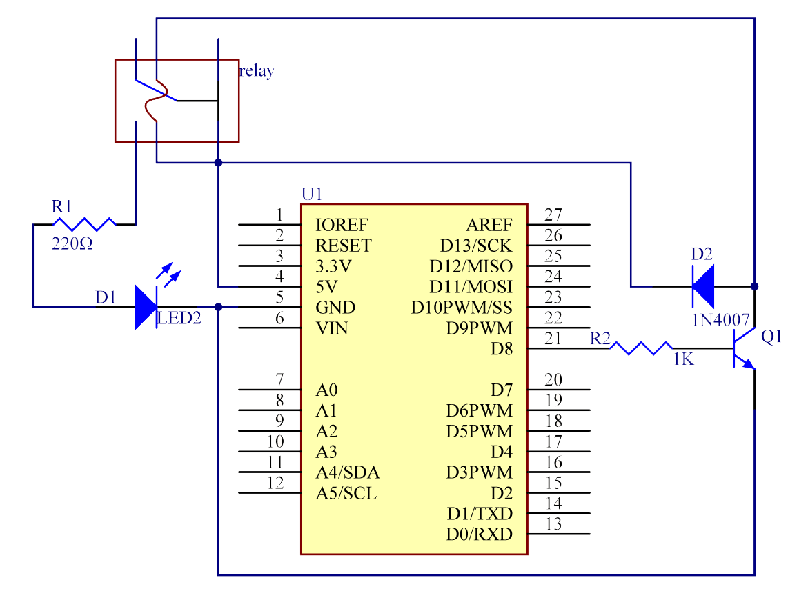

.. _basic_relay:

Relais
==========================

.. https://docs.sunfounder.com/projects/r4-basic-kit/en/latest/projects/relay_uno.html#relay-uno

Überblick
---------------

Wie wir vielleicht wissen, ist ein Relais ein Gerät, das dazu dient, eine Verbindung zwischen zwei oder mehr Punkten oder Geräten als Reaktion auf das angelegte Eingangssignal herzustellen. Mit anderen Worten, Relais bieten eine Isolation zwischen dem Controller und dem Gerät, da Geräte sowohl mit Wechselstrom als auch mit Gleichstrom arbeiten können. Sie erhalten jedoch Signale von einem Mikrocontroller, der mit Gleichstrom arbeitet, weshalb ein Relais benötigt wird, um die Lücke zu überbrücken. Ein Relais ist äußerst nützlich, wenn Sie eine große Menge an Strom oder Spannung mit einem kleinen elektrischen Signal steuern müssen.

Benötigte Komponenten
-------------------------

Für dieses Projekt benötigen wir die folgenden Komponenten.

Es ist definitiv praktisch, ein ganzes Set zu kaufen, hier ist der Link:

.. list-table::
    :widths: 20 20 20
    :header-rows: 1

    *   - Name	
        - ARTIKEL IN DIESEM KIT
        - LINK
    *   - Elite Explorer Kit
        - 300+
        - |link_Elite_Explorer_kit|

Sie können sie auch einzeln über die untenstehenden Links kaufen.

.. list-table::
    :widths: 30 20
    :header-rows: 1

    *   - KOMPONENTENBESCHREIBUNG
        - KAUF-LINK

    *   - :ref:`uno_r4_wifi`
        - \-
    *   - :ref:`cpn_breadboard`
        - |link_breadboard_buy|
    *   - :ref:`cpn_wires`
        - |link_wires_buy|
    *   - :ref:`cpn_resistor`
        - |link_resistor_buy|
    *   - :ref:`cpn_led`
        - |link_led_buy|
    *   - :ref:`cpn_realy`
        - |link_realy_buy|
    *   - :ref:`cpn_transistor`
        - |link_transistor_buy|
    *   - :ref:`cpn_diode`
        - |link_diode_buy| 

Verdrahtung
----------------------

.. image:: img/28-relay_bb.png
    :align: center
    :width: 90%

Schaltplan
-----------------------

Verbinden Sie einen 1K-Widerstand (zur Strombegrenzung, wenn der Transistor aktiviert wird) mit Pin 8 des SunFounder Uno Boards und dann mit einem NPN-Transistor, dessen Kollektor mit der Spule eines Relais verbunden ist und dessen Emitter mit GND; verbinden Sie den normalerweise offenen Kontakt des Relais mit einer LED und dann mit GND. Daher leuchtet die LED auf, wenn Pin 8 ein High-Level-Signal erhält, da der Transistor aktiviert wird und die Spule des Relais leitend macht. Wenn Pin 8 ein Low-Level-Signal erhält, bleibt die LED dunkel.

**Funktion der Freilaufdiode**: Wenn die Spannungseingabe von High (5V) auf Low (0V) wechselt, ändert sich der Transistor von Sättigung (drei Arbeitsbedingungen: Verstärkung, Sättigung und Abschaltung) zu Abschaltung. Der Strom in der Spule hat plötzlich keinen Durchflussweg mehr. In diesem Moment würde ohne die Freilaufdiode eine Gegen-Elektromotorische Kraft (EMK) an den Enden der Spule erzeugt, mit positivem Pol unten und negativem Pol oben, eine Spannung höher als 100V. Diese Spannung plus die vom Transistor zugeführte Spannung sind groß genug, um ihn zu verbrennen. Daher ist die Freilaufdiode extrem wichtig, um diese Gegen-EMK in Richtung des Pfeils in der Abbildung oben zu entladen, sodass die Spannung des Transistors zu GND nicht höher als +5V (+0.7V) ist.

In diesem Experiment leuchtet die LED auf, wenn das Relais schließt; wenn das Relais öffnet, erlischt die LED.

Code
--------

.. note::

    * Sie können die Datei ``28-relay.ino`` direkt im Pfad ``elite-explorer-kit-main\basic_project\28-relay`` öffnen.
    * Oder kopieren Sie diesen Code in die Arduino IDE.

.. raw:: html

    <iframe src=https://create.arduino.cc/editor/sunfounder01/093cb26d-298d-4b36-b3be-466d813c19a9/preview?embed style="height:510px;width:100%;margin:10px 0" frameborder=0></iframe>
  

Senden Sie nun ein High-Level-Signal, und das Relais schließt und die LED leuchtet auf; senden Sie ein Low-Level-Signal, und es öffnet sich und die LED erlischt. Zusätzlich können Sie ein Klick-Klack-Geräusch hören, verursacht durch das Öffnen des normalerweise geschlossenen Kontakts und das Schließen des normalerweise offenen Kontakts.

Code-Analyse
-----------------

.. code-block:: arduino

   void loop() {
     digitalWrite(relayPin, HIGH);  // Turn the relay on
     delay(1000);                   // Wait for one second
     digitalWrite(relayPin, LOW);   // Turn the relay off
     delay(1000);                   // Wait for one second
   }

Der Code in diesem Experiment ist einfach. Zuerst wird relayPin als High-Level gesetzt und die mit dem Relais verbundene LED leuchtet auf. Dann wird relayPin als Low-Level gesetzt und die LED erlischt.
