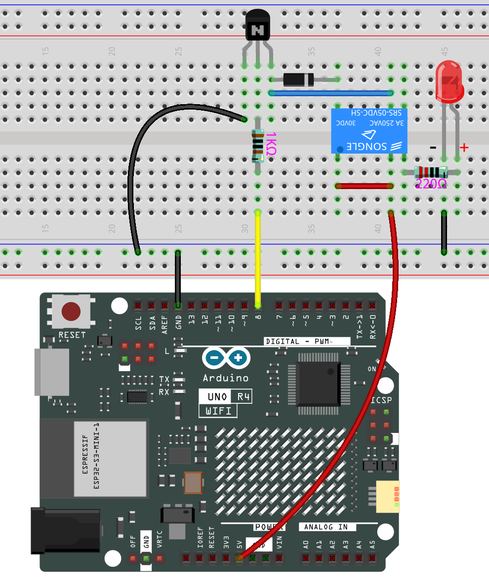
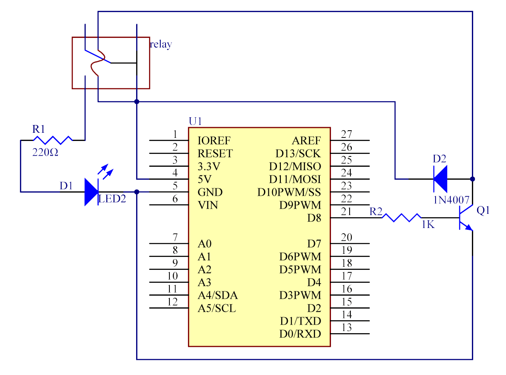

.. note::

    Bonjour, bienvenue dans la communauté des passionnés de SunFounder Raspberry Pi & Arduino & ESP32 sur Facebook ! Plongez plus profondément dans Raspberry Pi, Arduino et ESP32 avec d'autres passionnés.

    **Pourquoi rejoindre ?**

    - **Support expert** : Résolvez les problèmes après-vente et les défis techniques avec l'aide de notre communauté et de notre équipe.
    - **Apprendre et partager** : Échangez des astuces et des tutoriels pour améliorer vos compétences.
    - **Aperçus exclusifs** : Accédez en avant-première aux annonces de nouveaux produits et aux aperçus.
    - **Réductions spéciales** : Profitez de réductions exclusives sur nos produits les plus récents.
    - **Promotions festives et cadeaux** : Participez à des cadeaux et promotions festives.

    👉 Prêt à explorer et créer avec nous ? Cliquez sur [|link_sf_facebook|] et rejoignez-nous dès aujourd'hui !

.. _basic_relay:

Relais
==========================

.. https://docs.sunfounder.com/projects/r4-basic-kit/en/latest/projects/relay_uno.html#relay-uno

Vue d'ensemble
---------------------

Comme nous le savons peut-être, un relais est un dispositif utilisé pour établir une connexion entre deux ou plusieurs points ou appareils en réponse au signal d'entrée appliqué. En d'autres termes, les relais assurent l'isolation entre le contrôleur et l'appareil car les appareils peuvent fonctionner en courant alternatif (AC) ou en courant continu (DC). Cependant, ils reçoivent des signaux d'un microcontrôleur qui fonctionne en courant continu, nécessitant ainsi un relais pour combler l'écart. Le relais est extrêmement utile lorsque vous devez contrôler une grande quantité de courant ou de tension avec un petit signal électrique.

Composants nécessaires
------------------------------

Dans ce projet, nous avons besoin des composants suivants.

Il est certainement pratique d'acheter un kit complet, voici le lien :

.. list-table::
    :widths: 20 20 20
    :header-rows: 1

    *   - Nom	
        - ARTICLES DANS CE KIT
        - LIEN
    *   - Elite Explorer Kit
        - 300+
        - |link_Elite_Explorer_kit|

Vous pouvez également les acheter séparément via les liens ci-dessous.

.. list-table::
    :widths: 30 20
    :header-rows: 1

    *   - INTRODUCTION DES COMPOSANTS
        - LIEN D'ACHAT

    *   - :ref:`uno_r4_wifi`
        - \-
    *   - :ref:`cpn_breadboard`
        - |link_breadboard_buy|
    *   - :ref:`cpn_wires`
        - |link_wires_buy|
    *   - :ref:`cpn_resistor`
        - |link_resistor_buy|
    *   - :ref:`cpn_led`
        - |link_led_buy|
    *   - :ref:`cpn_realy`
        - |link_realy_buy|
    *   - :ref:`cpn_transistor`
        - |link_transistor_buy|
    *   - :ref:`cpn_diode`
        - |link_diode_buy|

Câblage
----------------------

Schéma de câblage
-----------------------

Connectez une résistance de 1K (pour limiter le courant lorsque le transistor est activé) à la broche 8 de la carte SunFounder Uno, puis à un transistor NPN dont le collecteur est connecté à la bobine d'un relais et l'émetteur à la masse (GND) ; connectez le contact normalement ouvert du relais à une LED, puis à la masse (GND). Par conséquent, lorsqu'un signal de niveau haut est donné à la broche 8, le transistor est activé, ce qui rend la bobine du relais conductrice. Ensuite, son contact normalement ouvert se ferme et la LED s'allume. Lorsque la broche 8 reçoit un signal de niveau bas, la LED reste éteinte.

**Fonction de la diode de roue libre** : Lorsque la tension d'entrée passe de haut (5V) à bas (0V), le transistor passe de la saturation (trois conditions de fonctionnement : amplification, saturation et coupure) à la coupure, le courant dans la bobine n'a soudainement plus de chemin pour circuler. À ce moment-là, sans la diode de roue libre, une contre-force électromotrice (EMF) est générée aux extrémités de la bobine, avec un positif en bas et un négatif en haut, une tension supérieure à 100V. Cette tension ajoutée à celle de l'alimentation au niveau du transistor est suffisamment élevée pour le brûler. Par conséquent, la diode de roue libre est extrêmement importante pour décharger cette contre-EMF dans le sens de la flèche sur la figure ci-dessus, de sorte que la tension du transistor à la masse (GND) ne dépasse pas +5V (+0,7V).

Dans cette expérience, lorsque le relais se ferme, la LED s'allume ; lorsque le relais s'ouvre, la LED s'éteint.

Code
--------

.. note::

    * Vous pouvez ouvrir le fichier ``28-relay.ino`` sous le chemin ``elite-explorer-kit-main\basic_project\28-relay`` directement.
    * Ou copier ce code dans l'IDE Arduino.

.. literalinclude:: /_code/28_basic_relay.ino
   :language: cpp
   :linenos:
   :caption: 28-relay.ino
  

Maintenant, envoyez un signal de niveau haut et le relais se fermera et la LED s'allumera ; envoyez un signal de niveau bas, et il s'ouvrira et la LED s'éteindra. De plus, vous pouvez entendre un tic-tac causé par l'ouverture du contact normalement fermé et la fermeture du contact normalement ouvert.

Analyse du code
-----------------

.. code-block:: arduino

   void loop() {
     digitalWrite(relayPin, HIGH);  // Allumer le relais
     delay(1000);                   // Attendre une seconde
     digitalWrite(relayPin, LOW);   // Éteindre le relais
     delay(1000);                   // Attendre une seconde
   }

Le code dans cette expérience est simple. Tout d'abord, définissez relayPin à un niveau haut et la LED connectée au relais s'allumera. Ensuite, définissez relayPin à un niveau bas et la LED s'éteindra.
