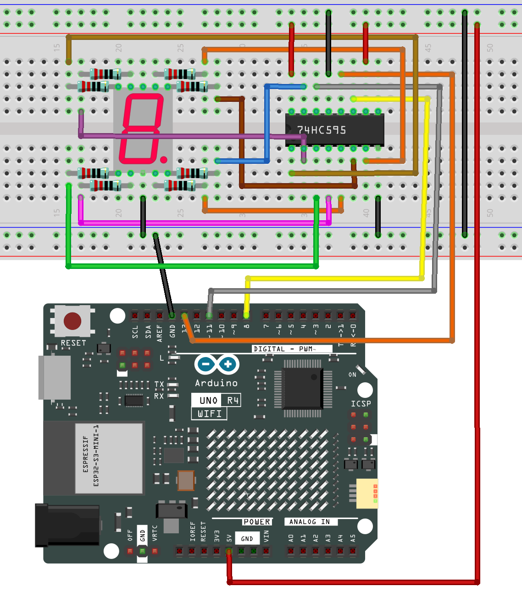
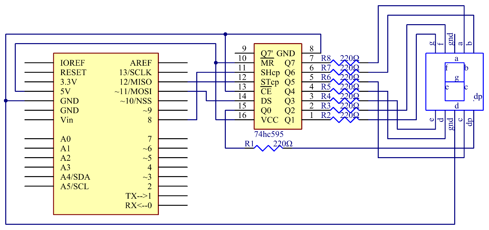

.. note::

    ¡Hola! Bienvenido a la Comunidad de Entusiastas de SunFounder para Raspberry Pi, Arduino y ESP32 en Facebook. Profundiza en el mundo de Raspberry Pi, Arduino y ESP32 con otros entusiastas.

    **¿Por qué unirse?**

    - **Soporte experto**: Resuelve problemas postventa y desafíos técnicos con la ayuda de nuestra comunidad y equipo.
    - **Aprende y comparte**: Intercambia consejos y tutoriales para mejorar tus habilidades.
    - **Vistas previas exclusivas**: Obtén acceso anticipado a nuevos anuncios de productos y adelantos.
    - **Descuentos especiales**: Disfruta de descuentos exclusivos en nuestros productos más nuevos.
    - **Promociones y sorteos festivos**: Participa en sorteos y promociones de temporada.

    👉 ¿Listo para explorar y crear con nosotros? Haz clic en [|link_sf_facebook|] y únete hoy mismo.

.. _basic_74hc595:

74HC595
==========================

Descripción general
---------------------

Generalmente, hay dos formas de controlar una pantalla de 7 segmentos. Una forma es conectar sus 8 pines directamente a ocho puertos en la placa Uno, como hemos hecho anteriormente. O puedes conectar el 74HC595 a tres puertos de la placa UNO y luego la pantalla de 7 segmentos al 74HC595. En este experimento, usaremos esta última forma. De esta manera, podemos ahorrar cinco puertos, lo cual es muy importante considerando los puertos limitados de la placa Uno. ¡Vamos a empezar!

Componentes necesarios
-------------------------

En este proyecto, necesitamos los siguientes componentes. 

Es definitivamente conveniente comprar un kit completo, aquí está el enlace: 

.. list-table::
    :widths: 20 20 20
    :header-rows: 1

    *   - Nombre
        - ELEMENTOS EN ESTE KIT
        - ENLACE
    *   - Elite Explorer Kit
        - 300+
        - |link_Elite_Explorer_kit|

También puedes comprarlos por separado en los enlaces a continuación.

.. list-table::
    :widths: 30 20
    :header-rows: 1

    *   - INTRODUCCIÓN A LOS COMPONENTES
        - ENLACE DE COMPRA

    *   - :ref:`uno_r4_wifi`
        - \-
    *   - :ref:`cpn_breadboard`
        - |link_breadboard_buy|
    *   - :ref:`cpn_wires`
        - |link_wires_buy|
    *   - :ref:`cpn_resistor`
        - |link_resistor_buy|
    *   - :ref:`cpn_7segment`
        - |link_7segment_buy|
    *   - :ref:`cpn_74hc595`
        - |link_74hc595_buy|

Conexión
----------

Diagrama esquemático
-----------------------

En el experimento, MR (pin 10) está conectado a 5V (Nivel ALTO) y OE (pin 1) a GND (Nivel BAJO). Por lo tanto, los datos se ingresan en el borde ascendente de SHcp y entran en el registro de memoria a través del borde ascendente. Usamos la función shiftout() para enviar un dato de 8 bits al registro de desplazamiento a través de DS. En el borde ascendente del SHcp, los datos en el registro de desplazamiento se mueven sucesivamente un bit a la vez, es decir, los datos en Q1 se mueven a Q2, y así sucesivamente. En el borde ascendente de STcp, los datos en el registro de desplazamiento se mueven al registro de memoria. Todos los datos se moverán al registro de memoria después de 8 veces. Luego, los datos en el registro de memoria se envían al bus (Q0-Q7). Así, los 16 caracteres se muestran en la pantalla de 7 segmentos en turno.

Código
------

.. note::

    * Puedes abrir el archivo ``29-74hc595.ino`` en la ruta ``elite-explorer-kit-main\basic_project\29-74hc595`` directamente.
    * O copiar este código en Arduino IDE.

.. raw:: html

    <iframe src=https://create.arduino.cc/editor/sunfounder01/c7232b3c-61c9-4d7d-849b-55ed406181b1/preview?embed style="height:510px;width:100%;margin:10px 0" frameborder=0></iframe>

Después de cargar el código en la placa uno, deberías ver la pantalla de 7 segmentos mostrar de 0 a 9 y de A a F.
    
Análisis del código
--------------------

**Establecer los elementos del array**

.. code-block:: arduino

    int datArray[16] = {252, 96, 218, 242, 102, 182, 190, 224, 254, 246, 238, 62, 156, 122, 158, 142};

Este array almacena los datos de los 16 caracteres de 0 a F. 252 representa 0, que puedes calcular por ti mismo. Para mostrar 0, el segmento g (el del medio) de la pantalla de 7 segmentos debe estar en nivel bajo (apagado).

Dado que el segmento g está conectado a Q1 del 74HC595, configura tanto Q1 como DP (el punto) en nivel bajo y deja los demás pines en nivel alto.
Por lo tanto, los valores de Q7 Q6 Q5 Q4 Q3 Q2 Q1 Q0 son 1 1 1 1 1 1 0 0.

Cambia los números binarios a decimales:
1x2\ :sup:`7`\ +1x2\ :sup:`6`\ +1x2\ :sup:`5`\ +1x2\ :sup:`4`\ +1x2\ :sup:`3`\ +1x2\ :sup:`2`\ +0x2\ :sup:`1`\ +1x2\ :sup:`0`\ =252.

Así que ese es el valor para que se muestre el número **0**. Puedes calcular otros caracteres de manera similar.

**Mostrar 0-F en la pantalla de 7 segmentos**

.. code-block:: arduino

    for(int num = 0; num < 16; num++)

    {

      digitalWrite(STcp,LOW); //poner a tierra ST_CP y mantenerlo bajo mientras se transmite

      shiftOut(DS,SHcp,MSBFIRST,datArray[num]);

      //retorna el pin de cierre alto para señalar al chip que ya no necesita escuchar información

      digitalWrite(STcp,HIGH); //activar el ST_CP para guardar los datos

      delay(1000); //esperar un segundo

    }

Establece ``STcp`` en nivel bajo primero y luego en nivel alto. Generará un pulso ascendente de STcp.

``shiftOut()`` se usa para desplazar un byte de datos un bit a la vez, lo que significa desplazar un byte de datos en ``dataArray[num]`` al registro de desplazamiento con el pin DS. ``MSBFIRST`` significa mover desde los bits altos.

Después de ejecutar ``digitalWrite(STcp,HIGH)``, STcp estará en el borde ascendente. En este momento, los datos en el registro de desplazamiento se moverán al registro de memoria.

Un byte de datos se transferirá al registro de memoria después de 8 veces. Luego, los datos del registro de memoria se envían al bus (Q0-Q7). Verás que un carácter se muestra en la pantalla de 7 segmentos. Luego espera 1000 ms. Después de esa línea, vuelve a ``for()``. El bucle se repite hasta que todos los caracteres se muestren en la pantalla de 7 segmentos uno por uno después de 16 veces.
