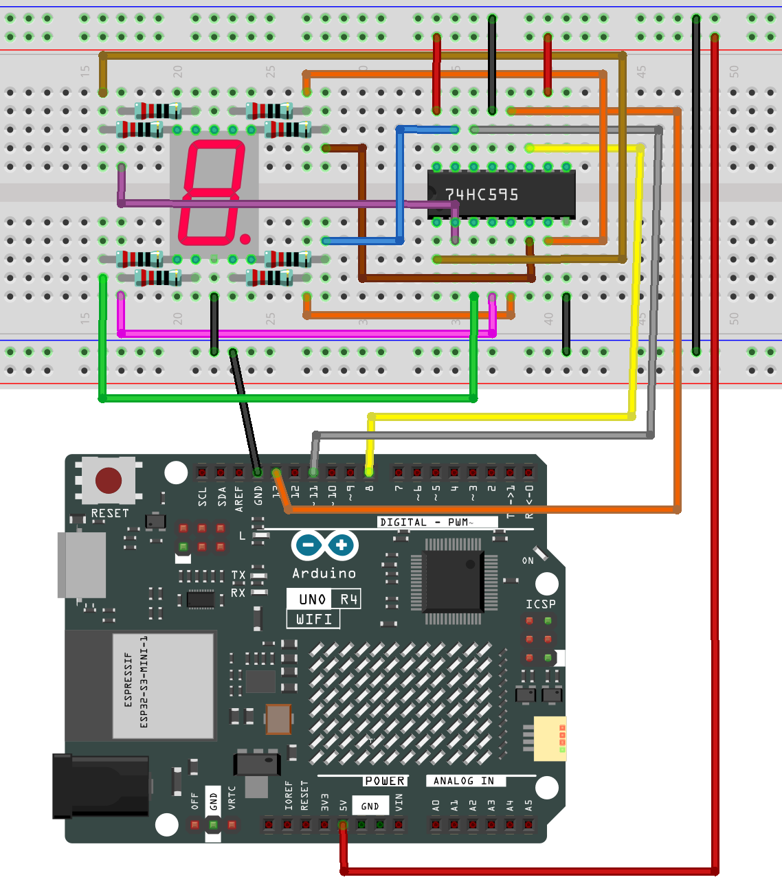
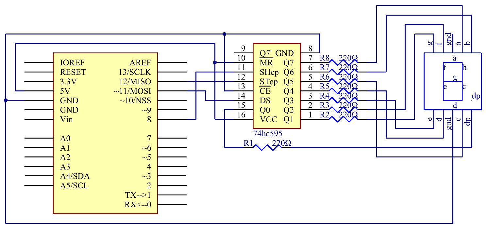

.. note::

    Bonjour, bienvenue dans la communauté des passionnés de SunFounder Raspberry Pi & Arduino & ESP32 sur Facebook ! Plongez plus profondément dans Raspberry Pi, Arduino et ESP32 avec d'autres passionnés.

    **Pourquoi nous rejoindre ?**

    - **Support expert** : Résolvez les problèmes après-vente et les défis techniques avec l'aide de notre communauté et de notre équipe.
    - **Apprendre et partager** : Échangez des astuces et des tutoriels pour améliorer vos compétences.
    - **Aperçus exclusifs** : Accédez en avant-première aux annonces de nouveaux produits et aux aperçus.
    - **Réductions spéciales** : Profitez de réductions exclusives sur nos produits les plus récents.
    - **Promotions festives et cadeaux** : Participez à des cadeaux et promotions festives.

    👉 Prêt à explorer et créer avec nous ? Cliquez sur [|link_sf_facebook|] et rejoignez-nous dès aujourd'hui !

.. _basic_74hc595:

74HC595
==========================

Vue d'ensemble
----------------------

En général, il existe deux façons de piloter un afficheur à 7 segments. Une méthode consiste à connecter ses 8 broches directement à huit ports sur la carte Uno, ce que nous avons fait précédemment. Ou vous pouvez connecter le 74HC595 à trois ports de la carte UNO puis l'afficheur à 7 segments au 74HC595. Dans cette expérience, nous utiliserons la deuxième méthode. De cette manière, nous pouvons économiser cinq ports - compte tenu du nombre limité de ports de la carte Uno, cela est très important. Commençons maintenant !

Composants nécessaires
------------------------

Dans ce projet, nous avons besoin des composants suivants.

Il est certainement pratique d'acheter un kit complet, voici le lien :

.. list-table::
    :widths: 20 20 20
    :header-rows: 1

    *   - Nom	
        - ARTICLES DANS CE KIT
        - LIEN
    *   - Elite Explorer Kit
        - 300+
        - |link_Elite_Explorer_kit|

Vous pouvez également les acheter séparément via les liens ci-dessous.

.. list-table::
    :widths: 30 20
    :header-rows: 1

    *   - INTRODUCTION DES COMPOSANTS
        - LIEN D'ACHAT

    *   - :ref:`uno_r4_wifi`
        - \-
    *   - :ref:`cpn_breadboard`
        - |link_breadboard_buy|
    *   - :ref:`cpn_wires`
        - |link_wires_buy|
    *   - :ref:`cpn_resistor`
        - |link_resistor_buy|
    *   - :ref:`cpn_7segment`
        - |link_7segment_buy|
    *   - :ref:`cpn_74hc595`
        - |link_74hc595_buy|

Câblage
----------------------

Schéma de câblage
--------------------

Dans l'expérience, MR (broche 10) est connecté à 5V (niveau HAUT) et OE (broche 1) à la masse (niveau BAS). Par conséquent, les données sont entrées sur le front montant de SHcp et entrent dans le registre de mémoire par le front montant. Nous utilisons la fonction shiftOut() pour envoyer des données de 8 bits au registre de décalage via DS. Sur le front montant de SHcp, les données dans le registre de décalage se déplacent successivement d'un bit à la fois, c'est-à-dire que les données de Q1 se déplacent vers Q2, et ainsi de suite. Sur le front montant de STcp, les données dans le registre de décalage entrent dans le registre de mémoire. Toutes les données seront déplacées vers le registre de mémoire après 8 fois. Ensuite, les données dans le registre de mémoire sont sorties sur le bus (Q0-Q7). Ainsi, les 16 caractères sont affichés à tour de rôle dans l'afficheur à 7 segments.

Code
--------

.. note::

    * Vous pouvez ouvrir le fichier ``29-74hc595.ino`` sous le chemin ``elite-explorer-kit-main\basic_project\29-74hc595`` directement.
    * Ou copier ce code dans l'IDE Arduino.

.. literalinclude:: /_code/29_basic_74hc595.ino
   :language: cpp
   :linenos:
   :caption: 29-74hc595.ino

Après avoir téléversé le code sur la carte Uno, vous devriez maintenant voir l'afficheur à 7 segments afficher de 0 à 9 et de A à F.
    

Analyse du code
--------------------

**Définir les éléments du tableau**

.. code-block:: arduino

    int datArray[16] = {252, 96, 218, 242, 102, 182, 190, 224, 254, 246, 238, 62, 156, 122, 158, 142};

Ce tableau stocke les données des 16 caractères de 0 à F. 252 représente 0, que vous pouvez calculer vous-même. Pour afficher 0, le segment g (le central) de l'afficheur à 7 segments doit être à un niveau bas (éteint).

Comme le segment g est connecté à Q1 du 74HC595, définissez à la fois Q1 et DP (le point) à un niveau bas et laissez les autres broches à un niveau haut. 
Par conséquent, les valeurs de Q7 Q6 Q5 Q4 Q3 Q2 Q1 Q0 sont 1 1 1 1 1 1 0 0.

Changez les nombres binaires en nombres décimaux :
1x2\ :sup:`7`\ +1x2\ :sup:`6`\ +1x2\ :sup:`5`\ +1x2\ :sup:`4`\ +1x2\ :sup:`3`\ +1x2\ :sup:`2`\ +0x2\ :sup:`1`\ +1x2\ :sup:`0`\ =252.

Donc, c'est la valeur pour afficher le chiffre **0**. Vous pouvez calculer les autres caractères de la même manière.

**Afficher 0-F sur l'afficheur à 7 segments**

.. code-block:: arduino

    for(int num = 0; num < 16; num++)

    {

      digitalWrite(STcp,LOW); //mettre ST_CP à la masse et maintenir bas tant que vous transmettez

      shiftOut(DS,SHcp,MSBFIRST,datArray[num]);

      //remettre la broche de verrouillage à haut pour signaler à la puce

      //qu'elle n'a plus besoin d'écouter les informations

      digitalWrite(STcp,HIGH); //mettre ST_CP à haut pour sauvegarder les données

      delay(1000); //attendre une seconde

    }

Définissez ``STcp`` à un niveau bas d'abord, puis à un niveau haut. Cela générera une impulsion de front montant de STcp.

``shiftOut()`` est utilisé pour décaler un octet de données un bit à la fois, ce qui signifie décaler un octet de données dans ``dataArray[num]`` vers le registre de décalage avec la broche DS. ``MSBFIRST`` signifie déplacer à partir des bits de poids fort.

Après l'exécution de ``digitalWrite(STcp,HIGH)``, le STcp sera à un front montant. À ce moment-là, les données dans le registre de décalage seront transférées dans le registre de mémoire.

Un octet de données sera transféré dans le registre de mémoire après 8 fois. Ensuite, les données du registre de mémoire sont sorties sur le bus (Q0-Q7). Vous verrez un caractère s'afficher sur l'afficheur à 7 segments. Attendez ensuite 1000 ms. Après cette ligne, revenez à ``for()``. La boucle se répète jusqu'à ce que tous les caractères soient affichés sur l'afficheur à 7 segments un par un après 16 fois.
