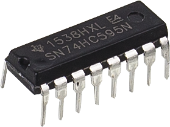
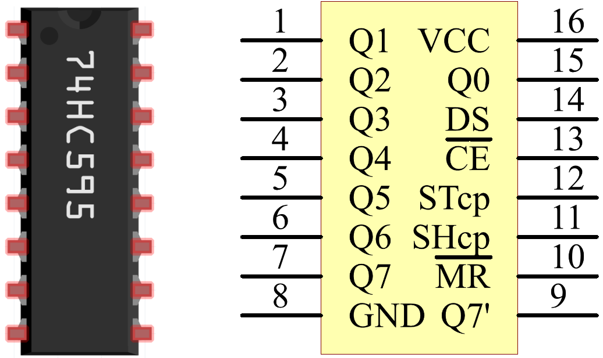

.. _cpn_74hc595:

74HC595
===========

74HC595由一个8位移位寄存器和一个具有三态并行输出的储存寄存器组成。它将串行输入转换为并行输出，从而可以节省MCU的IO端口。
当MR（引脚10）为高电平且OE（引脚13）为低电平时，数据在SHcp的上升沿输入，并通过SHcp的上升沿进入储存寄存器。如果将两个时钟连接在一起，移位寄存器始终比储存寄存器早一个脉冲。它有一个串行移位输入引脚（Ds）、一个串行输出引脚（Q）和一个异步复位按钮（低电平）。储存寄存器输出一个具有并行8位三态的总线。当OE使能（低电平）时，储存寄存器中的数据输出到总线。

* |link_74hc595_datasheet|

74HC595的引脚及其功能：

* **Q0-Q7** ：8位并行数据输出引脚，可直接控制8个LED或7段数码管的8个引脚。
* **Q7'** ：级联输出引脚，连接到另一个74HC595的DS引脚，用于串联多个74HC595。
* **MR** ：复位引脚，低电平有效。
* **SHcp** ：移位寄存器时序输入。在上升沿，移位寄存器中的数据依次移动一位，即Q1中的数据移动到Q2，依此类推。在下降沿，移位寄存器中的数据保持不变。
* **STcp** ：储存寄存器时序输入。在上升沿，移位寄存器中的数据移入储存寄存器。
* **CE** ：输出使能引脚，低电平有效。
* **DS** ：串行数据输入引脚。
* **VCC** ：正电源电压。
* **GND** ：接地。

**示例**

* :ref:`basic_74hc595` （基础项目）
* :ref:`fun_digital_dice` （趣味项目）
