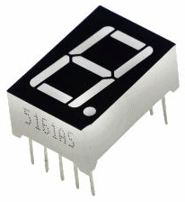
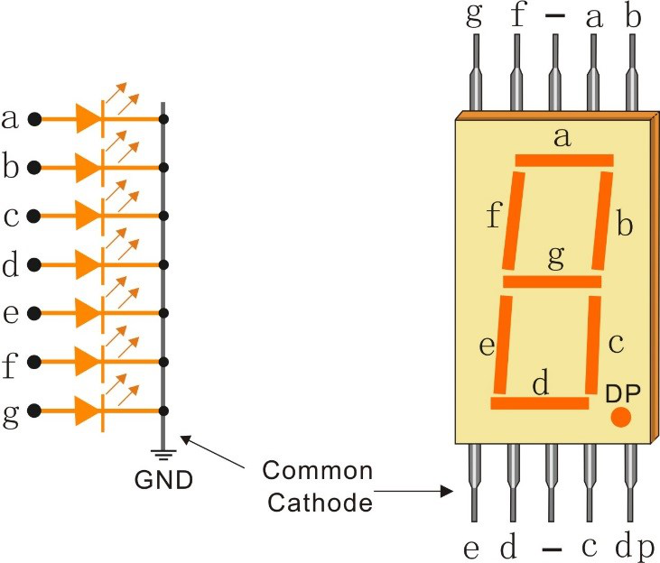
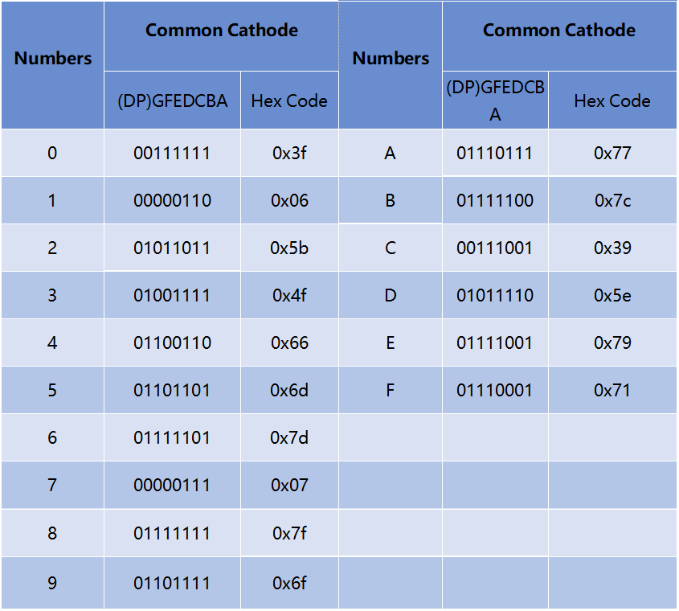

.. _cpn_7segment:

7段数码管
======================

7段数码管是一种8字形的元件，内部封装了7个LED。每个LED称为一个段——通电时，一个段构成要显示的数字的一部分。

有两种引脚连接类型：共阴极（CC）和共阳极（CA）。顾名思义，共阴极数码管将所有7个LED的阴极连接在一起，而共阳极数码管将所有7个段的阳极连接在一起。

本套件中使用的是共阴极7段数码管，以下是其电子符号。

数码管中的每个LED都有其位置段，其中一个连接引脚从矩形塑料封装中引出。这些LED引脚标记为"a"到"g"，代表每个独立的LED。另一个LED引脚连接在一起形成一个公共引脚。因此，通过按特定顺序正向偏置相应LED段的引脚，一些段会亮起，而其他段保持暗灭，从而在数码管上显示相应的字符。

**显示代码**

为了帮助您了解7段数码管（共阴极）如何显示数字，我们绘制了下表。数字是在7段数码管上显示的0-F数字；(DP)GFEDCBA指的是相应LED设置为0或1，例如，00111111表示DP和G设置为0，而其他设置为1。因此，数字0显示在7段数码管上，而HEX代码对应十六进制数。

**示例**

* :ref:`basic_7segment` （基础项目）
* :ref:`basic_74hc595` （基础项目）
* :ref:`fun_digital_dice` （趣味项目）
