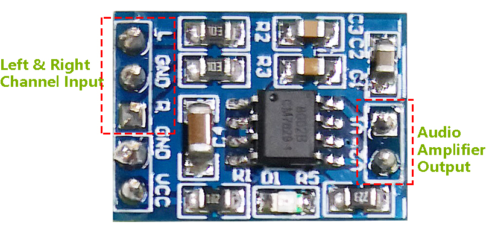
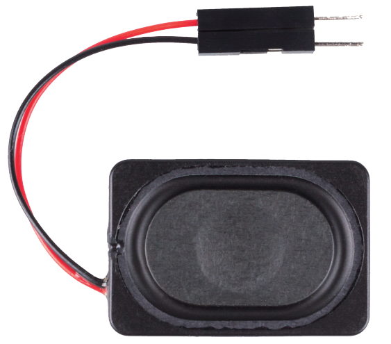
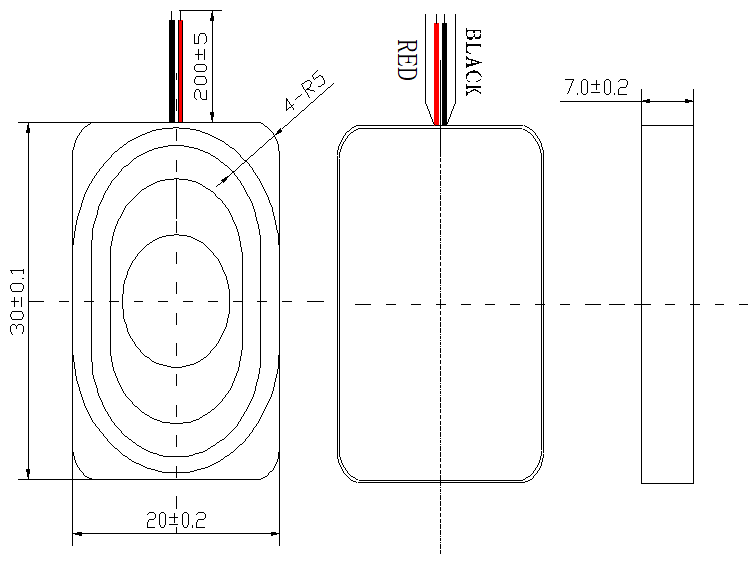

.. _cpn_audio_speaker:

音频模块和喇叭
===========================

**音频功放模块**

音频功放模块包含一个HXJ8002音频功率放大芯片。该芯片是一款低电源功率放大器，可在5V直流电源下为3Ω BTL负载提供3W的平均音频功率，且具有低谐波失真（在1KHz下低于10%阈值失真）。该芯片无需任何耦合电容或自举电容即可放大音频信号。

该模块可由2.0V至5.5V直流电源供电，工作电流为10mA（典型待机电流为0.6uA），可为3Ω、4Ω或8Ω阻抗的喇叭产生强大的放大声音。该模块具有改进的爆音和咔嗒声消除电路，可显著减少开关机时的瞬态噪声。除高效率低功耗外，其小巧的尺寸使其可广泛应用于便携式和电池供电的项目及微控制器中。

* **IC** ：HXJ8002
* **输入电压** ：2V ~ 5.5V
* **待机模式电流** ：0.6uA（典型值）
* **输出功率** ：3W（3Ω负载），2.5W（4Ω负载），1.5W（8Ω负载）
* **输出喇叭阻抗** ：3Ω、4Ω、8Ω
* **尺寸** ：19.8mm x 14.2mm

**喇叭**

* **尺寸** ：20x30x7mm
* **阻抗** ：8欧姆
* **额定输入功率** ：1.5W
* **最大输入功率** ：2.0W
* **线长** ：10cm

尺寸图如下：

* :download:`2030喇叭数据手册 <https://github.com/sunfounder/sf-pdf/raw/master/datasheet/2030-speaker-datasheet.pdf>`

**示例**

* :ref:`basic_audio_speaker` （基础项目）
* :ref:`fun_welcome` （趣味项目）
* :ref:`fun_fruit_piano` （趣味项目）
* :ref:`new_dac`

