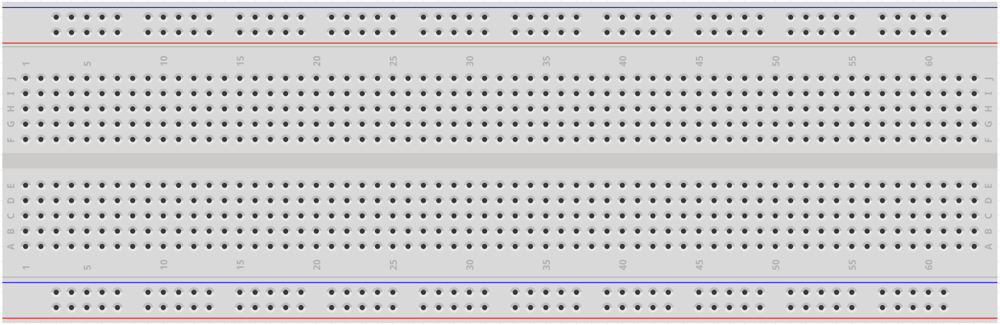
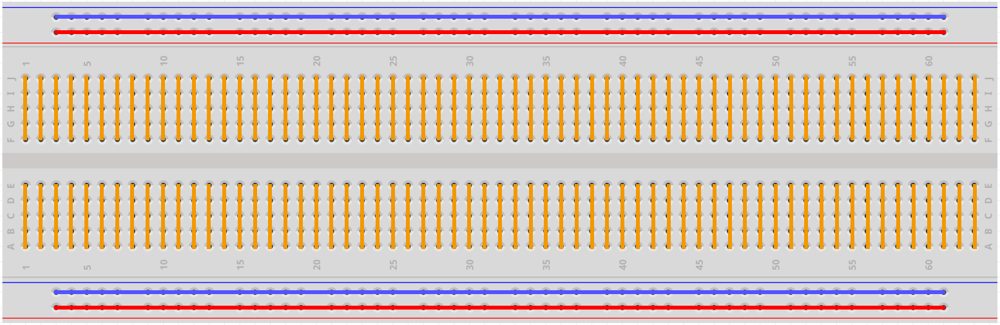

.. _cpn_breadboard:

面包板
==============

面包板是一种用于电子原型制作的构造基板。最初这个词指的是一个 literal bread board（切面包的木板），一块用来切面包的抛光木板。在20世纪70年代，免焊面包板（也称为插板、端子阵列板）问世，如今"breadboard"一词通常指代这些板子。

它用于在完成电路设计之前快速搭建和测试电路。
它有许多孔，可以将上述元件如IC、电阻以及杜邦线插入其中。
面包板允许您轻松地插入和移除元件。

图片显示了面包板的内部结构。
虽然面包板上的这些孔看起来是相互独立的，但实际上它们通过内部的金属条相互连接。

如果您想了解更多关于面包板的信息，请参阅：|link_breadboard_tutorials|

