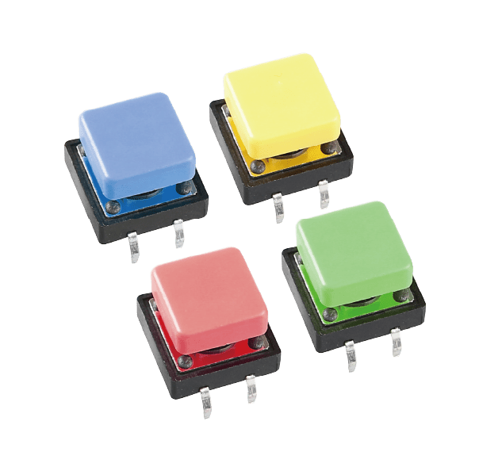

.. note::

    Bonjour, bienvenue dans la communauté des passionnés de SunFounder Raspberry Pi & Arduino & ESP32 sur Facebook ! Plongez plus profondément dans l'univers du Raspberry Pi, Arduino et ESP32 avec d'autres passionnés.

    **Pourquoi nous rejoindre ?**

    - **Support d'experts** : Résolvez les problèmes après-vente et les défis techniques avec l'aide de notre communauté et de notre équipe.
    - **Apprendre et partager** : Échangez des astuces et des tutoriels pour améliorer vos compétences.
    - **Aperçus exclusifs** : Accédez en avant-première aux annonces de nouveaux produits et aux avant-premières.
    - **Réductions exclusives** : Profitez de réductions exclusives sur nos produits les plus récents.
    - **Promotions festives et cadeaux** : Participez à des concours et des promotions festives.

    👉 Prêt à explorer et créer avec nous ? Cliquez sur [|link_sf_facebook|] et rejoignez-nous dès aujourd'hui !

.. _cpn_button:

Bouton
==========

.. image:: img/button.png
    :width: 400
    :align: center

Les boutons sont des composants courants utilisés pour contrôler les dispositifs électroniques. Ils sont généralement utilisés comme interrupteurs pour connecter ou rompre des circuits. Bien que les boutons existent en différentes tailles et formes, celui utilisé ici est un mini-bouton de 6 mm comme montré sur les images suivantes.
La broche 1 est connectée à la broche 2 et la broche 3 à la broche 4. Il suffit donc de connecter soit la broche 1 et la broche 2 à la broche 3 ou à la broche 4.

Voici la structure interne d'un bouton. Le symbole en bas à droite est généralement utilisé pour représenter un bouton dans les circuits. 

.. image:: img/button_symbol.png
    :width: 400
    :align: center

Étant donné que la broche 1 est connectée à la broche 2, et la broche 3 à la broche 4, lorsque le bouton est pressé, les 4 broches sont connectées, fermant ainsi le circuit.

.. image:: img/button2.png
    :width: 600
    :align: center

Dans ce kit, nous fournissons deux types de boutons. Celui mentionné précédemment est un petit bouton, et il y a aussi un gros bouton. Ils ont le même principe, seule la taille diffère.

**Exemple**

* :ref:`basic_button` (Basic Project)
* :ref:`fun_digital_dice` (Fun Project)
* :ref:`fun_smart_fan` (Fun Project)
* :ref:`fun_pong` (Fun Project)
* :ref:`iot_mqtt_publish` (IoT Project)
* :ref:`new_hid_keyboard` 

