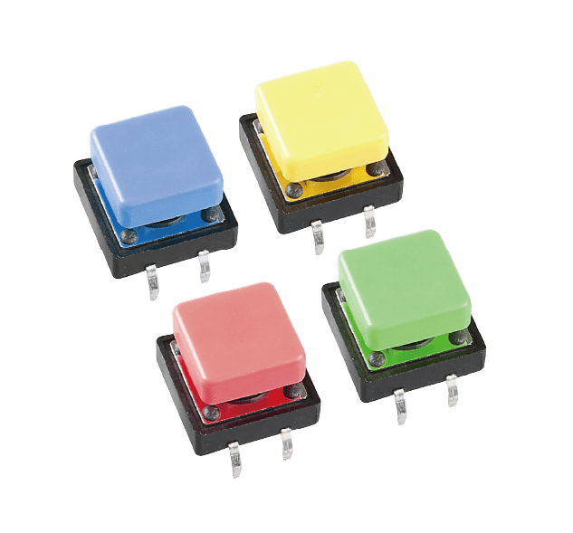

.. _cpn_button:

按钮
==========

.. image:: img/button.png
    :width: 400
    :align: center

按钮是用于控制电子设备的常见元件。它们通常用作开关来连接或断开电路。虽然按钮有各种尺寸和形状，但这里使用的是6mm微型按钮，如下图所示。
引脚1连接到引脚2，引脚3连接到引脚4。因此，您只需将引脚1或引脚2中的任一个连接到引脚3或引脚4即可。

以下是按钮的内部结构。下方右侧的符号通常用于在电路中表示按钮。

.. image:: img/button_symbol.png
    :width: 400
    :align: center

由于引脚1连接到引脚2，引脚3连接到引脚4，当按钮被按下时，4个引脚全部连接，从而闭合电路。

在本套件中，我们提供了两种类型的按钮。前面提到的是一个小按钮，还有一个大按钮。它们的原理相同，只是尺寸不同。

**示例**

* :ref:`basic_button` （基础项目）
* :ref:`fun_digital_dice` （趣味项目）
* :ref:`fun_smart_fan` （趣味项目）
* :ref:`fun_pong` （趣味项目）
* :ref:`iot_mqtt_publish` （物联网项目）
* :ref:`new_hid_keyboard`

