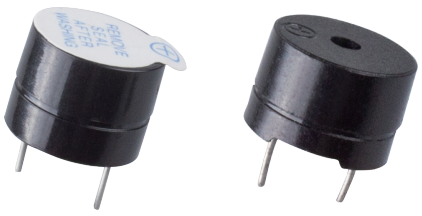
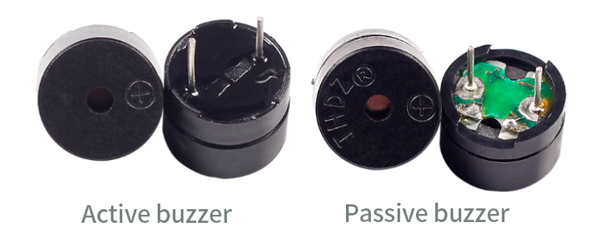

.. _cpn_buzzer:

ブザー
=======

統合構造を持つ電子ブザーとして、DC電源で動作するブザーは、コンピューター、プリンター、コピー機、アラーム、電子玩具、自動車電子機器、電話、タイマーなどの電子製品や音声装置に広く使用されています。

ブザーはアクティブタイプとパッシブタイプに分類されます（下の写真を参照）。ブザーのピンが上を向くようにして、緑の基板を持つものがパッシブブザーで、黒いテープで囲まれたものがアクティブブザーです。

アクティブブザーとパッシブブザーの違い：

アクティブブザーには振動源が内蔵されているため、通電すると音が鳴ります。しかし、パッシブブザーにはそのような源がないため、DC信号を使用してもビープ音が鳴りません。代わりに、2K～5Kの周波数の矩形波を使用して駆動する必要があります。アクティブブザーは、複数の内蔵振動回路のため、通常、パッシブブザーよりも高価です。

以下はブザーの電気記号です。プラスとマイナスの極を持つ2つのピンがあります。表面に+があるものがアノードで、もう一方がカソードです。

.. image:: img/buzzer_symbol.png
    :width: 150

ブザーのピンを確認すると、長い方がアノードで、短い方がカソードです。接続するときに混同しないでください。そうしないと、ブザーは音を鳴らしません。

|link_buzzer_wiki|

**例**

* :ref:`basic_active_buzzer` （基本プロジェクト）
* :ref:`basic_passive_buzzer` （基本プロジェクト）
* :ref:`fun_access` （楽しいプロジェクト）

