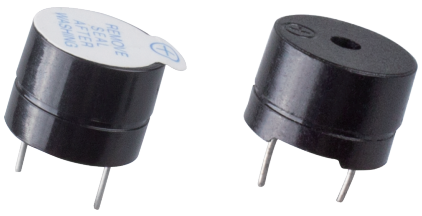
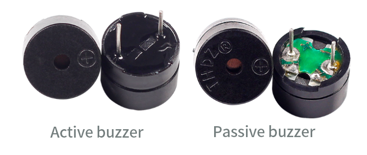
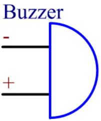

.. _cpn_buzzer:

蜂鸣器
=======

作为一种具有集成结构的电子蜂鸣器，由直流电源供电的蜂鸣器广泛用于计算机、打印机、复印机、报警器、电子玩具、汽车电子设备、电话、定时器和其他电子产品或语音设备中。

蜂鸣器可分为有源蜂鸣器和无源蜂鸣器（见下图）。将蜂鸣器引脚朝上放置，带有绿色电路板的蜂鸣器是无源蜂鸣器，而用黑色胶带封装的则是有源蜂鸣器。

有源蜂鸣器和无源蜂鸣器的区别：

有源蜂鸣器内部有振荡源，因此通电后会发出声音。而无源蜂鸣器没有振荡源，因此使用直流信号时不会发声；相反，需要使用频率在2K到5K之间的方波来驱动它。有源蜂鸣器由于内置了多个振荡电路，通常比无源蜂鸣器更贵。

以下是蜂鸣器的电气符号。它有两个引脚，有正负极之分。表面带有+标记的是阳极，另一个是阴极。

您可以检查蜂鸣器的引脚，较长的是阳极，较短的是阴极。连接时请勿接反，否则蜂鸣器不会发声。

|link_buzzer_wiki|

**示例**

* :ref:`basic_active_buzzer` （基础项目）
* :ref:`basic_passive_buzzer` （基础项目）
* :ref:`fun_access` （趣味项目）
