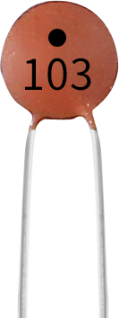
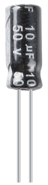

.. _cpn_capacitor:

电容
=============

电容是指在给定电位差下的电荷存储量，用C表示，国际单位是法拉（F）。
一般来说，电荷在电场中受力运动。当导体之间存在介质时，电荷运动受到阻碍，电荷在导体上积累，导致电荷的累积。

存储的电荷量称为电容量。由于电容是电子设备中应用最广泛的电子元件之一，因此被广泛用于直流隔离、耦合、旁路、滤波、调谐回路、能量转换和控制电路中。电容器分为电解电容、固态电容等。

根据材料特性，电容器可分为：铝电解电容、薄膜电容、钽电容、陶瓷电容、超级电容等。

本套件中使用了陶瓷电容和电解电容。

* `陶瓷电容 - 维基百科 <https://en.wikipedia.org/wiki/Ceramic_capacitor>`_

* `电解电容 - 维基百科 <https://en.wikipedia.org/wiki/Electrolytic_capacitor>`_

陶瓷电容上标有103或104字样，代表电容值，103=10x10^3pF，104=10x10^4pF

**单位换算**

    1F=10^3mF=10^6uF=10^9nF=10^12pF

**示例**

* :ref:`basic_button` （基础项目）

