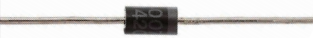
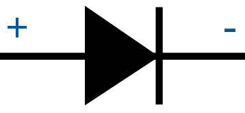
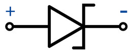

.. _cpn_diode:

二极管
=================

二极管是一种具有两个电极的电子元件。它允许电流仅沿一个方向流动，这通常被称为"整流"功能。
因此，二极管可以被看作是电子版的止回阀。

由于其单向导电性，二极管几乎用于所有具有一定复杂度的电子电路中。它是最早的半导体器件之一，具有广泛的应用。

根据用途分类，可分为检波二极管、整流二极管、限幅二极管、稳压二极管等。

本套件中包含整流二极管和稳压二极管。

**整流二极管**

整流二极管是一种半导体二极管，用于通过整流桥应用将交流电（AC）转换为直流电（DC）。通过肖特基势垒替代的整流二极管主要在数字电子领域具有价值。该二极管能够传导从mA到几kA变化的电流值，以及高达几kV的电压。

整流二极管的设计采用硅材料，能够传导高电流值。这些二极管并不常见，但仍使用锗或砷化镓基半导体二极管。锗二极管具有较低的允许反向电压和较低的允许结温。与硅二极管相比，锗二极管的一个优点是正向偏置操作时的阈值电压值较低。

* |link_general_purpose_diode|

**稳压二极管**

稳压二极管是一种特殊类型的二极管，设计用于在达到特定反向电压（称为齐纳电压）时可靠地允许电流"反向"流动。

这种二极管是一种半导体器件，在达到临界反向击穿电压之前具有非常高的电阻。在此临界击穿点，反向电阻减小到非常小的值，电流增加，而在此低电阻区域内电压保持恒定。

* |link_zener_diode|

**示例**

 * :ref:`basic_relay` （基础项目）
