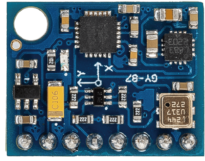
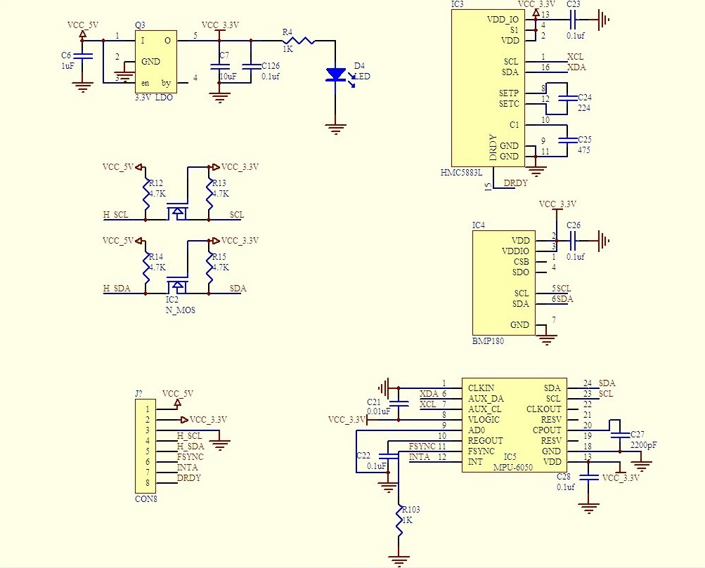

.. note::

    Hola, bienvenido a la Comunidad de Entusiastas de SunFounder para Raspberry Pi, Arduino y ESP32 en Facebook. Profundiza en Raspberry Pi, Arduino y ESP32 con otros entusiastas.

    **¿Por qué unirse?**

    - **Soporte experto**: Resuelve problemas postventa y desafíos técnicos con la ayuda de nuestra comunidad y equipo.
    - **Aprende y comparte**: Intercambia consejos y tutoriales para mejorar tus habilidades.
    - **Vistas previas exclusivas**: Obtén acceso anticipado a nuevos anuncios de productos y adelantos.
    - **Descuentos especiales**: Disfruta de descuentos exclusivos en nuestros productos más nuevos.
    - **Promociones y sorteos festivos**: Participa en sorteos y promociones de temporada.

    👉 ¿Listo para explorar y crear con nosotros? Haz clic en [|link_sf_facebook|] y únete hoy mismo.

.. _cpn_gy87:

Módulo IMU GY-87
============================

El módulo sensor GY-87 es un módulo de alta precisión de 10 ejes (10DOF) capaz de medir la aceleración, la velocidad angular y la fuerza del campo magnético en tres ejes: x, y y z. Consta de tres sensores principales: MPU6050, QMC5883L y BMP180, y se comunica a través del protocolo I2C.

El módulo sensor GY-87 se basa en tres sensores:

1. **MPU6050**: Es un acelerómetro y giroscopio de 6 ejes que puede medir la aceleración y la velocidad angular en tres ejes x, y y z.
2. **QMC5883L**: Es una brújula digital de 3 ejes que puede medir la fuerza del campo magnético en tres ejes x, y y z.
3. **BMP180**: Es un sensor barométrico de temperatura y presión que puede medir la presión atmosférica y la temperatura.

El MPU6050 mide la aceleración y la velocidad angular en tres ejes x, y y z. El QMC5883L mide la fuerza del campo magnético en tres ejes x, y y z. El BMP180 mide la presión atmosférica y la temperatura. Los datos de estos sensores se combinan para proporcionar información precisa sobre la orientación del módulo en el espacio.

El módulo sensor GY-87 se utiliza comúnmente en aplicaciones como drones, robótica y otros proyectos que requieren información precisa de orientación. Es compatible con las placas Arduino y se puede interconectar fácilmente con ellas utilizando el protocolo de comunicación I2C.

.. raw:: html

     

**Ejemplo**

* :ref:`basic_gy87_bmp180` (Basic Project)
* :ref:`basic_gy87_mpu6050` (Basic Project)
* :ref:`basic_gy87_qmc5883l` (Basic Project)
* :ref:`fun_escape` (Fun Project)
