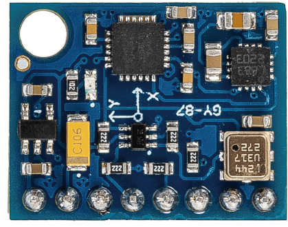

.. _cpn_gy87:

GY-87 IMU模块
============================

GY-87传感器模块是一款高精度10轴（10DOF）模块，能够测量x、y、z三个轴上的加速度、角速度和磁场强度。它由三个主要传感器组成：MPU6050、QMC5883L和BMP180，并通过I2C协议进行通信。

GY-87传感器模块基于三个传感器：

1. **MPU6050** ：这是一个6轴加速度计和陀螺仪，可以测量x、y、z三个轴上的加速度和角速度。
2. **QMC5883L** ：这是一个3轴数字罗盘，可以测量x、y、z三个轴上的磁场强度。
3. **BMP180** ：这是一个气压温度和压力传感器，可以测量大气压和温度。

MPU6050测量x、y、z三个轴上的加速度和角速度。QMC5883L测量x、y、z三个轴上的磁场强度。BMP180测量大气压和温度。这些传感器的数据被结合起来，提供模块在空间中方向的精确信息。

GY-87传感器模块常用于无人机、机器人和其他需要精确方向信息的项目中。它与Arduino板兼容，可以使用I2C通信协议轻松连接。

.. .. image:: img/GY-87-SCH.jpg
..     :align: center
..     :width: 100%

.. raw:: html

     

**示例**

* :ref:`basic_gy87_bmp180` （基础项目）
* :ref:`basic_gy87_mpu6050` （基础项目）
* :ref:`basic_gy87_qmc5883l` （基础项目）
* :ref:`fun_escape` （趣味项目）
