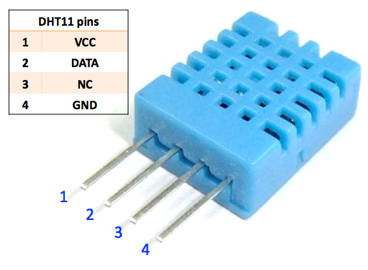

.. _cpn_dht11:

温湿度传感器模块
=============================

数字温湿度传感器DHT11是一款复合传感器，包含已校准的数字信号输出的温度和湿度。
采用了专用的数字模块采集技术和温湿度传感技术，确保产品具有高可靠性和卓越的长期稳定性。

只有三个引脚可供使用：VCC、GND和DATA。
通信过程始于DATA线向DHT11发送起始信号，DHT11接收信号并返回应答信号。
然后主机接收应答信号，并开始接收40位温湿度数据（8位湿度整数 + 8位湿度小数 + 8位温度整数 + 8位温度小数 + 8位校验和）。

* |link_dht11_datasheet|

**示例**

* :ref:`basic_humiture_sensor` （基础项目）
* :ref:`fun_plant_monitor` （趣味项目）
* :ref:`iot_arduino_cloud` （物联网项目）
* :ref:`iot_ble_home` （物联网项目）
