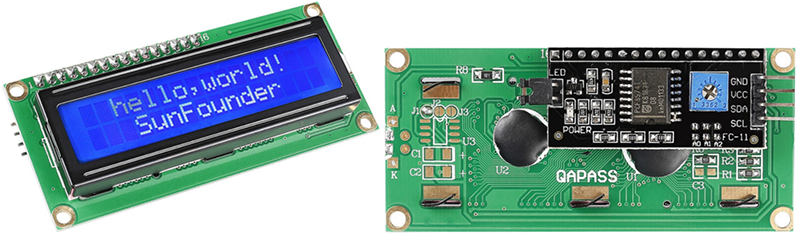
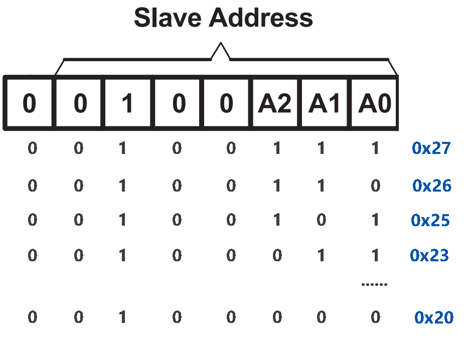
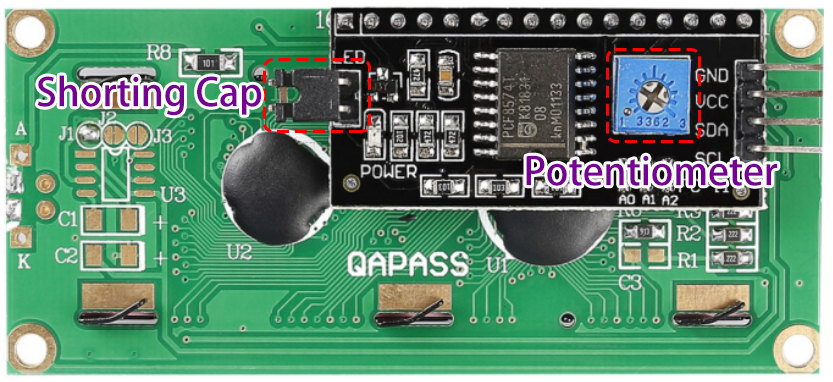

.. _cpn_i2c_lcd1602:

I2C LCD1602
==============

* **GND** ：接地
* **VCC** ：电源电压，5V。
* **SDA** ：串行数据线。通过上拉电阻连接到VCC。
* **SCL** ：串行时钟线。通过上拉电阻连接到VCC。

众所周知，虽然LCD和其他一些显示器极大地丰富了人机交互，但它们有一个共同的缺点。当它们连接到控制器时，会占用控制器多个IO口，而控制器没有那么多外部端口。这也限制了控制器的其他功能。

因此，带有I2C模块的LCD1602被开发出来以解决这个问题。I2C模块内置了PCF8574 I2C芯片，可将I2C串行数据转换为LCD显示所需的并行数据。

* |link_pcf8574_datasheet|

**I2C地址**

默认地址基本上为0x27，少数情况下可能是0x3F。

以默认地址0x27为例，可以通过短接A0/A1/A2焊盘来修改设备地址；在默认状态下，A0/A1/A2为1，如果焊盘被短接，则A0/A1/A2为0。

**背光/对比度**

背光可以通过跳线帽启用，拔下跳线帽即可禁用背光。背面的蓝色电位器用于调节对比度（最亮白色与最暗黑色之间的亮度比）。

* **短接帽** ：通过此帽启用背光，拔下此帽可禁用背光。
* **电位器** ：用于调节对比度（显示文本的清晰度），顺时针旋转增加，逆时针旋转减小。

**示例**

* :ref:`basic_i2c_lcd1602` （基础项目）
* :ref:`basic_ultrasonic_sensor` （基础项目）
* :ref:`fun_plant_monitor` （趣味项目）
* :ref:`fun_guess_number` （趣味项目）
* :ref:`iot_Bluetooth_lcd` （物联网项目）
