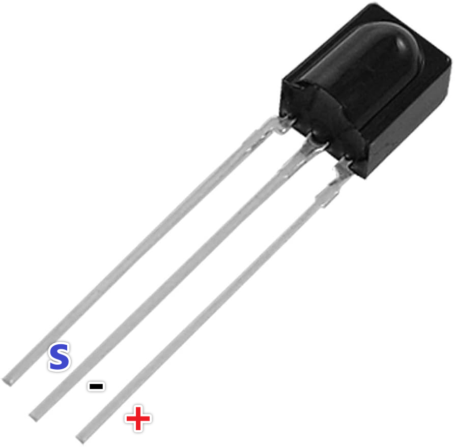
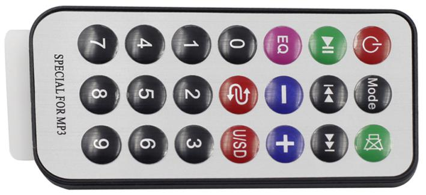

.. _cpn_ir_receiver:

红外接收模块
=================================

红外接收头
----------------------------

* S：信号输出
* +：VCC
* -：GND

.. 红外接收头是一种接收红外信号的元件，可独立接收红外线并输出与TTL电平兼容的信号。其大小与普通塑料封装的晶体管相似，适用于各种红外遥控和红外传输。

SL838是一款用于红外遥控系统的小型接收头。它包含高速高灵敏度光电二极管和前置放大器，并用环氧树脂封装形成红外滤光片。其主要优点是在干扰环境中也能保持可靠功能。

红外（IR）通信是一种流行、低成本、易于使用的无线通信技术。红外光的波长比可见光略长，因此人眼不可见——非常适合无线通信。红外通信的一种常见调制方案是38KHz调制。

* 可用于遥控
* 宽工作电压：2.7~5V
* 内置PCM频率滤波器
* 兼容TTL和CMOS
* 抗干扰能力强
* 符合RoHS标准

遥控器
-------------------------

这是一款迷你型红外无线遥控器，具有21个功能按钮，发射距离可达8米，适用于在儿童房中操作各种设备。

* 尺寸：85x39x6mm
* 遥控距离：8-10m
* 电池：3V纽扣型锂锰电池
* 红外载波频率：38KHz
* 表面贴片材料：0.125mm PET
* 有效寿命：超过20,000次

**示例**

* :ref:`basic_irrecv` （基础项目）
* :ref:`fun_guess_number` （趣味项目）
