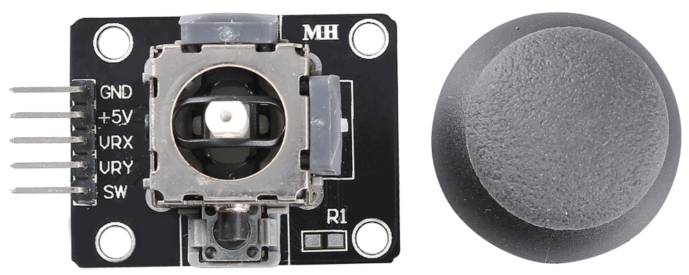
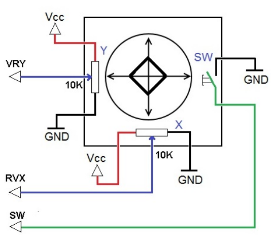

.. _cpn_joystick:

摇杆模块
======================

摇杆的基本思想是将摇杆的运动转换为计算机可以处理的电子信息。

为了向计算机传达完整的运动范围，摇杆需要测量摇杆在两个轴上的位置——X轴（左到右）和Y轴（上到下）。就像基础几何学中一样，X-Y坐标精确地定位了摇杆的位置。

为了确定摇杆的位置，摇杆控制系统只需监测每个轴的位置。传统的模拟摇杆设计使用两个电位器（即可变电阻器）来实现这一点。

摇杆还有一个数字输入，当摇杆被按下时触发。

**示例**

* :ref:`basic_joystick` （基础项目）
* :ref:`fun_snake` （趣味项目）
