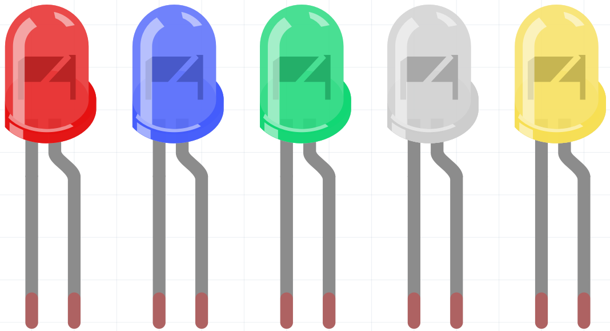

.. _cpn_led:

LED
==========

半导体发光二极管是一种通过PN结将电能转化为光能的元件。按波长可分为激光二极管、红外发光二极管和可见光发光二极管（通常称为LED）。

二极管具有单向导电性，因此电流将如图中电路符号的箭头所示方向流动。您只能将阳极接正电源，阴极接负电源。这样LED就会亮起。

一个LED有两个引脚。较长的是阳极，较短的是阴极。注意不要接反。LED具有固定的正向压降，因此不能直接连接到电路，因为电源电压可能超过此压降并导致LED烧毁。红色、黄色和绿色LED的正向电压为1.8V，白色LED为2.6V。大多数LED可承受最大20mA的电流，因此我们需要串联一个限流电阻。

电阻值的计算公式如下：

    R = (Vsupply – VD)/I

**R** 代表限流电阻的电阻值，**Vsupply** 代表电源电压，**VD** 代表压降，**I** 代表LED的工作电流。

以下是LED的详细介绍：|link_led_wiki| 。

**示例**

* :ref:`basic_led` （基础项目）
* :ref:`basic_relay` （基础项目）
* :ref:`fun_light_array` （趣味项目）
* :ref:`fun_smart_fan` （趣味项目）
