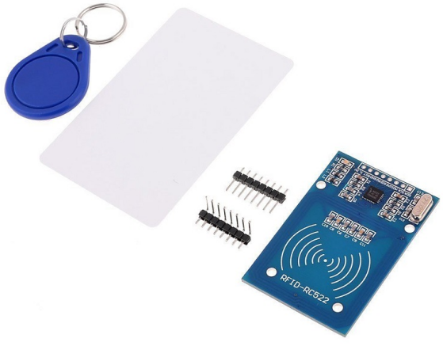

.. _cpn_mfrc522:

MFRC522模块
=====================

**RFID**

射频识别（RFID）指的是涉及使用物体（或标签）与询问设备（或读写器）之间无线通信的技术，用于自动跟踪和识别此类物体。标签的传输范围限制在距离读写器几米以内。读写器与标签之间不一定需要清晰的视线。

大多数标签至少包含一个集成电路（IC）和一个天线。微芯片存储信息并负责管理与读写器的射频（RF）通信。无源标签没有独立的能源，依赖读写器提供的外部电磁信号来供电运行。有源标签包含独立的能源，如电池。因此，它们可能具有更强的处理能力、传输能力和更大的范围。

**MFRC522**

MFRC522是一种集成的读写卡芯片。常用于13.56MHz的射频通信。由恩智浦公司推出，是一款低电压、低成本、小体积的非接触式卡芯片，是智能仪器和便携式手持设备的最佳选择。

MF RC522采用了先进的调制和解调概念，完全适用于所有类型的13.56MHz无源非接触式通信方法和协议。此外，它支持快速的CRYPTO1加密算法来验证MIFARE产品。MFRC522还支持MIFARE系列高速非接触式通信，双向数据传输速率高达424kbit/s。作为13.56MHz高集成度读写卡系列的新成员，MF RC522与现有的MF RC500和MF RC530非常相似，但也存在很大差异。它通过串行方式与主机通信，需要更少的接线。您可以在SPI、I2C和串行UART模式（类似于RS232）之间选择，这有助于减少连接，节省PCB板空间（更小的尺寸），并降低成本。

**示例**

* :ref:`basic_mfrc522` （基础项目）
* :ref:`fun_access` （趣味项目）
