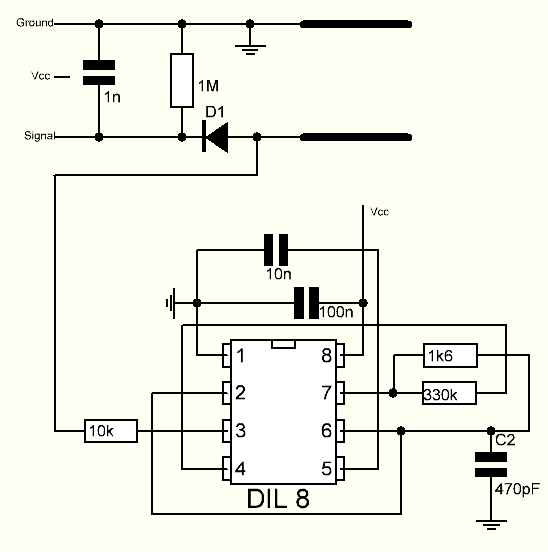

.. _cpn_soil_moisture:

土壤湿度模块
================================

.. image:: img/soil_mositure.png

* GND：接地
* VCC：电源，3.3v~5V
* AOUT：输出土壤湿度值，土壤越湿，数值越小。

这款电容式土壤湿度传感器不同于市面上大多数电阻式传感器，它采用电容感应原理来检测土壤湿度。它避免了电阻式传感器极易被腐蚀的问题，大大延长了其工作寿命。

它由耐腐蚀材料制成，具有出色的使用寿命。将其插入植物周围的土壤中，实时监测土壤湿度数据。该模块包含一个板载稳压器，可在3.3~5.5V电压范围内工作。非常适合3.3V和5V供电的低压微控制器。

电容式土壤湿度传感器的硬件原理图如下所示。

其中有一个由555定时器IC构建的固定频率振荡器。产生的方波随后被送入像电容器一样的传感器。然而，对于方波信号，电容器具有一定的电抗，或者说，与一个纯欧姆电阻（引脚3上的10k电阻）形成分压器。

土壤湿度越高，传感器的电容越大。因此，方波的电抗越小，从而降低了信号线上的电压，通过微控制器模拟输入的值也越小。

**规格参数**

* 工作电压：3.3 ~ 5.5 VDC
* 输出电压：0 ~ 3.0VDC
* 工作电流：5mA
* 接口：PH2.0-3P
* 尺寸：3.86 x 0.905 英寸（长 x 宽）
* 重量：15g

**示例**

* :ref:`basic_moisture` （基础项目）
* :ref:`fun_plant_monitor` （趣味项目）

