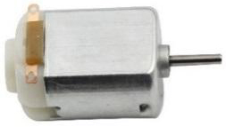

.. _cpn_motor:

直流电机
===================

这是一个3V直流电机。当您给两个端子分别提供高电平和低电平时，它就会旋转。

* **长度** ：25mm
* **直径** ：21mm
* **轴径** ：2mm
* **轴长** ：8mm
* **电压** ：3-6V
* **电流** ：0.35-0.4A
* **3V时转速** ：19000 RPM（每分钟转数）
* **重量** ：约14g（单个）

直流电机是一种将电能转换为机械能的连续执行器。直流电机通过产生持续的角旋转来使旋转泵、风扇、压缩机、叶轮等设备工作。

直流电机由两个部分组成，电机的固定部分称为**定子** ，电机的内部部分称为**转子** （或直流电机的**电枢** ），它旋转以产生运动。
产生运动的关键是将电枢置于永磁体的磁场中（其磁场从N极延伸到S极）。磁场与运动带电粒子（载流导线产生磁场）的相互作用产生使电枢旋转的扭矩。

.. image:: img/motor_sche.png
    :align: center

电流从电池的正极通过电路，经过碳刷流向换向器，然后到达电枢。
但由于换向器上的两个间隙，这种电流会在每个完整旋转的一半时反向。
这种持续的反向实际上将电池的直流电转换为交流电，使电枢在正确的时间以正确的方向承受扭矩，从而维持旋转。

**示例**

* :ref:`basic_motor` （基础项目）
* :ref:`fun_smart_fan` （趣味项目）
