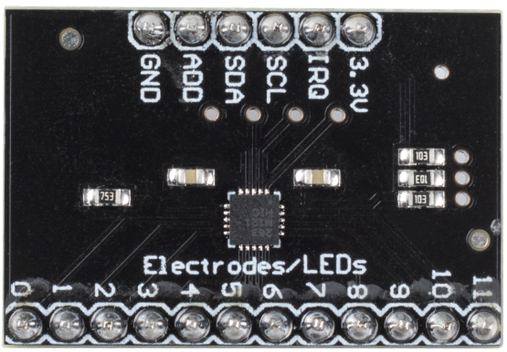

.. _cpn_mpr121:

MPR121
===========================

* **3.3V** ：电源
* **IRQ** ：开漏中断输出引脚，低电平有效
* **SCL** ：I2C时钟
* **SDA** ：I2C数据
* **ADD** ：I2C地址选择输入引脚。将ADDR引脚连接到VSS、VDD、SDA或SCL线，相应的I2C地址分别为0x5A、0x5B、0x5C和0x5D
* **GND** ：接地
* **0~11** ：电极0~11，电极是一种触摸传感器。通常，电极可以只是一块金属或一根导线。但有时根据导线的长度或电极所在材料的不同，可能会使触发传感器变得困难。因此，MPR121允许您配置触发和释放电极所需的条件。

**MPR121概述**

MPR121是继最初的MPR03x系列器件之后推出的第二代电容式触摸传感器控制器。
MPR121具有增强的内部智能，一些主要新增功能包括
更多的电极数量、硬件可配置的I2C地址、
带有去抖功能的扩展滤波系统，以及完全独立的
具有内置自动配置功能的电极。该器件还具有第13个
模拟感应通道，专门用于使用多路复用感应输入进行近距检测。

* |link_mpr121_datasheet|

**特性**

* 低功耗运行
    • 1.71 V 至 3.6 V 电源运行
    • 16 ms 采样间隔时期29 μA 电源电流
    • 3 μA 停止模式电流
* 12个电容感应输入
    • 8个输入具有LED驱动器和GPIO多功能
* 完整的触摸检测
    • 每个感应输入的自动配置
    • 每个感应输入的自动校准
    • 触摸/释放阈值和触摸检测去抖
* I2C接口，带中断输出
* 3 mm x 3 mm x 0.65 mm 20引脚QFN封装
* -40°C 至 +85°C 工作温度范围

**示例**

* :ref:`basic_mpr121` （基础项目）
* :ref:`fun_fruit_piano` （趣味项目）
