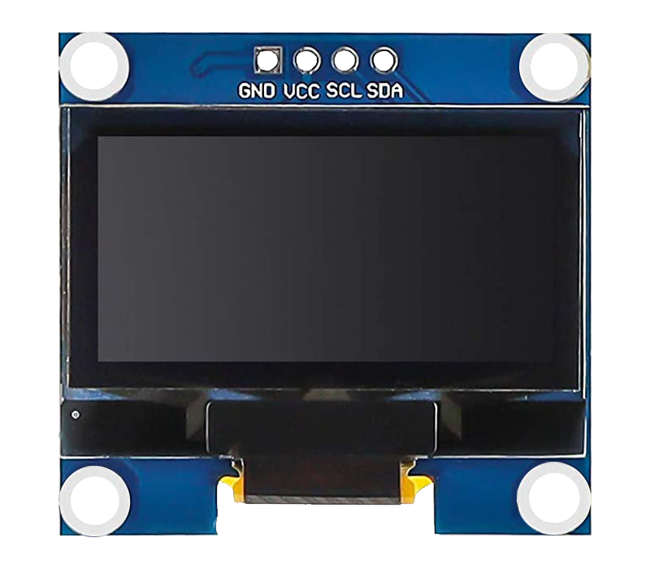

.. _cpn_oled:

OLED Display Module
==========================

Introduction
---------------------------
An OLED (Organic Light-Emitting Diode) display module is a device that can display text, graphics and images on a thin and flexible screen using organic materials that emit light when electric current is applied.

The main advantage of an OLED Display is that it emits its own light and doesn’t need another source of backlight. Due to this, OLED Displays often have better contrast, brightness and viewing angles when compared to LCD displays.

Another important feature of OLED Displays is deep black levels. Since each pixel emits its own light in an OLED Display, to produce black color, the individual pixel can be turned OFF.

Due to lower power consumption (only pixels which are lit up draw current), OLED displays are also popular in battery operated devices like Smart Watches, Health Trackers and other wearables.

Principle
---------------------------
An OLED display module consists of an OLED panel and an OLED driver chip that is mounted on the back of the module. The OLED panel is made of many tiny pixels that can produce different colors of light. Each pixel consists of several layers of organic materials sandwiched between two electrodes (anode and cathode). When electric current flows through the electrodes, the organic materials emit light of different wavelengths depending on their composition.

The OLED driver chip is a chip that can control the pixels of the OLED panel using a serial communication protocol called I2C (Inter-Integrated Circuit).

The OLED driver chip converts the signals from the Arduino into commands for the OLED panel. The Arduino can send data to the OLED driver chip using a library that can control the I2C protocol. One such library is the Adafruit SSD1306 library. With this library, you can initialize the OLED display module, set the brightness level, print text, graphics or images, etc.

**Example**

* :ref:`basic_oled` (Basic Project)
