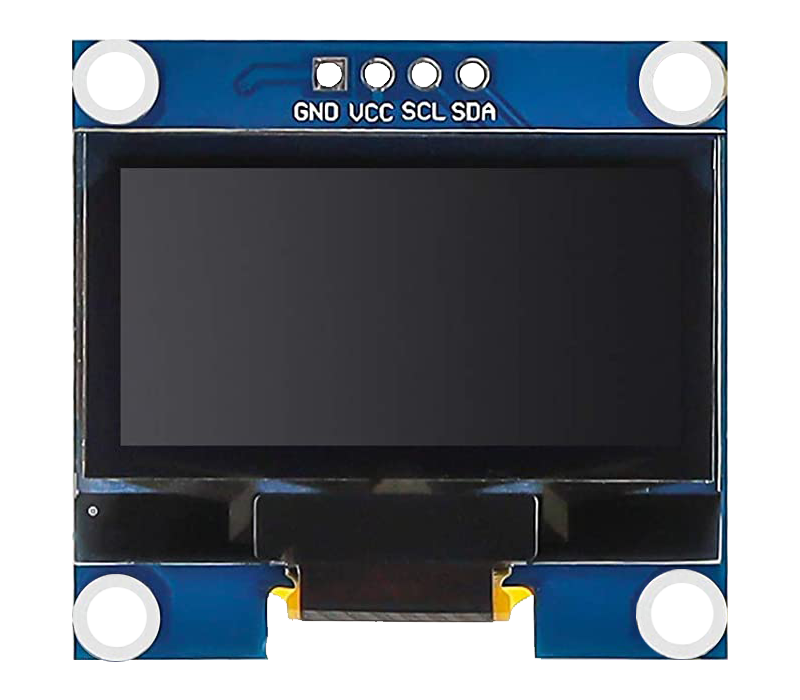

.. _cpn_oled:

OLED显示模块
==========================

概述
---------------------------
OLED（有机发光二极管）显示模块是一种可以在薄而灵活的屏幕上显示文本、图形和图像的设备，使用在电流通过时会发光的有机材料。

OLED显示的主要优点是其自身发光，不需要额外的背光源。因此，与LCD显示器相比，OLED显示器通常具有更好的对比度、亮度和可视角度。

OLED显示器的另一个重要特性是深黑色表现。由于OLED显示器中每个像素自身发光，要产生黑色，可以关闭单个像素。

由于功耗较低（只有点亮的像素才消耗电流），OLED显示器在智能手表、健康追踪器和其他可穿戴设备等电池供电设备中也很受欢迎。

工作原理
---------------------------
OLED显示模块由OLED面板和安装在模块背面的OLED驱动芯片组成。OLED面板由许多微小的像素组成，可以产生不同颜色的光。每个像素由夹在两个电极（阳极和阴极）之间的多层有机材料组成。当电流流过电极时，有机材料根据其成分发出不同波长的光。

OLED驱动芯片是一种可以使用称为I2C（集成电路间互联）的串行通信协议来控制OLED面板像素的芯片。

OLED驱动芯片将Arduino发出的信号转换为OLED面板的命令。Arduino可以使用控制I2C协议的库向OLED驱动芯片发送数据。其中一个这样的库是Adafruit SSD1306库。使用该库，您可以初始化OLED显示模块、设置亮度级别、打印文本、图形或图像等。

**示例**

* :ref:`basic_oled` （基础项目）
* :ref:`fun_pong` （趣味项目）
* :ref:`iot_weathertime_screen` （物联网项目）
