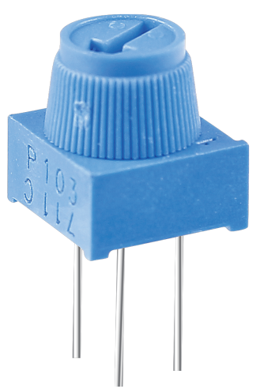
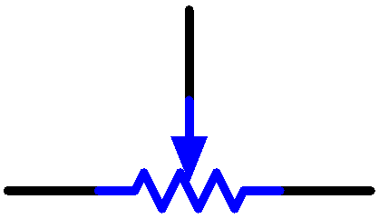

.. _cpn_potentiometer:

电位器
===============

电位器也是一种具有3个端子的电阻元件，其电阻值可以按照某种规律进行调节。

电位器有各种形状、尺寸和阻值，但它们都具有以下共同点：

* 它们有三个端子（或连接点）。
* 它们有一个旋钮、螺丝或滑块，可以移动以改变中间端子与任一外侧端子之间的电阻。
* 随着旋钮、螺丝或滑块的移动，中间端子与任一外侧端子之间的电阻从0Ω变化到电位器的最大电阻值。

以下是电位器的电路符号。

电位器在电路中的功能如下：

#. 用作分压器

    电位器是一种连续可调的电阻器。当您调节电位器的转轴或滑动柄时，可动触点会在电阻体上滑动。此时，可以根据施加在电位器上的电压以及可动臂旋转的角度或移动的行程来输出电压。

#. 用作变阻器

    当电位器用作变阻器时，将中间引脚和另外两个引脚之一接入电路。这样，就可以在可动触点的行程范围内获得平滑连续变化的电阻值。

#. 用作电流控制器

    当电位器用作电流控制器时，滑动触点端子必须连接为输出端子之一。

如果您想了解更多关于电位器的信息，请参阅：|link_potentiometer_wiki| 。

**示例**

* :ref:`basic_potentiometer` （基础项目）
* :ref:`fun_hue` （趣味项目）

