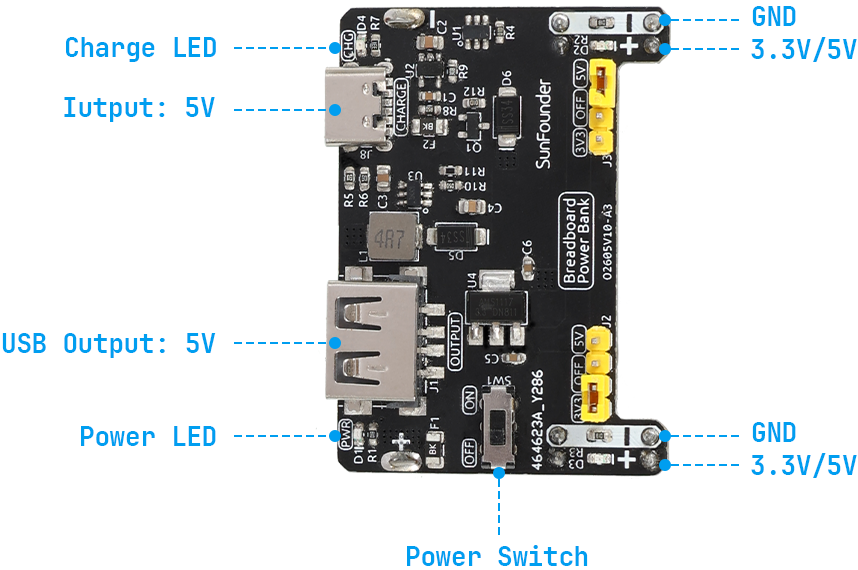

.. note::

    Bonjour, bienvenue dans la communauté des passionnés de SunFounder Raspberry Pi, Arduino et ESP32 sur Facebook ! Plongez dans l'univers de Raspberry Pi, Arduino et ESP32 avec d'autres passionnés.

    **Pourquoi nous rejoindre ?**

    - **Support d'experts** : Résolvez les problèmes après-vente et les défis techniques avec l'aide de notre communauté et de notre équipe.
    - **Apprendre et partager** : Échangez des astuces et des tutoriels pour améliorer vos compétences.
    - **Aperçus exclusifs** : Accédez en avant-première aux annonces de nouveaux produits et aux avant-premières.
    - **Réductions exclusives** : Profitez de réductions exclusives sur nos produits les plus récents.
    - **Promotions festives et cadeaux** : Participez à des concours et des promotions festives.

    👉 Prêt à explorer et créer avec nous ? Cliquez sur [|link_sf_facebook|] et rejoignez-nous dès aujourd'hui !

.. _cpn_power:

Module d'alimentation
===========================

.. note::
    Pour protéger la batterie du :ref:`cpn_power`, veuillez la charger complètement avant de l'utiliser pour la première fois.

Lorsque nous avons besoin d'un courant important pour alimenter un composant, cela peut interférer gravement avec le fonctionnement normal de la carte Arduino UNO. Par conséquent, nous alimentons séparément le composant avec ce module pour le faire fonctionner en toute sécurité et de manière stable.

Vous pouvez simplement le brancher sur la plaque de prototypage pour fournir de l'énergie. Il fournit une tension de 3,3V et 5V, et vous pouvez connecter l'une ou l'autre via un cavalier inclus.

.. raw:: html

     

**Caractéristiques et spécifications**

* Entrée de charge : USB Type-C, 5V
* Tension de sortie : 5V, 3,3V (ajustable via cavaliers. Configuration de 0V, 3,3V et 5V)
* Courant de sortie : 5V/1.5A, 3.3V/1A
* Interrupteur ON-OFF disponible
* Deux canaux indépendants
* Sortie USB (Type-A) disponible
* Batterie : Batterie Lithium-ion 14500 3.7V, 500mAh
* Dimension : 52mm x 32mm x 24mm (L x l x H)

**Exemple**

* :ref:`basic_motor` (Projet de base)
* :ref:`basic_pump` (Projet de base)
* :ref:`basic_stepper_motor` (Projet de base)
* :ref:`fun_smart_fan` (Projet amusant)
* :ref:`fun_plant_monitor` (Projet amusant)
* :ref:`fun_access` (Projet amusant)
* :ref:`fun_pong` (Projet amusant)

