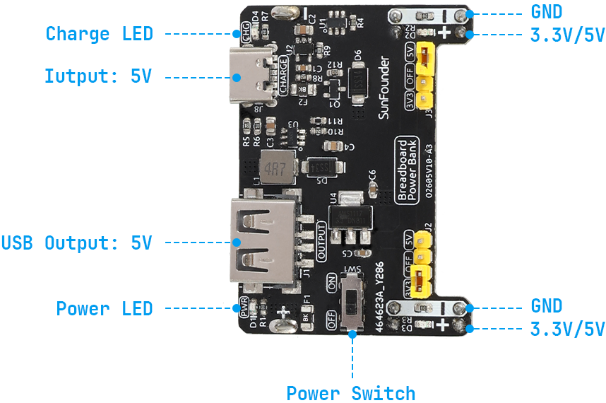

.. note::

    Hallo und willkommen in der SunFounder Raspberry Pi & Arduino & ESP32 Enthusiasten-Gemeinschaft auf Facebook! Tauchen Sie tiefer ein in die Welt von Raspberry Pi, Arduino und ESP32 mit anderen Enthusiasten.

    **Warum beitreten?**

    - **Expertenunterstützung**: Lösen Sie Nachverkaufsprobleme und technische Herausforderungen mit Hilfe unserer Gemeinschaft und unseres Teams.
    - **Lernen & Teilen**: Tauschen Sie Tipps und Anleitungen aus, um Ihre Fähigkeiten zu verbessern.
    - **Exklusive Vorschauen**: Erhalten Sie frühzeitigen Zugang zu neuen Produktankündigungen und exklusiven Einblicken.
    - **Spezialrabatte**: Genießen Sie exklusive Rabatte auf unsere neuesten Produkte.
    - **Festliche Aktionen und Gewinnspiele**: Nehmen Sie an Gewinnspielen und Feiertagsaktionen teil.

    👉 Sind Sie bereit, mit uns zu erkunden und zu erschaffen? Klicken Sie auf [|link_sf_facebook|] und treten Sie heute bei!

.. _cpn_power:

Stromversorgungsmodul
=====================

.. note::
    Um den Power-Pack des :ref:`cpn_power` zu schonen, laden Sie ihn bitte vor dem ersten Gebrauch vollständig auf.

Wenn wir einen großen Strom benötigen, um eine Komponente zu betreiben, kann dies die normale Arbeit des Arduino UNO-Boards stark beeinträchtigen. Daher versorgen wir die Komponente separat mit diesem Modul, um sie sicher und stabil laufen zu lassen.

Sie können es einfach in das Steckbrett stecken, um Strom zu liefern. Es bietet eine Spannung von 3,3V und 5V, und Sie können entweder über eine mitgelieferte Jumperkappe verbinden.

.. raw:: html

     

**Merkmale und Spezifikationen**

* Ladeeingang: USB Typ-C, 5V
* Ausgangsspannung: 5V, 3,3V (einstellbar über Jumper. 0V, 3,3V und 5V Konfiguration)
* Ausgangsstrom: 5V/1,5A, 3,3V/1A
* Ein-Aus-Schalter verfügbar
* Zwei unabhängige Kanäle
* USB (Typ-A) Ausgang verfügbar
* Akku: 3,7V Power-Pack, 500mAh
* Abmessungen: 52mm x 32mm x 24mm (L x B x H)

**Beispiel**

* :ref:`basic_motor` (Grundprojekt)
* :ref:`basic_pump` (Grundprojekt)
* :ref:`basic_stepper_motor` (Grundprojekt)
* :ref:`fun_smart_fan` (Spaßprojekt)
* :ref:`fun_plant_monitor` (Spaßprojekt)
* :ref:`fun_access` (Spaßprojekt)
* :ref:`fun_pong` (Spaßprojekt)

