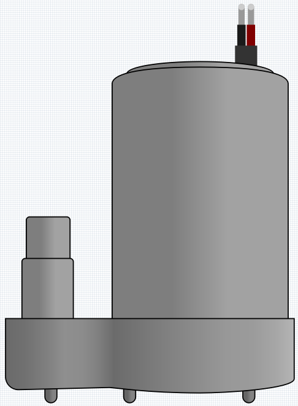

.. _cpn_pump:

直流水泵
================

该水泵本质上作为一个直流电机运行，工作电压为3V，电流为100mA。通电后，水泵从其塑料外壳的底部吸水，并从出水管排出。它必须始终保持浸在水中才能正常工作。反接极性不会使其成为进水装置；它只会向外抽水！

它非常适合初学者使用这款潜水泵制作喷泉或植物浇水项目，因为它非常易于使用！

**特性**

* **电压范围** ：DC 3 ~ 4.5V
* **工作电流** ：120 ~ 180mA
* **功率** ：0.36 ~ 0.91W
* **最大扬程** ：0.35 ~ 0.55M
* **最大流量** ：80 ~ 100 L/H
* **连续工作寿命** ：100小时
* **防水等级** ：IP68
* **驱动方式** ：直流，磁力驱动
* **材料** ：工程塑料
* **出水管外径** ：7.8 mm
* **出水管内径** ：6.5 mm
* 这是一款潜水泵，应在此方式下使用。如果在未浸入水中的情况下开启，它会过热，存在过热风险。
* 附带25cm公头导线，便于插入面包板。

**示例**

* :ref:`basic_pump` （基础项目）
* :ref:`fun_plant_monitor` （趣味项目）
