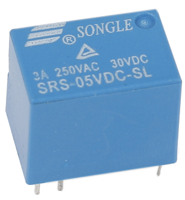
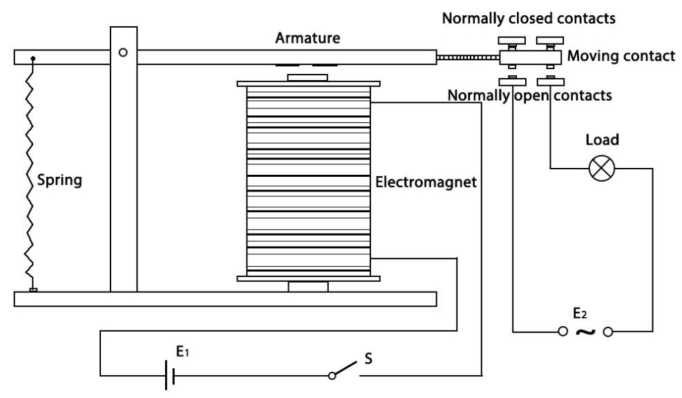

.. _cpn_realy:

继电器
==========================================

众所周知，继电器是一种用于根据输入的信号在两点或多点之间提供连接的设备。换句话说，继电器在控制器和设备之间提供隔离，因为设备可能工作在交流电和直流电上。然而，它们接收来自微控制器的信号，微控制器工作在直流电上，因此需要继电器来桥接这一差距。当需要用微弱的电信号控制大电流或大电压时，继电器非常有用。

每个继电器有5个部分：

**电磁铁** - 它由一个绕有线圈的铁芯组成。当电流通过时，它变成磁性。因此，它被称为电磁铁。

**衔铁** - 可移动的磁性条称为衔铁。当电流流过时，线圈通电，从而产生磁场，用于接通或断开常开（N/O）或常闭（N/C）触点。衔铁可以通过直流电（DC）以及交流电（AC）来移动。

**弹簧** - 当没有电流流过电磁铁上的线圈时，弹簧将衔铁拉开，使电路无法接通。

一组**触点** - 有两个接触点：

- 常开 - 继电器激活时连接，继电器未激活时断开。

- 常闭 - 继电器激活时断开，继电器未激活时连接。

**模制框架** - 继电器用塑料外壳覆盖以进行保护。

继电器的工作原理很简单。当向继电器供电时，电流开始流过控制线圈；结果，电磁铁开始通电。然后衔铁被吸引到线圈，将动触点一起拉下，从而与常开触点连接。因此，带有负载的电路通电。断开电路的情况类似，动触点将在弹簧的作用下被拉起并与常闭触点连接。通过这种方式，继电器的开关动作可以控制负载电路的状态。

**示例**

* :ref:`basic_relay` （基础项目）
