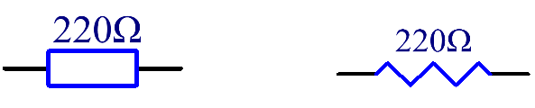
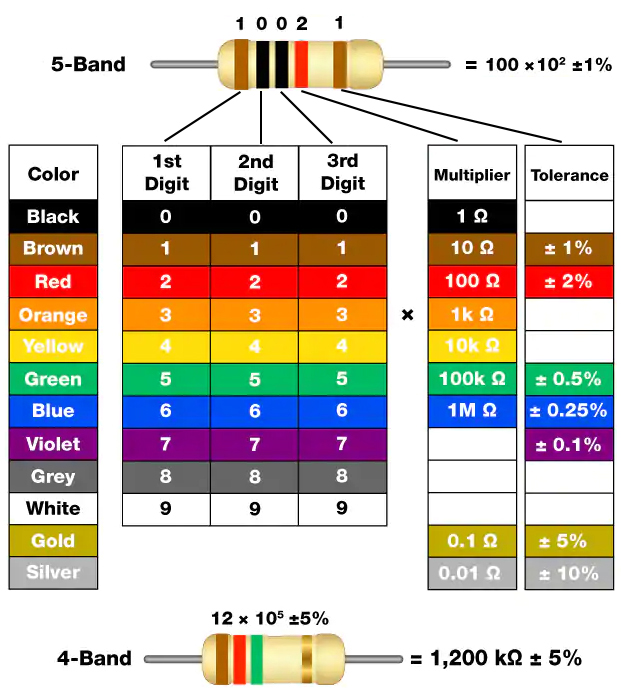
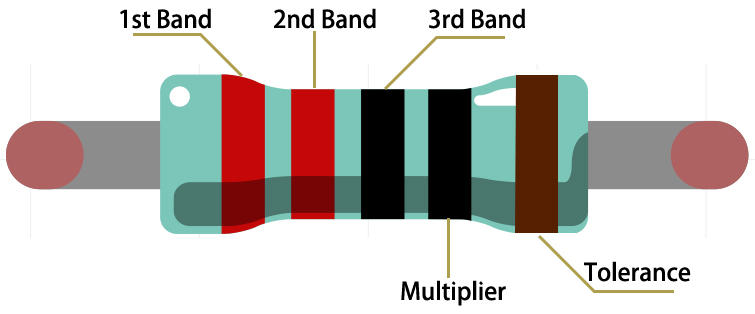

.. _cpn_resistor:

电阻
============

电阻是一种能够限制支路电流的电子元件。
固定电阻是其阻值不能改变的电阻，而电位器或可变电阻的阻值可以调节。

两种常用的电阻电路符号。通常，阻值标记在上面。因此，如果您在电路中看到这些符号，它代表一个电阻。

**Ω** 是电阻的单位，较大的单位包括KΩ、MΩ等。
它们之间的关系如下所示：1 MΩ=1000 KΩ, 1 KΩ = 1000 Ω。通常，电阻的阻值标记在其上。

使用电阻时，首先需要知道其阻值。有两种方法：您可以观察电阻上的色环，或者使用万用表测量阻值。建议使用第一种方法，因为它更方便快捷。

如卡片所示，每种颜色代表一个数字。

.. list-table::

   * - 黑色
     - 棕色
     - 红色
     - 橙色
     - 黄色
     - 绿色
     - 蓝色
     - 紫色
     - 灰色
     - 白色
     - 金色
     - 银色
   * - 0
     - 1
     - 2
     - 3
     - 4
     - 5
     - 6
     - 7
     - 8
     - 9
     - 0.1
     - 0.01

4环和5环电阻经常使用，上面分别有4条和5条彩色色环。

通常，拿到电阻时，您可能难以确定从哪一端开始读取颜色。
技巧是：第4环和第5环之间的间隔相对较大。

因此，您可以观察电阻一端两条色环之间的间隔；
如果它比其他任何色环间隔都大，那么您可以从相反的一端开始读取。

让我们看看如何阅读下面所示的5环电阻的阻值。

因此，对于这个电阻，应从左到右读取阻值。
数值格式应为：第1环 第2环 第3环 x 10^倍数（Ω），允许误差为±公差百分比。
所以这个电阻的阻值是2(红) 2(红) 0(黑) x 10^0(黑) Ω = 220 Ω，
允许误差为 ± 1%（棕色）。

.. list-table::常见电阻色环
    :header-rows: 1

    * - 电阻
      - 色环
    * - 10Ω
      - 棕黑黑银棕
    * - 100Ω
      - 棕黑黑黑棕
    * - 220Ω
      - 红红黑黑棕
    * - 330Ω
      - 橙橙黑黑棕
    * - 1kΩ
      - 棕黑黑棕棕
    * - 2kΩ
      - 红黑黑棕棕
    * - 5.1kΩ
      - 绿棕黑棕棕
    * - 10kΩ
      - 棕黑黑红棕
    * - 100kΩ
      - 棕黑黑橙棕
    * - 1MΩ
      - 棕黑黑绿棕

您可以从维基百科了解更多关于电阻的信息：`电阻 - 维基百科 <https://en.wikipedia.org/wiki/Resistor>`_.
