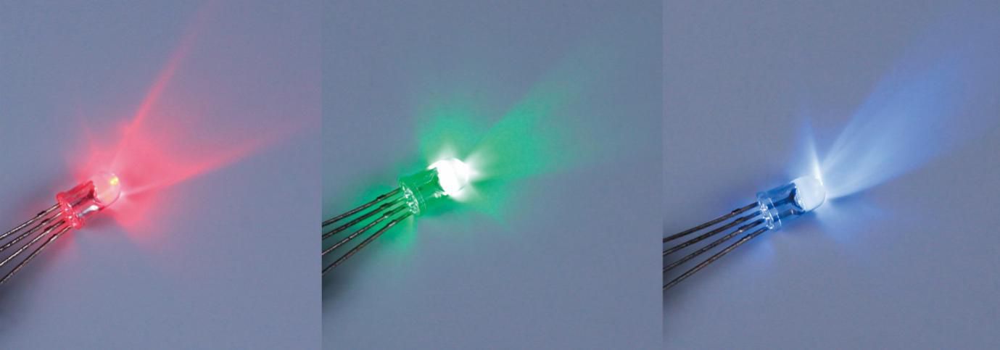
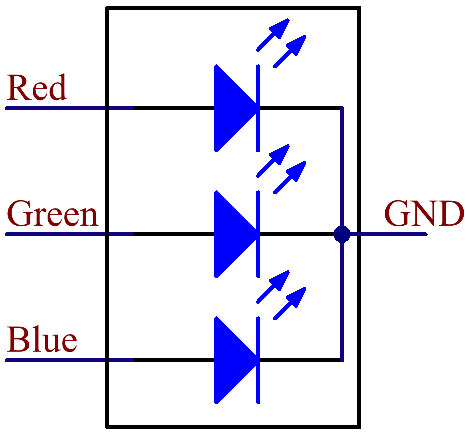

.. _cpn_rgb_led:

RGB LED
=================

RGB LED能发出多种颜色的光。一个RGB LED将红色、绿色和蓝色三个LED封装在透明或半透明的塑料外壳中。通过改变三个引脚的输入电压并将它们叠加，可以显示各种颜色，据统计，可以产生16,777,216种不同的颜色。

RGB LED可分为共阳极和共阴极两种。本套件中使用的是后者。**共阴极** （CC）是指将三个LED的阴极连接在一起。将其与GND连接并接入三个引脚后，LED将闪烁相应的颜色。

其电路符号如下图所示。

RGB LED有4个引脚：最长的是GND；其他分别是红色、绿色和蓝色。触摸其塑料外壳，您会发现有一个切口。最靠近切口的引脚是第一个引脚，标记为红色，然后依次是GND、绿色和蓝色。

.. image:: img/rgb_pin.jpg
    :width: 200

**示例**

* :ref:`basic_rgb_led` （基础项目）
* :ref:`fun_hue` （趣味项目）
