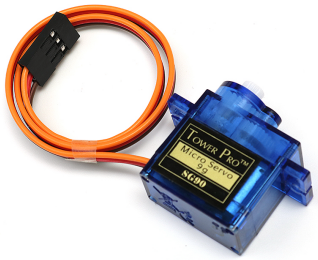

.. _cpn_servo:

舵机
===========

舵机通常由以下部分组成：外壳、转轴、齿轮系统、电位器、直流电机和内置控制板。

它的工作原理如下：微控制器向舵机发送PWM信号，舵机中的内置控制板通过信号线接收信号并控制内部电机转动。结果，电机驱动齿轮系统，减速后带动转轴运动。舵机的转轴和电位器连接在一起。当转轴旋转时，它带动电位器，因此电位器向内置控制板输出电压信号。然后控制板根据当前位置确定旋转的方向和速度，从而能够精确停止在定义的位置并保持在那里。

.. image:: img/servo_internal.png
    :align: center

角度由施加到控制线上的脉冲持续时间决定。这称为脉宽调制。舵机期望每20ms收到一个脉冲。脉冲的长度决定了电机转动的角度。例如，1.5ms的脉冲将使电机转到90度位置（中间位置）。
当发送给舵机的脉冲小于1.5ms时，舵机旋转到一个位置并使其输出轴从中间点逆时针旋转一定角度。当脉冲大于1.5ms时，则发生相反的情况。命令舵机转到有效位置的最小脉冲宽度和最大脉冲宽度是每个舵机的特性。通常，最小脉冲约为0.5ms，最大脉冲约为2.5ms。

.. image:: img/servo_duty.png
    :width: 600
    :align: center

**示例**

* :ref:`basic_servo` （基础项目）
* :ref:`fun_smart_can` （趣味项目）
