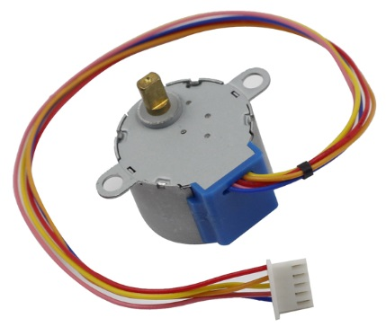
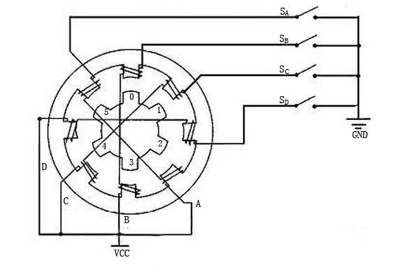
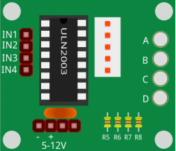

.. _cpn_stepper_motor:

步进电机
=========================

步进电机由于其独特的设计，可以在没有任何反馈机制的情况下实现高精度控制。步进电机的转轴上安装有一系列磁铁，由一系列电磁线圈控制，这些线圈按特定顺序正向和反向充电，从而以微小的"步进"精确地向前或向后移动。

**原理**

步进电机有两种类型：单极性和双极性，了解您正在使用哪种类型非常重要。在本实验中，我们将使用单极性步进电机。

步进电机是一种四相电机，使用单极性直流电源。只要按照适当的时序为电机的各相绕组通电，就可以使其一步一步地旋转。四相反应式步进电机的原理图：

图中，电机中间是一个转子——一个齿轮状的永磁体。转子周围是0到5号齿。再外面是8个磁极，每两个相对的磁极通过线圈绕组连接。因此它们形成A到D四对，称为一相。它有四根引线连接到开关SA、SB、SC和SD。因此，四相在电路中是并联的，同一相中的两个磁极是串联的。

**以下是四相步进电机的工作原理：**

开始时，开关SB通电，开关SA、SC和SD断电，B相磁极与转子的0号和3号齿对齐。同时，1号和4号齿与C相和D相磁极产生错齿。2号和5号齿与D相和A相磁极产生错齿。当开关SC通电，开关SB、SA和SD断电时，转子在C相绕组的磁场以及1号和4号齿之间的磁场作用下旋转。然后1号和4号齿与C相绕组的磁极对齐。而0号和3号齿与A相和B相磁极产生错齿，2号和5号齿与A相和D相磁极产生错齿。如此循环往复。依次给A、B、C、D相通电，转子将按照A、B、C、D的顺序旋转。

四相步进电机有三种工作模式：单四拍、双四拍和八拍。单四拍和双四拍的步进角相同，但单四拍的驱动力矩较小。八拍的步进角是单四拍和双四拍的一半。因此，八拍工作模式可以保持较高的驱动力矩并提高控制精度。在本实验中，我们让步进电机以八拍模式工作。

**ULN2003模块**

为了在电路中使用电机，需要使用驱动板。步进电机驱动ULN2003是一款7通道反相器电路。也就是说，当输入端为高电平时，ULN2003的输出端为低电平，反之亦然。如果给IN1提供高电平，给IN2、IN3和IN4提供低电平，那么输出端OUT1为低电平，其他所有输出端为高电平。因此D1点亮，开关SA接通，步进电机旋转一步。依此类推。因此，只需给步进电机提供特定的时序，它就会一步一步地旋转。这里的ULN2003用于为步进电机提供特定的时序。

**示例**

* :ref:`basic_stepper_motor` （基础项目）
* :ref:`fun_access` （趣味项目）
