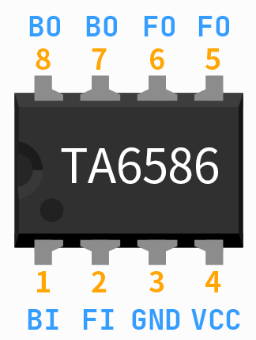
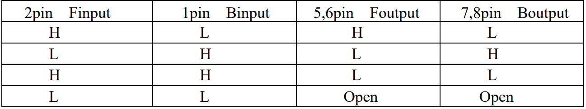

.. _cpn_ta6586:

TA6586 - Motor Driver Chip
=================================

.. image:: img/ta6586.png

TA6586 is a monolithic IC designed for driving bi-directional DC motor. It has
two pins of logic inputs for controlling the direction, forward and backward.
The circuit feature good anti-interference performance, small standby current and
low output saturation pressure drop. It has a built-in clamp diode to reverse the impact
of the release of inductive load current, making it in the drive relays, DC motors,
stepper motors or control the use of switching power safe and reliable.
TA6586 is suitable for toy vehicles, remote-controlled aircraft motor drive, automatic
valve motor, electromagnetic lock drive, precision instruments and other circuits.

**Features**

* Low stand-by current: ≦2uA
* Wide supply voltage range
* Built-in Brake Function
* Thermal Shutdown protection
* Over Current Limit and Short Circuit Protect Function
* DIP8 Pb-Free package.

**Pin Function**

.. image:: img/ta6586_pin.png
    :width: 75%

**Input Truth Table**

**Example**

* :ref:`basic_motor` (Basic Project)
* :ref:`basic_pump` (Basic Project)
* :ref:`fun_smart_fan` (Fun Project)
* :ref:`fun_plant_monitor` (Fun Project)